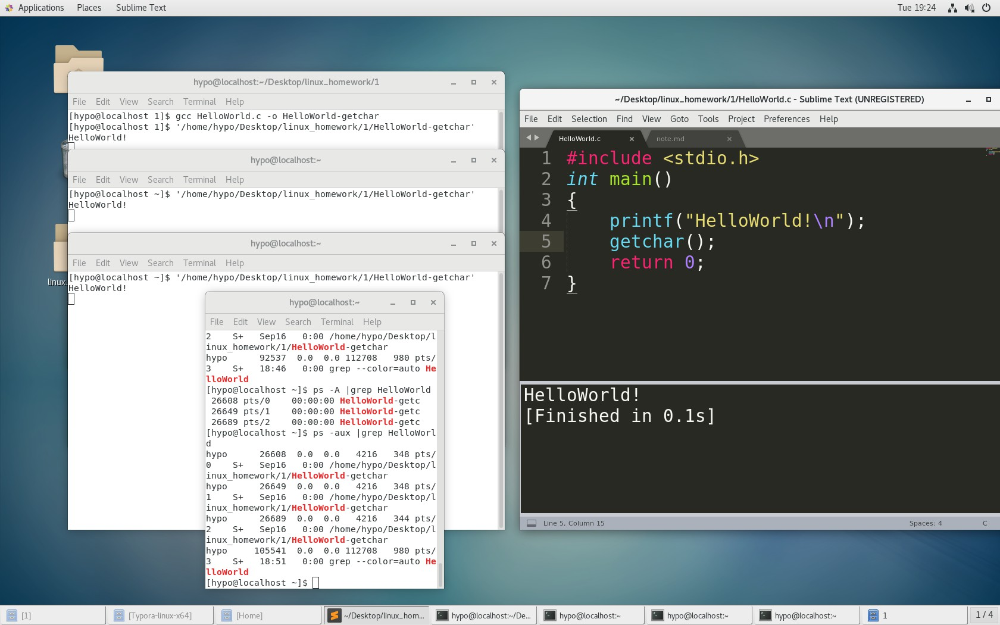
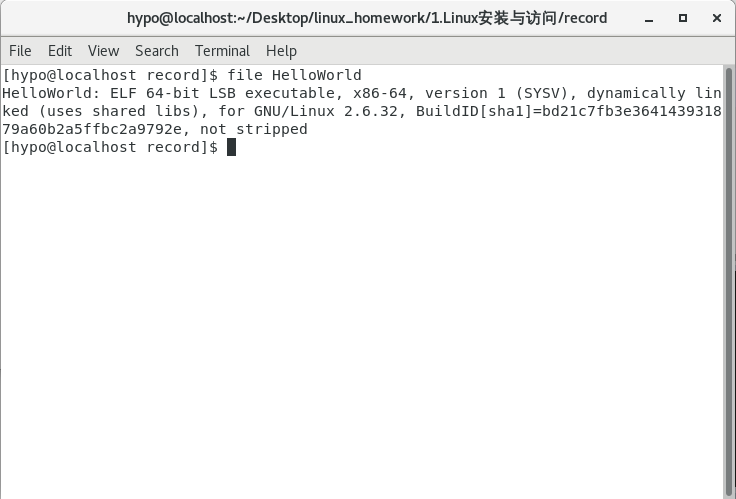
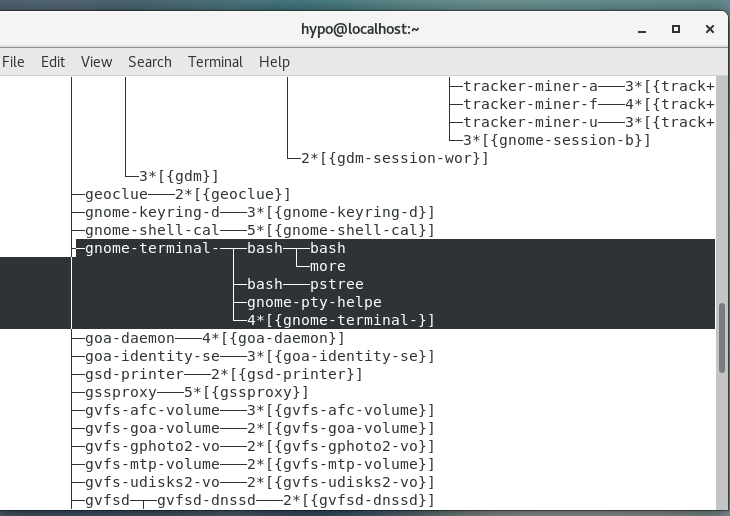
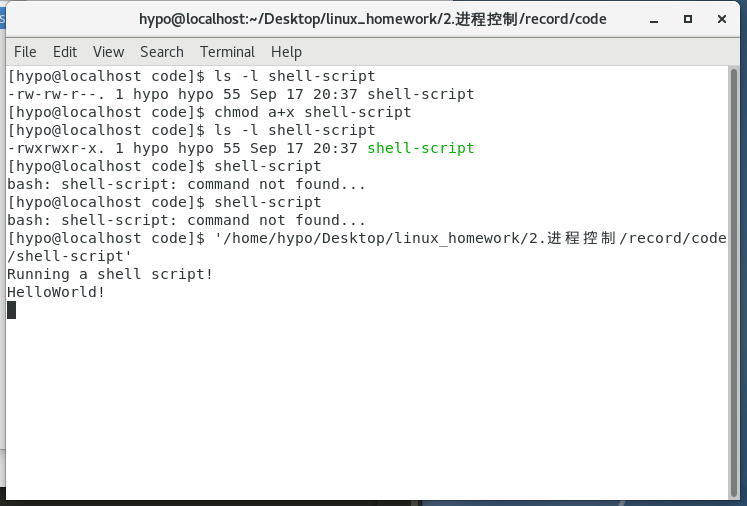
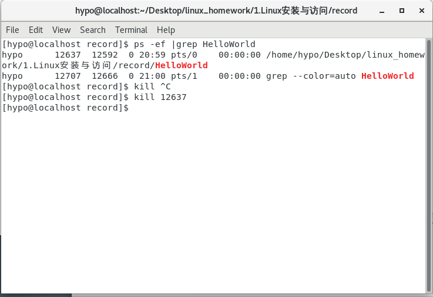
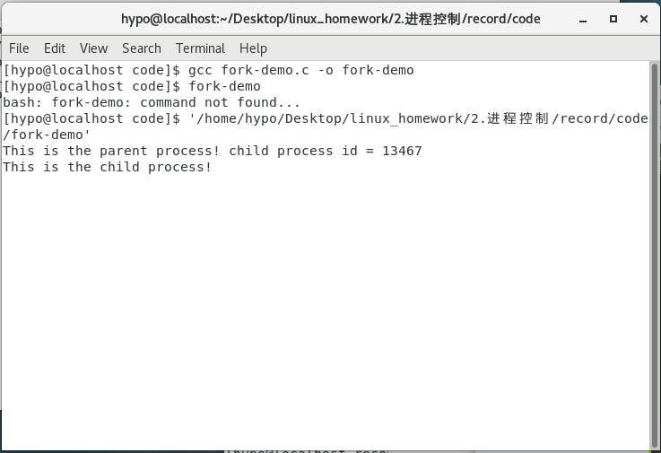
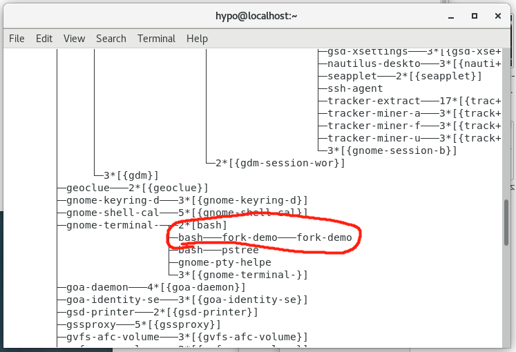
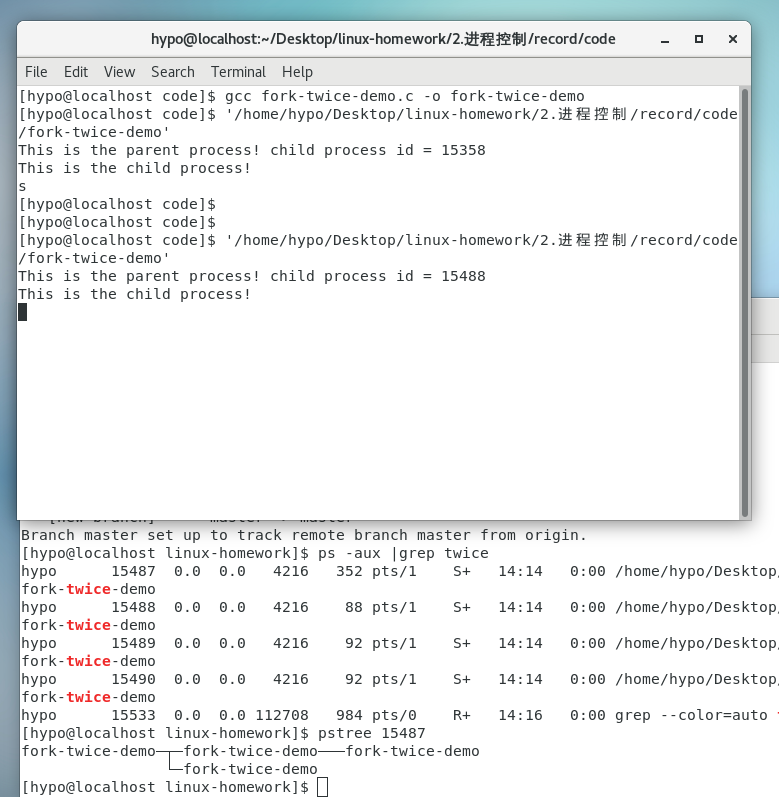
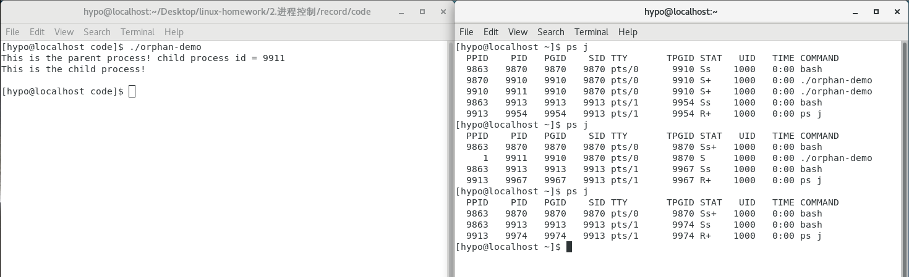
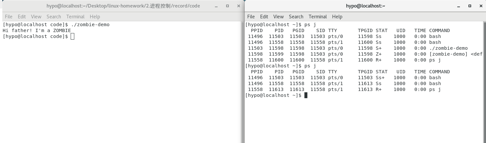

###  2-1 察看HelloWorld-gechar 的三个进程<br>
```bash
ps -aux |grep HelloWorld
```
3个进程的PIsssD分别是26608 26649 26689<br>

### 2-2 屏显 HelloWorld 可执行文件信息<br>
```bash
file HelloWorld
```

x86-64 平台上的ELF 格式可执行文件。
一种用于二进制文件、可执行文件、目标代码、共享库和核心转储格式文件。
ELF文件由4部分组成，分别是ELF头（ELF header）、程序头表（Program header table）、节（Section）和节头表（Section header table）。
由于ELF 文件内部包含了足够的信息，操作系统可以根据ELF 可执行文件创建出进程映像，进程映像以及各种管理数据结构构成了进程实体，另外进程还可能向系统申请各种资源——共同组成了进程实体的全部内涵。进程实体被调度运行就构成了进程的活动，如果系统中有多个活动的进程，那么它们各自有独立的进程空间（各自独立地使用自己的0~0xFFFFFFFF 虚存空间）。<br>
在Linux 中进程PCB 是task_struct 结构体，<br>

### 进程间组织关系<br>
Linux 系统中所有进程通过进程控制块PCB（struct task_struct）形成多种组织关系。根据
进程创建过程可以有亲缘关系，通过进程间的父子关系组织成一个进程树<br>
一个进程通过创建一个子进程则形成父子关系，如果创建多个子进程，那么这些新创建的
进程间属于兄弟关系<br>
### 2-3 pstree 输出

### 2-4 查看会话、进程组和控制终端的例子

### PPID(PPID，Parent PID)   PID(进程ID)   PGID(Process Group ID 进程组 ID号)    SID(Session ID 会话ID)  TTY  TPGID(tty process group ID for the process group leader) STAT()   UID   TIME  COMMAND<br>
STAT:D 无法中断的休眠状态（通常 IO 的进程）；R 正在运行可中在队列中可过行的；S 处于休眠状态；T 停止或被追踪；W 进入内存交换（从内核2.6开始无效）；X 死掉的进程（从来没见过）；Z 僵尸进程；+ 位于后台的进程组<br>
“会话/进程组/线程组”几个概念呈现层级关系，Linux 系统中可以有多个会话（session），
每个会话可以包含多个进程组（process group），每个进程组可以包含多个进程，每个进程构
成一个线程组——一个线程组由一个进程内的一个或多个线程组成，这些对象都有各自的ID。会话是从用户登录系统到退出前的全部活动，不同帐户的登录属于不同会话，而同一帐户的多次登录也构成不同的会话。而进程组主要出于作业控制的目的，有些shell 没有作用控制能力，就将整个会话的所有进程构成一个进程组。
### 2-5 创建进程的命令
```bash
chmod a+x shell-script
shell-script
```

第一行用于指出该脚本需要用/usr/bin/bash 来解
释执行，第二行shell 内部命令echo 用来显示，第三行HelloWorld 是外部命令（磁盘上的可执
行文件）。
### 2-6 通过ps 查找进程的PID
1.查找进程的PID<br>
2.kill PID <br>
```bash
ps -ef |grep HelloWorld-getchar
```

### 2-7 fork-demo 的输出

fork 函数被成功调用后将按照父进程的样子复制出一个完全相同的子进程。父进程fork()
函数结束时的返回值是子进程的PID 编号。新创建的子进程则也是从fork()返回处开始执行，
但不同的是它获得的返回值是0。也就是说父子进程执行上几乎相同，<br>
* 唯一区别是子进程中返回0 值而父进程中返回子进程PID。<br>
* 如果fork()出错则只有父进程获得返回值-1 而子进程未能创建。<br>
### 2-8 fork-demo 的输出

### 2-9 fork-twice-demo 执行后的 输出

### 孤儿进程和僵尸进程
（1） 孤儿进程：一个父进程退出，而它的一个或多个子进程还在运行，那么那些子进程将成为孤儿进程。孤儿进程将被init 进程（进程号为1）所收养，并由init 进程对它们完成状态收集工作。
（2） 僵尸进程：一个子进程在其父进程还没有调用wait()或waitpid()的情况下退出。这个子进程就是僵尸进程。
	子进程结束后大部分资源都将直接回收，但是还将在PCB（struct task_struct 和内核堆栈）中记录一些退出时的状态等信息，这些信息供父进程检查后才能销毁回收。因此，僵尸进程因相应的数据没有父进程处理并回收，将会导致资源浪费，而孤儿则不会有这样的问题。

* 孤儿进程

* 僵尸进程
