#### 3-1 /proc/cpuinfo 信息
```bash
cat /proc/cpuinfo
```
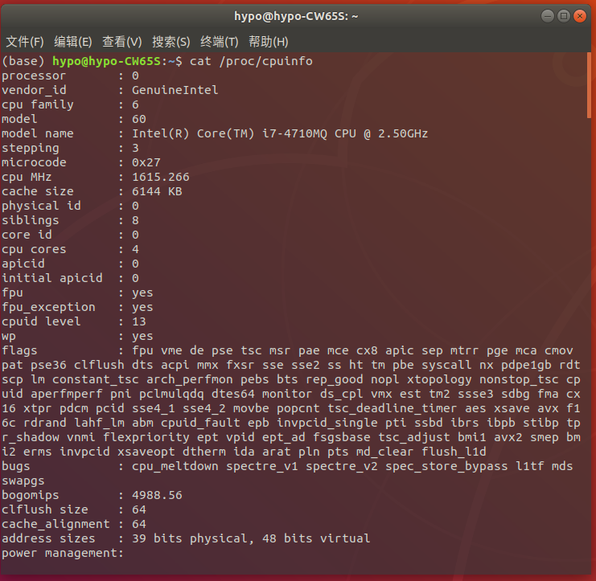
CPU型号为Intel(R) Core(TM) i7-4710MQ CPU @ 2.50GHz,拥有四核心八线程
#### 3-2 top 命令的输出
```bash
top
```
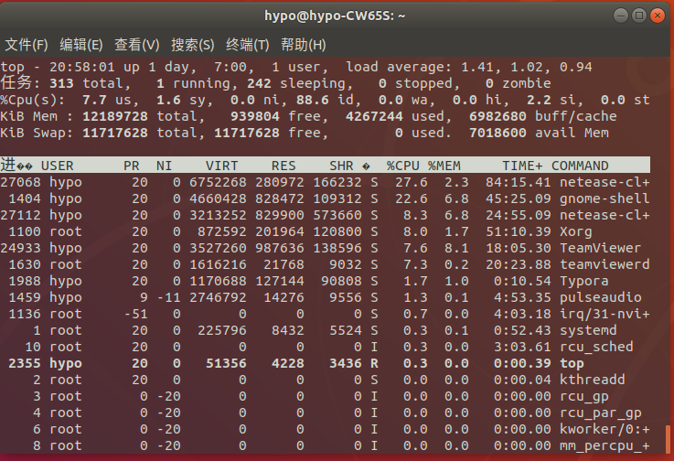
其中 7.7 us 表示 7.7%的时间用于运行用户空间的代码,相应地有 sy 对应运行内核代码占用 CPU 时间的百分比、ni 表示低优先级用户态代码占用 CPU时间的百分比、id 表示空闲(运行 idle 任务进程)CPU 时间的百分比、wa 表示 IO 等待占用CPU 时间的百分比、hi 表示硬件中断(Hardware IRQ)占用 CPU 时间的百分比、si 表示软中断(Software Interrupts)占用 CPU 时间的百分比以及和虚拟化有关的 st(steal time)占用 CPU时间的百分比。
#### 3-3 top 命令的输出(展开 CPU 利用率)
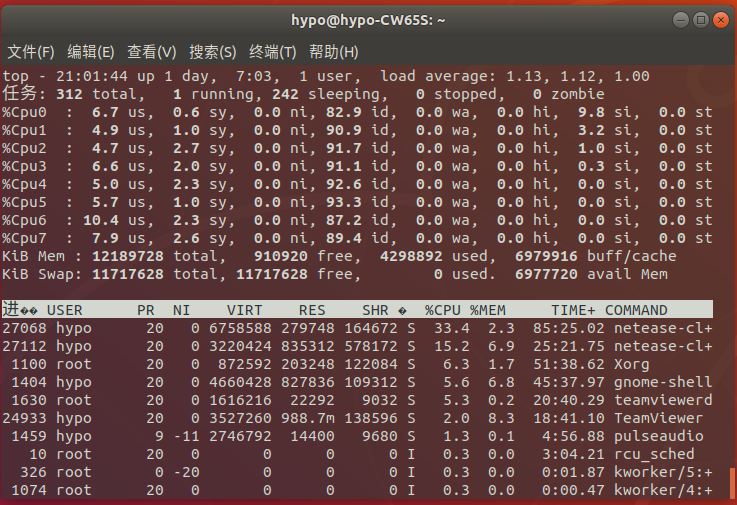
#### 3-4&3-5 全系统的调度统计
```bash
cat /proc/sched_debug
cat /proc/schedstat
```
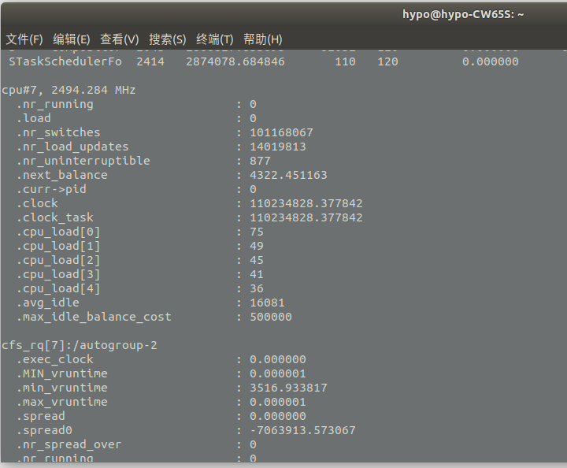
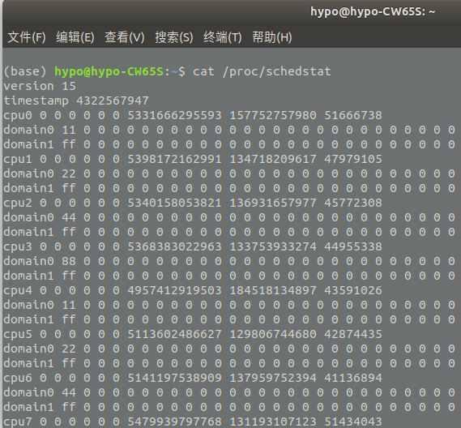
#### 3-6 ps –aux 查看进程状态
```bash
ps -aux
```
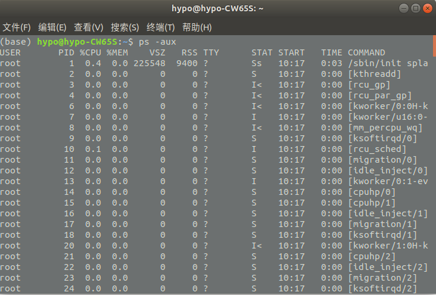
* R:TASK_RUNNING  可执行状态,包括就绪和正在 CPU 上执行
* S:TASK_INTERRUPTIBLE   可中断的睡眠状态,也是操作系统课程中所谓的阻塞状态
* D:TASK_UNINTERRUPTIBLE 不可中断的睡眠状态
* T:TASK_STOPPED 或 TASK_TRACED 暂停状态或跟踪状态
* Z:TASK_DEAD(-EXIT_ZOMBIE) 退出状态,且成为僵尸进程
* X:TASK_DEAD(-EXIT_DEAD)  退出状态,且进程即将被销毁
#### 3-7&3-8 就绪与阻塞
3-7 HelloWorld-loop-getchar 的运行输出
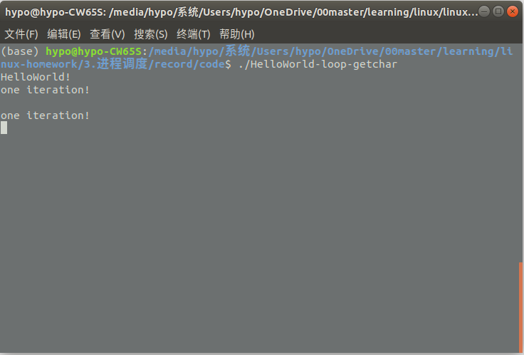<br>
3-8 用 ps 观察 HelloWorld-loop-getchar 进程调度状态变化
```bash
ps aux|grep HelloWorld-loop-getchar
```
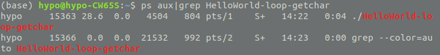

#### 3-9&3-10 进程的调度统计
```bash
cat /proc/15366/status
```
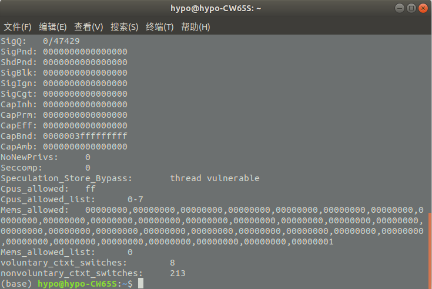
进程主动切换的次数8,进程主动切换的次数213<br>

```bash
cat /proc/15363/stat
```
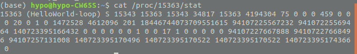

#### 3-11&3-12&3-13&3-14普通进程的 CFS 调度
* nice 命令可以用-xx 给出调整的数值(降低优先级 xx),也可以用“-n xx”方式直接设定 NICE 值(-
20~19)
* taskset -c 0　在命令前加上这条语句可以绑定进程运行在制定CPU<br>
3-11 执行 Run-NICE.sh 脚本并用 ps –a 查看
<br>

3-12 用 top 观察优先权不同的两个进程
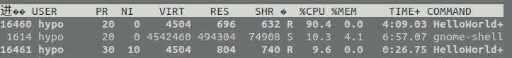
16460 号进程占用了 CPU 的 90.4%的时间,16461 号进程仅占用了 CPU 的 9.6%的时间。<br>

3-13 /proc/PID/sched
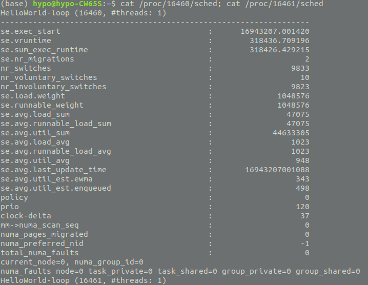
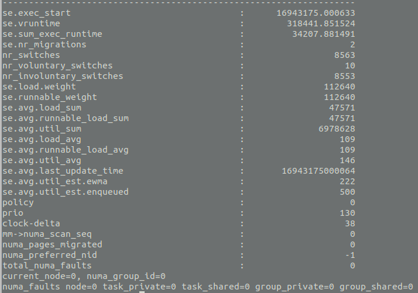<br>
3-14 /proc/PID/schedstat
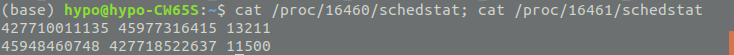

#### 3-15&3-16创建实时进程
* 以 root 身份运行 RT-process-demo 进程,如果以普通用户运行 RT-process-demo 则会报告不允许创建实时进程。<br>

3-15 用 ps –al 观察 RT-process-demo 的四个观测点


<br>
3-16 用/proc/PID/sched 观察 RT-process-demo 的四个观测点
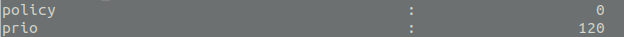<br>

<br>

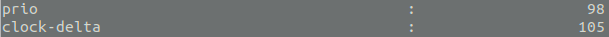<br>

<br>

```bash
sudo taskset -c 0 ./RR-FIFO.sh
```
经过多次测试发现实验结果无法在ubuntu18.04 多核处理(非虚拟机)器下复现
