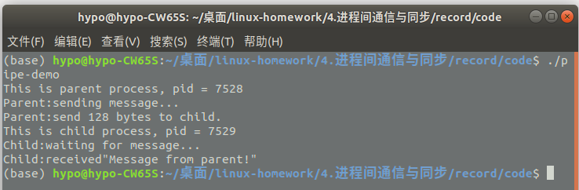
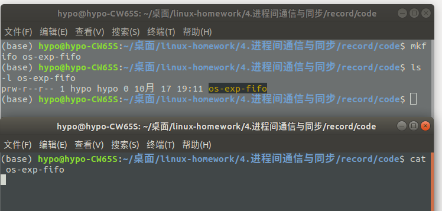
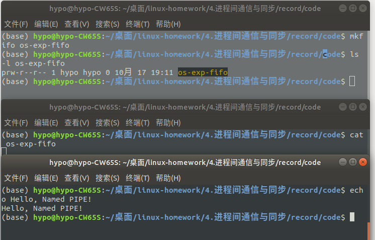
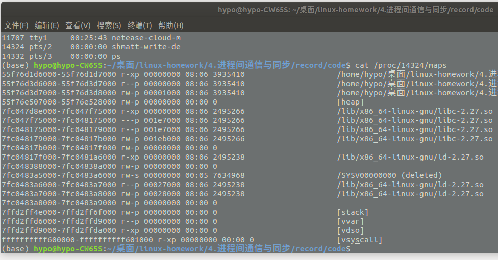
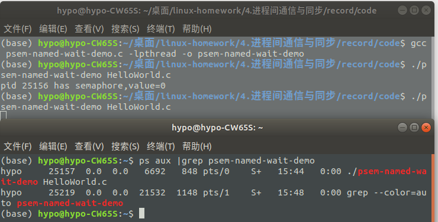
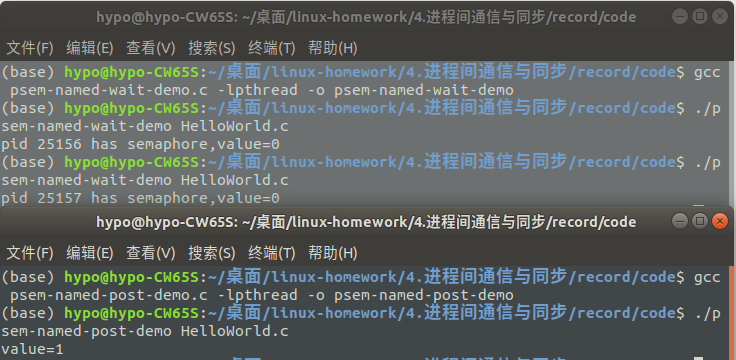
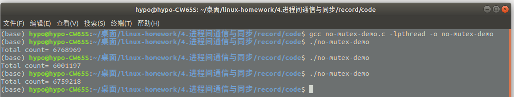
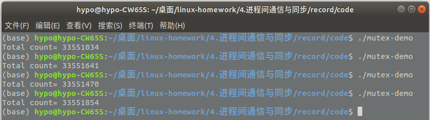

### 4-1 无名管道
* 管道(pipe),或称无名管道,是所有 Unix 都提供的一种进程间通信机制。
* Unix 命令中使用“|”来连接两个命令时使用的就是管道,例如“ls | more”
* 无名管道有一个主要缺点,只能通过父子进程之间(及其后代)使用文件描述符的继承来访问,无法在任意的进程之间使用。

屏显 4-1 pipe-demo 的输出


### 4-2&4-3&4-4  命名管道(FIFO)
* FIFO 就是无名管道的升级版——有可访问的磁盘索引节点,即 FIFO 文件将出现在目录树中(不像无名管道那样只存在于 pipefs 特殊文件系统中)

4-2 mkfifo 创建命名管道
4-3 用 cat 尝试读取空的管道文件(阻塞)


4-4 用 echo 向管道写入数据(cat 被唤醒并显示管道文件的内容)


### System V IPC
System V IPC 指的是 AT&T 在 System V.2 发行版中引入的三种进程间通信工具:
* (1)信号量,用来管理对共享资源的访问
* (2)共享内存,用来高效地实现进程间的数据共享
* (3)消息队列,用来实现进程间数据的传递。
### ipcs
* 在 Linux 中执行 ipcs 命令可以查看到当前系统中所有的 System V IPC 对象
*  ipcs -a 是默认的输出全部信息、ipcs -m 显示共享内存的信息、ipcs -q 显示消息队列的信息、ipcs -s 显示信号量集的信息。另外用还有一些格式控制的参数,–t 将会输出带时间信息、-p 将输出进程 PID 信息、-c 将输出创建者/拥有者的 PID、-l 输出相关的限制条件。例如用 ipcs -ql 将显示消息队列的限制条件
```bash
ipcs
--------- 消息队列 -----------
键        msqid      拥有者  权限     已用字节数 消息      

------------ 共享内存段 --------------
键        shmid      拥有者  权限     字节     连接数  状态      
0x00000000 65536      hypo       600        524288     2          目标       
0x00000000 229377     hypo       600        134217728  2          目标       
.................................

--------- 信号量数组 -----------
键        semid      拥有者  权限     nsems   
```
```bash
ipcs -ql

---------- 消息限制 -----------
系统最大队列数量 = 32000
最大消息尺寸 (字节) = 8192
默认的队列最大尺寸 (字节) = 16384
```
### 4-5 消息队列
屏显 4-5 msgtool 的执行结果
```bash
(base) $ ./msgtool s 1 Hello,my_msq_queue!
Sending a message 
(base)$ ipcs -q

--------- 消息队列 -----------
键        msqid      拥有者  权限     已用字节数 消息      
0x6d060ca4 0          hypo       660        20           1           

(base) $ ./msgtool r 1
Reading a message 
Type: 1 Text: Hello,my_msq_queue!
(base)$ ipcs -q

--------- 消息队列 -----------
键        msqid      拥有者  权限     已用字节数 消息      
0x6d060ca4 0          hypo       660        0            0           

```
### 4-6 ~ 4-10共享内存
屏显 4-6 shmget-demo 的输出
```bash
$./shmget-demo
Successfully created segment : 7634968
------------ 共享内存段 --------------
键        shmid      拥有者  权限     字节     连接数  状态      

0x00000000 7241751    hypo       600        524288     2          目标       
0x00000000 7634968    hypo       666        4096       0                 

Successfully created segment : 7438361 
```
屏显 4-7 shmatt-write-demo 运行时的输出(1)
```bash
$./shmatt-write-demo 7634968
 segment attached at 0x7f24a55f6000
 
------------ 共享内存段 --------------
键        shmid      拥有者  权限     字节shmatt-write-demo 映射共享内存时的进程布局

击键回车后 shmat-write-demo 将解除共享内存的映射,此时 ipcs –m 显示对应的共享内存区没有人使用(nattch 列为 0)

屏显 4-9 shmatt-demo 运行时的输出(2)


$. ipcs -m
​
------------ 共享内存段 --------------
键        shmid      拥有者  权限     字节     连接数  状态      
​
0x00000000 7667735    hypo       600        524288     2          目标       
0x00000000 7634968    hypo       666        4096       0                       
​
屏显 4-10 shmatt-read-demo 的部分输出


$ ./shmatt-read-demo 7634968
 segment attached at 0x7f19a5aee000
​
------------ 共享内存段 --------------
键        shmid      拥有者  权限     字节     连接数  状态      
0x00000000 7634968    hypo       666        4096       1                       
 
The string in SHM is :Hello shared memory!
虽然创建该共享内存的进程已经结束了,可是 shmatt-read-demo 映射 ID 为的共享内存后,仍读出了原来写入的字符串,如所示。     连接数  状态      
0x00000000 7634968    hypo       666        4096       1                                
0x00000000 6881306    hypo       600        2738960    2          目标    
```
屏显 4-8 shmatt-write-demo 映射共享内存时的进程布局

击键回车后 shmat-write-demo 将解除共享内存的映射,此时 ipcs –m 显示对应的共享内存区没有人使用(nattch 列为 0)

屏显 4-9 shmatt-demo 运行时的输出(2)

```bash
$. ipcs -m

------------ 共享内存段 --------------
键        shmid      拥有者  权限     字节     连接数  状态      

0x00000000 7667735    hypo       600        524288     2          目标       
0x00000000 7634968    hypo       666        4096       0                       

```
屏显 4-10 shmatt-read-demo 的部分输出
```bash
$ ./shmatt-read-demo 7634968
 segment attached at 0x7f19a5aee000

------------ 共享内存段 --------------
键        shmid      拥有者  权限     字节     连接数  状态      
0x00000000 7634968    hypo       666        4096       1                       
 
The string in SHM is :Hello shared memory!
```
虽然创建该共享内存的进程已经结束了,可是 shmatt-read-demo 映射 ID 为的共享内存后,仍读出了原来写入的字符串,如所示。
### POSIX 有名信号量
屏显 4-11 psem-named-open-demo 的输出
```bash
$ gcc psem-named-open.c -lpthread -o psem-named-open
$ ./psem-named-open
please input a file name to act as the ID of the sem!
$ ./psem-named-open HelloWorld.c
```
屏显 4-12 ps 查看 psem-named-wait-demo 的运行状态


该信量进行 P 操作(增 1 操作),使得前面的 psem-named-wait-demo 进程从原来的阻塞状态唤醒并执行结束。
图 4-6 psem-named-post-demo 的运行输出(并唤醒阻塞的 psem-named-wait-demo 进程)


### POSIX 无名信号量
POSIX 无名信号量适用于线程间通信,如果无名信号量要用于进程间同步,信号量要放在共享内存中(只要该共享内存区存在,该信号灯就可用)。
### 互斥量
屏显 4-13 mutex-demo 的输出


屏显 4-14 mutex-demo 的输出
(在新版本gcc中mutex m;应改为pthread_mutex_t m;)


