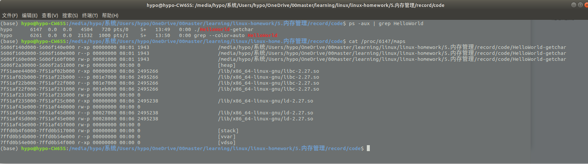
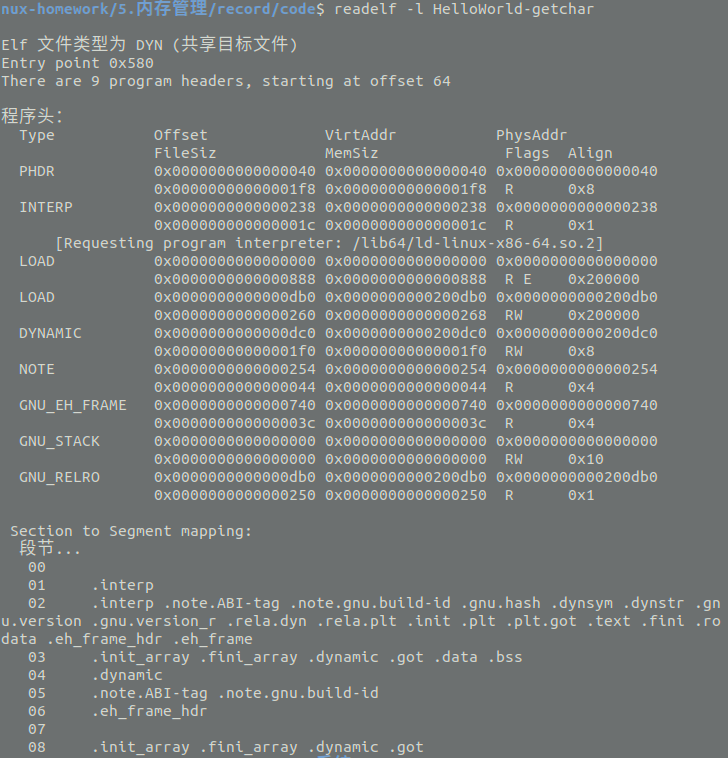
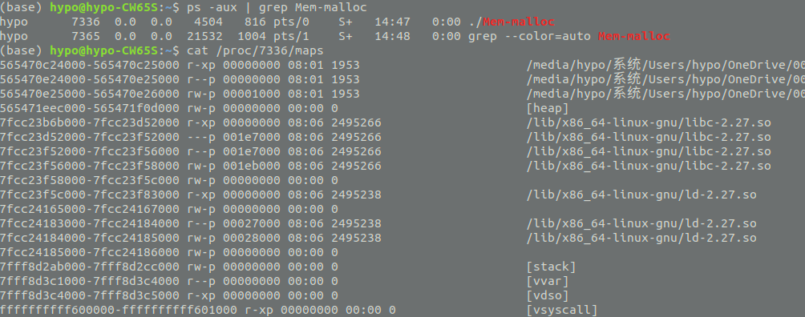
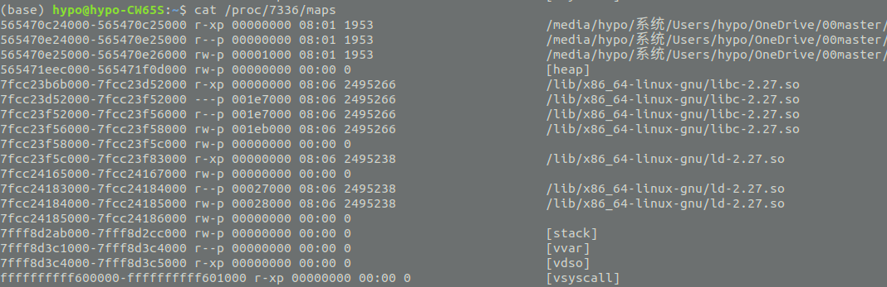
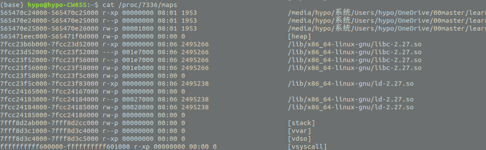
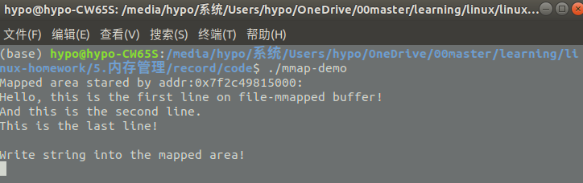
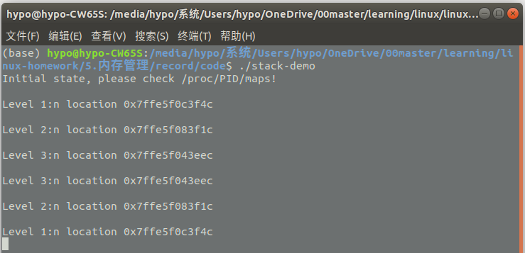
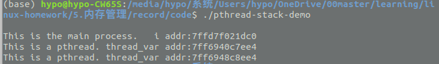

# 实验记录
### 5.1.1. 进程映像
* 屏显 5-1 HelloWorld-getchar 的内存布局

每一行是一个具有特定属性的连续的内存区,每行的开头是该区间的地址范围。后面的 rxwp 分别代表:r=可读、w=可写、x=可执行、s=共享以及 p=私有,再后面一列的数字用于表示文件映射内存对应于文件中的起始位置(如果不是文件映射区则为 0)。
* 屏显 5-2 ELF 可执行文件的节
```bash
(base) hypo@hypo-CW65S$ readelf -S HelloWorld-getchar
There are 29 section headers, starting at offset 0x1968:
节头：
  [号] 名称              类型             地址              偏移量
       大小              全体大小          旗标   链接   信息   对齐
  [ 0]                   NULL             0000000000000000  00000000
       0000000000000000  0000000000000000           0     0     0
......
  [14] .text             PROGBITS         0000000000000580  00000580
       00000000000001a2  0000000000000000  AX       0     0     16
  [16] .rodata           PROGBITS         0000000000000730  00000730
       0000000000000010  0000000000000000   A       0     0     4
......
  [23] .data             PROGBITS         0000000000201000  00001000
       0000000000000010  0000000000000000  WA       0     0     8
  [24] .bss              NOBITS           0000000000201010  00001010
       0000000000000008  0000000000000000  WA       0     0     1
......
Key to Flags:
  W (write), A (alloc), X (execute), M (merge), S (strings), I (info),
  L (link order), O (extra OS processing required), G (group), T (TLS),
  C (compressed), x (unknown), o (OS specific), E (exclude),
  l (large), p (processor specific)
```
1.其中编号为 13 的.text 节是 Helloworld-getchar.c 编译后的 x86-64 平台上的可执行二进制代码
2.编号为 23 的.data是用于保存已初始化的全局变量和局部静态变量
3.编号为 16 的.rodata 是编译器识别出来的只读数据

* 屏显 5-3 ELF 段以及段-节映射关系
  ELF 可执行文件的程序头(Program Header)里面描述了与装入过程有关的信息,告知操作系统如何将它们映射到虚拟空间中。我们用 readelf -l 命令查看这些信息
  
  02 段所对应的节装入到虚存空间VirtAddr=0x0000000000000000 的区域中,而且此虚存空间区域的属性需要设置为“R E”——表示只读和可执行(包括了代码段和只读数据)。
03 段所对应的节装入到虚存空间VirtAddr=0x0000000000200db0 的区域内,并且其属性 Flags 为“RW”表示可读可写,但不可执行(因为它们都是数据)

### 5.1.2  堆区
在堆区分配内存可以用 malloc()等函数来完成,用完后需要用 free()进行释放。malloc()函数的原型如下:
```c
#include <malloc.h> 
void *malloc(unsigned int num_bytes);
```
该函数将分配长度为 num_bytes 字节的内存块,如果分配成功则返回指向被分配内存的指针,否则返回空指针 NULL。当内存不再使用时,应使用 free()函数将内存块释放。
* 屏显 5-4 执行 malloc()之前的内存布局

* 屏显 5-5 执行 5 次 malloc()之后的内存布局

* 屏显 5-6 执行 2 次 free()之后的内存布局

观察[heap]区，由于将 5 次分配的内存释放掉第 2/4 次分配的空间,原来的空间将被分割成多段,但是 Linux 操作系统似乎并没有将这两段区间回收。
原因：1)malloc()作为 C 语言库对进程用户空间的管理和 2)操作系统对进程用户空间管理两级机制的问题了。C 语言库向操作系统申请可用的合法空间,并预留给变量或缓冲区来使用。然后用户进程通过 free()回收则代表这些区间不再用于原来的用途,但仍可能是合法空间(还能访问到原来该空间上的数据)。除非 C 语言库决定将某些内存区间向操作系统申请释放掉,这些区间才会称为非法空间。
但是如果分配的空间较大,malloc()回收空间时会向操作系统申请释放相应的空间。
* 屏显 5-7 Mem-malloc-8M 运行后的进程布局
```bash
564c4c575000-564c4c596000 rw-p 00000000 00:00 0                          [heap]
.....

564c4c575000-564c4c596000 rw-p 00000000 00:00 0                          [heap]
7fcd72fa8000-7fcd757ad000 rw-p 00000000 00:00 0 
......

564c4c575000-564c4c596000 rw-p 00000000 00:00 0                          [heap]
7fcd72fa8000-7fcd737a9000 rw-p 00000000 00:00 0 
7fcd73faa000-7fcd747ab000 rw-p 00000000 00:00 0 
7fcd74fac000-7fcd757ad000 rw-p 00000000 00:00 0 
```
* 表 5-1 /proc/PID/status 中关于 VM 的项
```bash
# 初始状态
VmPeak:	    4504 kB
VmSize:	    4504 kB
VmData:	     176 kB
.....

#分配 5 个 8MB 空间
VmPeak:	   45484 kB
VmSize:	   45484 kB
VmData:	   41156 kB
......

#释放 2 个 8MB
VmPeak:	   45484 kB
VmSize:	   29092 kB
VmData:	   24764 kB
```
VmSize:虚存总量 的变化——从少到多然后再下降
VmPeak:记录着该进程历史上曾获得的最高虚存总量
VmData:数据区 

### 5.1.3  文件映射区
mmap()可以完成内存映射文件的操作
解除映射的函数为 munmap()
```c
#include <sys/mman.h>
void *mmap(void *start, size_t length, int prot, int flags, int fd, off_t offset);
int munmap(void *start, size_t length);
```
* 屏显 5-8 mmap-demo 的输出

* 屏显 5-9 /proc/PID/maps 中的文件映射信息
```bash
hypo@hypo-CW65S:$ ps -aux | grep mmap
hypo      3076  0.0  0.0   4508   740 pts/0    S+   20:52   0:00 ./mmap-demo
hypo      3115  0.0  0.0  21532  1012 pts/1    S+   20:53   0:00 grep --color=auto mmap
hypo@hypo-CW65S:$ cat /proc/3076/maps
.....
7f2c49815000-7f2c49816000 rw-s 00000000 08:01 615399              file-mapped.txt
......
(hypo@hypo-CW65S:$ ls -i file-mapped.txt
615399 file-mapped.txt
```
* 屏显 5-10 被修改后的 file-mmaped.txt 文件内容
```bash
hypo@hypo-CW65S:$ cat file-mapped.txt
Modification in the memory---------e-mmapped buffer!
And this is the second line.
This is the last line!
```

### 5.1.4 栈区
#### 主线程栈区
每一次函数调用所扩展出来的堆栈空间被称为一个栈帧,因此随着函数的调用层次加深,堆栈的栈顶会随着栈帧的叠加而逐步扩展。函数调用时的返回地址、栈帧指针和函数内部的局部数据(也称堆栈变量、自动变量)都保存在堆栈中的某个栈帧结构上。
* 屏显 5-11 stack-demo 运行输出


* 屏显 5-12 /proc/PID/maps 展示的堆栈变化
```bash
#begin
7ffe5f0e5000-7ffe5f106000 rw-p 00000000 00:00 0                          [stack]
#第 1 层调用
7ffe5f0c3000-7ffe5f106000 rw-p 00000000 00:00 0                          [stack]
#第 2层调用
7ffe5f083000-7ffe5f106000 rw-p 00000000 00:00 0                          [stack]
#第 3层调用
7ffe5f043000-7ffe5f106000 rw-p 00000000 00:00 0                          [stack]
#第 3层调用
7ffe5f043000-7ffe5f106000 rw-p 00000000 00:00 0                          [stack]
#第 2层调用
7ffe5f043000-7ffe5f106000 rw-p 00000000 00:00 0                          [stack]
#第 1 层调用
7ffe5f043000-7ffe5f106000 rw-p 00000000 00:00 0                          [stack]
```
#### 线程栈
* 屏显 5-13 pthread-stack-demo 的运行结果


* 屏显 5-14 创建线程后的内存布局
```bash
#线 程 创 建 前
7ff695103000-7ff695104000 rw-p 00000000 00:00 0 
7ffd7f003000-7ffd7f024000 rw-p 00000000 00:00 0                          [stack]
#线 程 创 建 后
7ff695103000-7ff695104000 rw-p 00000000 00:00 0 
7ffd7f003000-7ffd7f024000 rw-p 00000000 00:00 0                          [stack]
#在ubuntu18.04中并没有观察到出现两个stack
```
# 课后作业
#### 1.设计编写以下程序,着重考虑其通信和同步问题:

