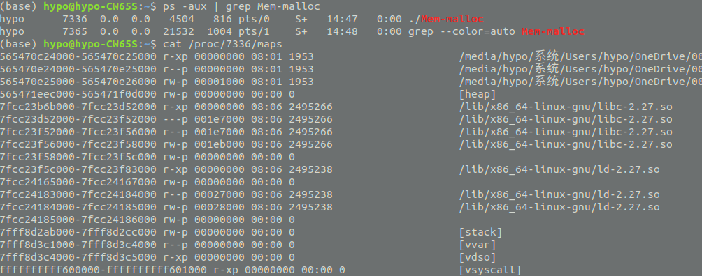
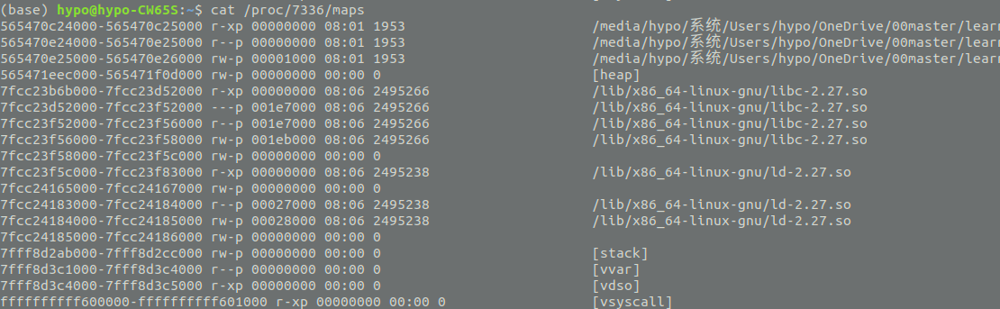

[toc]
## 实验目的
* 通过编程实践、观察，学习内存管理的方式。
## 实验环境
* 硬件
1.Intel(R) Xeon(R) Bronze 3104 CPU @ 1.70GHz
2.DDR4 16G
* 软件
1.CentOS 7
2.ubuntu 18.04
3.VMware Workstation Pro 15
##  实验记录
### 5.1.1 进程映像
* 屏显 5-1 HelloWorld-getchar 的内存布局

每一行是一个具有特定属性的连续的内存区,每行的开头是该区间的地址范围。后面的 rxwp 分别代表:r=可读、w=可写、x=可执行、s=共享以及 p=私有,再后面一列的数字用于表示文件映射内存对应于文件中的起始位置(如果不是文件映射区则为 0)。
* 屏显 5-2 ELF 可执行文件的节
```bash
(base) hypo@hypo-CW65S$ readelf -S HelloWorld-getchar
There are 29 section headers, starting at offset 0x1968:
节头：
  [号] 名称              类型             地址              偏移量
       大小              全体大小          旗标   链接   信息   对齐
  [ 0]                   NULL             0000000000000000  00000000
       0000000000000000  0000000000000000           0     0     0
......
  [14] .text             PROGBITS         0000000000000580  00000580
       00000000000001a2  0000000000000000  AX       0     0     16
  [16] .rodata           PROGBITS         0000000000000730  00000730
       0000000000000010  0000000000000000   A       0     0     4
......
  [23] .data             PROGBITS         0000000000201000  00001000
       0000000000000010  0000000000000000  WA       0     0     8
  [24] .bss              NOBITS           0000000000201010  00001010
       0000000000000008  0000000000000000  WA       0     0     1
......
Key to Flags:
  W (write), A (alloc), X (execute), M (merge), S (strings), I (info),
  L (link order), O (extra OS processing required), G (group), T (TLS),
  C (compressed), x (unknown), o (OS specific), E (exclude),
  l (large), p (processor specific)
```
1.其中编号为 13 的.text 节是 Helloworld-getchar.c 编译后的 x86-64 平台上的可执行二进制代码
2.编号为 23 的.data是用于保存已初始化的全局变量和局部静态变量
3.编号为 16 的.rodata 是编译器识别出来的只读数据

* 屏显 5-3 ELF 段以及段-节映射关系
  ELF 可执行文件的程序头(Program Header)里面描述了与装入过程有关的信息,告知操作系统如何将它们映射到虚拟空间中。我们用 readelf -l 命令查看这些信息
  
  02 段所对应的节装入到虚存空间VirtAddr=0x0000000000000000 的区域中,而且此虚存空间区域的属性需要设置为“R E”——表示只读和可执行(包括了代码段和只读数据)。
03 段所对应的节装入到虚存空间VirtAddr=0x0000000000200db0 的区域内,并且其属性 Flags 为“RW”表示可读可写,但不可执行(因为它们都是数据)

### 5.1.2  堆区
在堆区分配内存可以用 malloc()等函数来完成,用完后需要用 free()进行释放。malloc()函数的原型如下:
```c
#include <malloc.h> 
void *malloc(unsigned int num_bytes);
```
该函数将分配长度为 num_bytes 字节的内存块,如果分配成功则返回指向被分配内存的指针,否则返回空指针 NULL。当内存不再使用时,应使用 free()函数将内存块释放。
* 屏显 5-4 执行 malloc()之前的内存布局

* 屏显 5-5 执行 5 次 malloc()之后的内存布局

* 屏显 5-6 执行 2 次 free()之后的内存布局

观察[heap]区，由于将 5 次分配的内存释放掉第 2/4 次分配的空间,原来的空间将被分割成多段,但是 Linux 操作系统似乎并没有将这两段区间回收。
原因：1)malloc()作为 C 语言库对进程用户空间的管理和 2)操作系统对进程用户空间管理两级机制的问题了。C 语言库向操作系统申请可用的合法空间,并预留给变量或缓冲区来使用。然后用户进程通过 free()回收则代表这些区间不再用于原来的用途,但仍可能是合法空间(还能访问到原来该空间上的数据)。除非 C 语言库决定将某些内存区间向操作系统申请释放掉,这些区间才会称为非法空间。
但是如果分配的空间较大,malloc()回收空间时会向操作系统申请释放相应的空间。
* 屏显 5-7 Mem-malloc-8M 运行后的进程布局
```bash
564c4c575000-564c4c596000 rw-p 00000000 00:00 0                          [heap]
.....

564c4c575000-564c4c596000 rw-p 00000000 00:00 0                          [heap]
7fcd72fa8000-7fcd757ad000 rw-p 00000000 00:00 0 
......

564c4c575000-564c4c596000 rw-p 00000000 00:00 0                          [heap]
7fcd72fa8000-7fcd737a9000 rw-p 00000000 00:00 0 
7fcd73faa000-7fcd747ab000 rw-p 00000000 00:00 0 
7fcd74fac000-7fcd757ad000 rw-p 00000000 00:00 0 
```
* 表 5-1 /proc/PID/status 中关于 VM 的项
```bash
# 初始状态
VmPeak:	    4504 kB
VmSize:	    4504 kB
VmData:	     176 kB
.....

#分配 5 个 8MB 空间
VmPeak:	   45484 kB
VmSize:	   45484 kB
VmData:	   41156 kB
......

#释放 2 个 8MB
VmPeak:	   45484 kB
VmSize:	   29092 kB
VmData:	   24764 kB
```
VmSize:虚存总量 的变化——从少到多然后再下降
VmPeak:记录着该进程历史上曾获得的最高虚存总量
VmData:数据区 

### 5.1.3  文件映射区
mmap()可以完成内存映射文件的操作
解除映射的函数为 munmap()
```c
#include <sys/mman.h>
void *mmap(void *start, size_t length, int prot, int flags, int fd, off_t offset);
int munmap(void *start, size_t length);
```
* 屏显 5-8 mmap-demo 的输出

* 屏显 5-9 /proc/PID/maps 中的文件映射信息
```bash
hypo@hypo-CW65S:$ ps -aux | grep mmap
hypo      3076  0.0  0.0   4508   740 pts/0    S+   20:52   0:00 ./mmap-demo
hypo      3115  0.0  0.0  21532  1012 pts/1    S+   20:53   0:00 grep --color=auto mmap
hypo@hypo-CW65S:$ cat /proc/3076/maps
.....
7f2c49815000-7f2c49816000 rw-s 00000000 08:01 615399              file-mapped.txt
......
(hypo@hypo-CW65S:$ ls -i file-mapped.txt
615399 file-mapped.txt
```
* 屏显 5-10 被修改后的 file-mmaped.txt 文件内容
```bash
hypo@hypo-CW65S:$ cat file-mapped.txt
Modification in the memory---------e-mmapped buffer!
And this is the second line.
This is the last line!
```

### 5.1.4 栈区
#### 主线程栈区
每一次函数调用所扩展出来的堆栈空间被称为一个栈帧,因此随着函数的调用层次加深,堆栈的栈顶会随着栈帧的叠加而逐步扩展。函数调用时的返回地址、栈帧指针和函数内部的局部数据(也称堆栈变量、自动变量)都保存在堆栈中的某个栈帧结构上。
* 屏显 5-11 stack-demo 运行输出


* 屏显 5-12 /proc/PID/maps 展示的堆栈变化
```bash
#begin
7ffe5f0e5000-7ffe5f106000 rw-p 00000000 00:00 0                          [stack]
#第 1 层调用
7ffe5f0c3000-7ffe5f106000 rw-p 00000000 00:00 0                          [stack]
#第 2层调用
7ffe5f083000-7ffe5f106000 rw-p 00000000 00:00 0                          [stack]
#第 3层调用
7ffe5f043000-7ffe5f106000 rw-p 00000000 00:00 0                          [stack]
#第 3层调用
7ffe5f043000-7ffe5f106000 rw-p 00000000 00:00 0                          [stack]
#第 2层调用
7ffe5f043000-7ffe5f106000 rw-p 00000000 00:00 0                          [stack]
#第 1 层调用
7ffe5f043000-7ffe5f106000 rw-p 00000000 00:00 0                          [stack]
```
#### 线程栈
* 屏显 5-13 pthread-stack-demo 的运行结果


* 屏显 5-14 创建线程后的内存布局
```bash
#线 程 创 建 前
7ff695103000-7ff695104000 rw-p 00000000 00:00 0 
7ffd7f003000-7ffd7f024000 rw-p 00000000 00:00 0                          [stack]
#线 程 创 建 后
7ff695103000-7ff695104000 rw-p 00000000 00:00 0 
7ffd7f003000-7ffd7f024000 rw-p 00000000 00:00 0                          [stack]
#在ubuntu18.04中并没有观察到出现两个stack
```

### 5.1.4 访问任意进程的虚存
系统中有多个并发的进程存在,每个进程的虚存空间是独立的,除非映射了共享内存否则无法相互访问。进程通常只能通过/proc/self/mem 读取本进程内存的数据,但。 root 用户启动的进程可以不需要通过 ptrace 也能查看其他进程的内存空间,只要求被查看的进程处于不运行状态。
* 屏显 5-15 /proc/PID/mem 访问权限

* 屏显 5-16 show-var-addr 的输出

* 屏显 5-17 read-proc-mem 的输出

在16gb内存的ubuntu18.04操作系统下原代码运行失败，lseek64函数无法定位文件

### 5.1.6  虚存使用的物理页帧

```bash
cat /proc/PID/smaps #给出了 HelloWorld-gechar 进程各个虚存段使用物理页帧的情况
```
* 屏显 5-18 /proc/PID/smaps 的部分内容
```bash
hypo@hypo-CW65S:$ cat /proc/19361/smaps
55a323dda000-55a323ddb000 r-xp 00000000 08:01 615382                     HelloWorld-getchar
Size:                  4 kB

......

SwapPss:               0 kB
Locked:                0 kB
THPeligible:    0
VmFlags: rd ex 
```

### 5.2.1  分页机制
1.每个处理器核上运行的进程使用的是虚地址,每次取指令或数据都需要将程序虚地址转换成物理地址,这需要借助于页表信息来转换.

### 5.2.2  进程页表
由于ubuntu下无法安装kernel-debuginfo,下面的内容将在CentOS7中实现
* 屏显 5-19 show-virt-addr 的输出
```bash
[hypo@localhost code]$ ./show-virt-addr
Hello world!
 @ 0x400630
```


译后运行 show-virt-addr,打印出“Hello world!”字符串的虚地址 0x561a250f1754
* 屏显 5-20 crash 启动信息

```bash
[root@localhost code]# crash

crash 7.2.3-8.el7
Copyright (C) 2002-2017  Red Hat, Inc.
Copyright (C) 2004, 2005, 2006, 2010  IBM Corporation
Copyright (C) 1999-2006  Hewlett-Packard Co
Copyright (C) 2005, 2006, 2011, 2012  Fujitsu Limited
Copyright (C) 2006, 2007  VA Linux Systems Japan K.K.
Copyright (C) 2005, 2011  NEC Corporation
Copyright (C) 1999, 2002, 2007  Silicon Graphics, Inc.
Copyright (C) 1999, 2000, 2001, 2002  Mission Critical Linux, Inc.
This program is free software, covered by the GNU General Public License,
and you are welcome to change it and/or distribute copies of it under
certain conditions.  Enter "help copying" to see the conditions.
This program has absolutely no warranty.  Enter "help warranty" for details.
 
GNU gdb (GDB) 7.6
Copyright (C) 2013 Free Software Foundation, Inc.
License GPLv3+: GNU GPL version 3 or later <http://gnu.org/licenses/gpl.html>
This is free software: you are free to change and redistribute it.
There is NO WARRANTY, to the extent permitted by law.  Type "show copying"
and "show warranty" for details.
This GDB was configured as "x86_64-unknown-linux-gnu"...

WARNING: kernel relocated [892MB]: patching 85605 gdb minimal_symbol values

      KERNEL: /usr/lib/debug/lib/modules/3.10.0-957.el7.x86_64/vmlinux 
    DUMPFILE: /dev/crash
        CPUS: 4
        DATE: Wed Nov 20 16:06:12 2019
      UPTIME: 01:13:52
LOAD AVERAGE: 0.15, 0.12, 0.17
       TASKS: 558
    NODENAME: localhost.localdomain
     RELEASE: 3.10.0-957.el7.x86_64
     VERSION: #1 SMP Thu Nov 8 23:39:32 UTC 2018
     MACHINE: x86_64  (2501 Mhz)
      MEMORY: 2 GB
         PID: 13115
     COMMAND: "crash"
        TASK: ffff98a87ea2a080  [THREAD_INFO: ffff98a84dd18000]
         CPU: 3
       STATE: TASK_RUNNING (ACTIVE)

crash> 

```
* 屏显 5-21 执行set 命令
```bash
crash> set 9301
    PID: 9301
COMMAND: "show-virt-addr"
   TASK: ffff9c8597f50000  [THREAD_INFO: ffff9c859472c000]
    CPU: 0
  STATE: TASK_INTERRUPTIBLE 
```

show-virt-addr 进程的PCB（task_struct）地址为0xffff9c8597f50000 
* 屏显 5-22 用px 命令查看task_struct->mm->pgd 页表起始地址
```bash
crash> px ((struct task_struct *)0xffff9c8597f50000)->mm->pgd
$1 = (pgd_t *) 0xffff9c858ec60000 #PGD 起点的虚地址处
```

可以看出页表起始地址位于0xffff9c858ec60000 的虚地址处

* 地址变换过程
在使用页表进行地址转换前，我们先对虚地址进行分析，然后再展示地址转换原理。由于本例是使用64 位系统，一个页4KB 只能保存512 项页表项（4096 字节/8 字节=512），虚拟地址菜用4 级分页（9bit + 9bit + 9bit + 9bit + 12bit）——对应于PGD 索引/偏移、PUD 索引/偏移、PMD 索引/偏移、PD 索引/偏移和页内偏移.

```bash
#各级索引/偏移值的计算过程如下：
1.PGD 中的索引/偏移： (0x400630)>>（9+ 9 + 9 + 12）) & 0x1ff = 0
2.PUD 中的索引/偏移： (0x400630)>>（9 + 9 + 12）) & 0x1ff = 0
3.PMD 中的索引/偏移： (0x400630)>>（9 + 12）) & 0x1ff = 0x2
4.PTE 中的索引/偏移： (0x400630)>>（12）) & 0x1ff = 0
```
* 屏显 5-23 PGD 第0 项的读入
```bash
crash> px (0xffff9c858ec60000-0xffff880000000000)
$2 = 0x14858ec60000  #PGD 起点的物理地址
crash> rd 0xffff9c858ec60000
ffff9c858ec60000:  8000000017e7b067                    g.......
crash> pte 8000000017e7b067 #用pte 命令对其解释也获得相同的物理页帧号
      PTE         PHYSICAL  FLAGS
8000000017e7b067  17e7b000  (PRESENT|RW|USER|ACCESSED|DIRTY|NX)
#px命令无法获得期望的结果
```


* 屏显 5-24 PUD 第0 项的读入
```bash
crash> rd -p 0x17e7b000
        17e7b000:  000000001e687067                    gph.....
```
获得PMD 的地址（物理页帧号0x1e687）
虚地址0x1e687067 在PMG 的索引/偏移量为0x02（相当于16 字节），因此用物理地址方式读入rd -p 0x1e687010
* 屏显 5-25 PMD 第0x2 项的读入
```bash
crash> rd -p 0x1e687010
        1e687010:  0000000017f40067                    g.......
```
此时获得物理页帧位于物理地址0x17f40000处
*屏显 5-26 PTE 第0 项的读入
```bash
crash> rd -p 0x17f40000
        17f40000:  000000001a6e1005                    ........
crash> pte 000000001a6e1005
PTE PHYSICAL FLAGS
1a6e1005 1a6e1000 (PRESENT|USER)
```
* 屏显 5-27 读入物理地址的内容
```bash
crash> rd -p 1a6e1630 2
1a6e1630: 6f77206f6c6c6548 7325000a21646c72 Hello world!..%s
```
### 5.3.1 页帧、节点、内存域
* 物理页帧
物理内存的分配使用、访问权限保护等管理都是以页帧为单位进行的。一个物理页帧的大小和一个虚存页的大小相等.进程用户空间使用的页帧根据是否被改写分为dirty 脏页和clean 干净页。干净的匿名页内容为全0，改写后变为脏页。如果需要回收改写后的匿名页帧，则需要将其内容换出到交换空间。干净的文件映射页（页缓存中的页）内容来自于文件的对应内容，改写后变为脏页。如果需要回收脏文件映射页，则通过回写重新变为干净页而可以另作他用。当进程修改了文件映射页里的数据时，该页就被内核标记为脏页，与磁盘数据产生不一致。内核将会在合适的时间把脏页的数据写到磁盘中去，以保持内存中的数据和磁盘中的数据是一致的，该操作称为文件同步操作。

*NUMA 与UMA
UMA 架构中只有一个节点，各个处理器核访问同一物理地址单元时是完全对等的，而NUMA 架构中，不同处理器核在访问同一内存区域时却可能会有速度上的差异。

* 屏显 5-28 一个UMA 系统上的/proc/zoneinfo

```bash
Node 0, zone      DMA   #DMA
  pages free     2053
        min      96
        low      120
        high     144
        scanned  0
        spanned  4095
        present  3997
        managed  3976
......

  inactive_ratio:    1
Node 0, zone    DMA32  #这里开始时DMA32 的ZONE
  pages free     47254

......

  all_unreclaimable: 0
  start_pfn:         4096  #zone DMA32 的第一个物理页帧号是4096
  inactive_ratio:    3

```
可以看出该系统只有1 个节点——node0，但是里面划分为两个内存域DMA 和DMA32——DMA 内存域从1 号页帧开始而DMA32 内存域从4096 号页帧开始。

### 5.3.2 空闲页帧管理——Buddy 系统
每个内存域中未使用的空闲页帧，都由zone-> free_area[]组织成多个链表，并由buddy 系统管理。

* 代码 5-9 free_arae (linux-3.13/include/linux/mmzone.h)
```c
struct free_area {
struct list_head free_list[MIGRATE_TYPES];
unsigned long nr_free;
};
//其中nr_free 是对当前链表上所有空闲页帧的计数。MIGRATE_TYPES 是页帧的迁移属性
```

* 屏显 5-30 UMA 系统上的buddy 信息


* 屏显 5-32 /proc/pagetypeinfo 中关于页帧迁移属性的信息
```
[hypo@localhost code]$ cat /proc/pagetypeinfo
Page block order: 9
Pages per block:  512

Free pages count per migrate type at order       0      1      2      3      4      5      6      7      8      9     10 
Node    0, zone      DMA, type    Unmovable      2      4      5      0      2      2      0      1      1      1      0 
Node    0, zone      DMA, type  Reclaimable      0      3      0      3      0      0      0      1      1      0      0 
Node    0, zone      DMA, type      Movable      5      1      0      1      1      1      1      1      1      0      0 
Node    0, zone      DMA, type      Reserve      0      0      0      0      0      0      0      0      0      0      0 
Node    0, zone      DMA, type          CMA      0      0      0      0      0      0      0      0      0      0      0 
Node    0, zone      DMA, type      Isolate      0      0      0      0      0      0      0      0      0      0      0 
Node    0, zone    DMA32, type    Unmovable    140     80     40     45     18      7      1      1      1      0      0 
Node    0, zone    DMA32, type  Reclaimable      1     55     23     35      6      2      1      0      0      0      0 
Node    0, zone    DMA32, type      Movable     24    146   1715    727    536    251     98     30     56      1      0 
Node    0, zone    DMA32, type      Reserve      0      0      0      0      0      0      0      0      0      0      0 
Node    0, zone    DMA32, type          CMA      0      0      0      0      0      0      0      0      0      0      0 
Node    0, zone    DMA32, type      Isolate      0      0      0      0      0      0      0      0      0      0      0 

Number of blocks type     Unmovable  Reclaimable      Movable      Reserve          CMA      Isolate 
Node 0, zone      DMA            3            1            4            0            0            0 
Node 0, zone    DMA32          110           20          886            0            0            0 

```
### 5.3.3 物理内存分配与回收
Linux 在/proc/meminfo 中记录了系统中全部物理页帧的使用情况
* 屏显 5-33 /proc/meminfo 信息
```bash
[hypo@localhost code]$ cat /proc/meminfo
MemTotal:        1863224 kB
MemFree:          218968 kB
MemAvailable:     481060 kB
Buffers:               0 kB
Cached:           593472 kB
SwapCached:          676 kB
Active:           866552 kB
Inactive:         519076 kB
Active(anon):     677668 kB
Inactive(anon):   334056 kB
Active(file):     188884 kB
Inactive(file):   185020 kB
Unevictable:           0 kB
Mlocked:               0 kB
SwapTotal:       2097148 kB
SwapFree:        2091252 kB
Dirty:                16 kB
Writeback:             0 kB
AnonPages:        791500 kB
Mapped:           342916 kB
Shmem:            219568 kB
Slab:              98952 kB
SReclaimable:      38556 kB
SUnreclaim:        60396 kB
KernelStack:        9984 kB
PageTables:        37444 kB
NFS_Unstable:          0 kB
Bounce:                0 kB
WritebackTmp:          0 kB
CommitLimit:     3028760 kB
Committed_AS:    4615408 kB
VmallocTotal:   34359738367 kB
VmallocUsed:      215280 kB
VmallocChunk:   34359277564 kB
HardwareCorrupted:     0 kB
AnonHugePages:    251904 kB
CmaTotal:              0 kB
CmaFree:               0 kB
HugePages_Total:       0
HugePages_Free:        0
HugePages_Rsvd:        0
HugePages_Surp:        0
Hugepagesize:       2048 kB
DirectMap4k:      135040 kB
DirectMap2M:     1961984 kB
DirectMap1G:           0 kB

```
* 屏显 5-34 free 命令的输出
```bash
#简单地了解系统中的页帧使用情况则可以用free命令
#第一行是物理内存使用统计量，分别是总量、已使用量、空闲量、用于共享内存的量、用于缓存的量以及可用的量
#另一行是交换空间的使用量
[hypo@localhost code]$ free
              total        used        free      shared  buff/cache   available
Mem:        1863224      952416      217520      220476      693288      479616
Swap:       2097148        5896     2091252
```

* 进程的页帧使用
```bash
#创建用于映射的文件
[hypo@localhost ~]$ dd if=/dev/zero of=/home/hypo/tempfile bs=1024 count=8192
8192+0 records in
8192+0 records out
8388608 bytes (8.4 MB) copied, 0.0679351 s, 123 MB/s
#代码 5-10 process-pages-demo.c 代码 运行情况
```
* 屏显 5-35 porcess-pages-demo 的内存布局
```bash
[hypo@localhost ~]$ cat /proc/9191/maps
......
7f19df573000-7f19e0574000 rw-p 00000000 00:00 0 
7f19e0574000-7f19e0d74000 rw-s 00000000 fd:00 472929                     /home/hypo/tempfile
......
```

* 表 5-3 /proc/PID/smaps 在各检查点上的数值
```bash
# checkpoint 1
# NONE
# checkpoint 2
7f19df573000-7f19e0574000 rw-p 00000000 00:00 0 
Size:              16388 kB
Rss:                   4 kB
Pss:                   4 kB
Shared_Clean:          0 kB
Shared_Dirty:          0 kB
Private_Clean:         0 kB
Private_Dirty:         4 kB
Referenced:            4 kB
Anonymous:             4 kB
AnonHugePages:         0 kB
Swap:                  0 kB
KernelPageSize:        4 kB
MMUPageSize:           4 kB
Locked:                0 kB
7f19e0574000-7f19e0d74000 rw-s 00000000 fd:00 472929    
Size:               8192 kB
Rss:                   0 kB
Pss:                   0 kB
Shared_Clean:          0 kB
Shared_Dirty:          0 kB
Private_Clean:         0 kB
Private_Dirty:         0 kB
Referenced:            0 kB
Anonymous:             0 kB
AnonHugePages:         0 kB
Swap:                  0 kB
KernelPageSize:        4 kB
MMUPageSize:           4 kB
Locked:                0 kB
# checkpoint 3
7f19df573000-7f19e0574000 rw-p 00000000 00:00 0 
Size:              16388 kB
Rss:                   4 kB
Pss:                   4 kB
Shared_Clean:          0 kB
Shared_Dirty:          0 kB
Private_Clean:         0 kB
Private_Dirty:         4 kB
Referenced:            4 kB
Anonymous:             4 kB
AnonHugePages:         0 kB
Swap:                  0 kB
KernelPageSize:        4 kB
MMUPageSize:           4 kB
Locked:                0 kB
ProtectionKey:         0
VmFlags: rd wr mr mp me ac sd 
7f19e0574000-7f19e0d74000 rw-s 00000000 fd:00 472929                     /home/hypo/tempfile
Size:               8192 kB
Rss:                4096 kB
Pss:                4096 kB
Shared_Clean:          0 kB
Shared_Dirty:          0 kB
Private_Clean:      4096 kB
Private_Dirty:         0 kB
Referenced:         4096 kB
Anonymous:             0 kB
AnonHugePages:         0 kB
Swap:                  0 kB
KernelPageSize:        4 kB
MMUPageSize:           4 kB
Locked:                0 kB
ProtectionKey:         0
VmFlags: rd wr sh mr mp me ms sd 
# checkpoint 4
7f19df573000-7f19e0574000 rw-p 00000000 00:00 0 
Size:              16388 kB
Rss:                4660 kB
Pss:                4660 kB
Shared_Clean:          0 kB
Shared_Dirty:          0 kB
Private_Clean:         0 kB
Private_Dirty:      4660 kB
Referenced:         4660 kB
Anonymous:          4660 kB
AnonHugePages:      4096 kB
Swap:                  0 kB
KernelPageSize:        4 kB
MMUPageSize:           4 kB
Locked:                0 kB
ProtectionKey:         0
VmFlags: rd wr mr mp me ac sd 
7f19e0574000-7f19e0d74000 rw-s 00000000 fd:00 472929                     /home/hypo/tempfile
Size:               8192 kB
Rss:                4096 kB
Pss:                4096 kB
Shared_Clean:          0 kB
Shared_Dirty:          0 kB
Private_Clean:      2048 kB
Private_Dirty:      2048 kB
Referenced:         4096 kB
Anonymous:             0 kB
AnonHugePages:         0 kB
Swap:                  0 kB
KernelPageSize:        4 kB
MMUPageSize:           4 kB
Locked:                0 kB
ProtectionKey:         0
VmFlags: rd wr sh mr mp me ms sd 
# checkpoint 5
#None
```

* 表 5-4 /proc/PID/status 在各检查点上的数值
```bash
# checkpoint 1
VmPeak:	    4288 kB
VmSize:	    4216 kB
VmLck:	       0 kB
VmPin:	       0 kB
VmHWM:	     352 kB
VmRSS:	     352 kB
RssAnon:	      76 kB
RssFile:	     276 kB
RssShmem:	       0 kB
VmData:	      56 kB
VmStk:	     132 kB
VmExe:	       4 kB
VmLib:	    1936 kB
VmPTE:	      28 kB
VmSwap:	       0 kB
# checkpoint 2
VmPeak:	   28796 kB
VmSize:	   28796 kB
VmLck:	       0 kB
VmPin:	       0 kB
VmHWM:	     352 kB
VmRSS:	     352 kB
RssAnon:	      76 kB
RssFile:	     276 kB
RssShmem:	       0 kB
VmData:	   16444 kB
VmStk:	     132 kB
VmExe:	       4 kB
VmLib:	    1936 kB
VmPTE:	      32 kB
VmSwap:	       0 kB
# checkpoint 3
VmPeak:	   28796 kB
VmSize:	   28796 kB
VmLck:	       0 kB
VmPin:	       0 kB
VmHWM:	    4604 kB
VmRSS:	    4604 kB
RssAnon:	     100 kB
RssFile:	    4504 kB
RssShmem:	       0 kB
VmData:	   16444 kB
VmStk:	     132 kB
VmExe:	       4 kB
VmLib:	    1936 kB
VmPTE:	      60 kB
VmSwap:	       0 kB
# checkpoint 4
VmPeak:	   28796 kB
VmSize:	   28796 kB
VmLck:	       0 kB
VmPin:	       0 kB
VmHWM:	    9212 kB
VmRSS:	    9212 kB
RssAnon:	    4708 kB
RssFile:	    4504 kB
RssShmem:	       0 kB
VmData:	   16444 kB
VmStk:	     132 kB
VmExe:	       4 kB
VmLib:	    1936 kB
VmPTE:	      60 kB
VmSwap:	       0 kB
# checkpoint 5
VmPeak:	   28796 kB
VmSize:	    4216 kB
VmLck:	       0 kB
VmPin:	       0 kB
VmHWM:	    9212 kB
VmRSS:	     504 kB
RssAnon:	      96 kB
RssFile:	     408 kB
RssShmem:	       0 kB
VmData:	      56 kB
VmStk:	     132 kB
VmExe:	       4 kB
VmLib:	    1936 kB
VmPTE:	      28 kB
VmSwap:	       0 kB
```

* 表 5-5 /proc/meminfo 在各检查点上的数值
```bash
# checkpoint 1
MemTotal:        1863220 kB
MemFree:          163052 kB
MemAvailable:     730148 kB
Buffers:            2116 kB
Cached:           785260 kB
SwapCached:            0 kB
Active:           824652 kB
Inactive:         613544 kB
Active(anon):     651680 kB
Inactive(anon):   108456 kB
Active(file):     172972 kB
Inactive(file):   505088 kB
Unevictable:           0 kB
Mlocked:               0 kB
SwapTotal:       2097148 kB
SwapFree:        2097148 kB
Dirty:                20 kB
Writeback:             0 kB
AnonPages:        650840 kB
Mapped:           238944 kB
Shmem:            109316 kB
Slab:             100516 kB
SReclaimable:      40256 kB
SUnreclaim:        60260 kB
KernelStack:        9824 kB
PageTables:        36296 kB
NFS_Unstable:          0 kB
Bounce:                0 kB
WritebackTmp:          0 kB
CommitLimit:     3028756 kB
Committed_AS:    4352980 kB
VmallocTotal:   34359738367 kB
VmallocUsed:      215276 kB
VmallocChunk:   34359277564 kB
HardwareCorrupted:     0 kB
AnonHugePages:    159744 kB
CmaTotal:              0 kB
CmaFree:               0 kB
HugePages_Total:       0
HugePages_Free:        0
HugePages_Rsvd:        0
HugePages_Surp:        0
Hugepagesize:       2048 kB
DirectMap4k:      132992 kB
DirectMap2M:     1964032 kB
DirectMap1G:           0 kB
# checkpoint 2
MemTotal:        1863220 kB
MemFree:          140452 kB
MemAvailable:     707748 kB
Buffers:            2116 kB
Cached:           788908 kB
SwapCached:            0 kB
Active:           843484 kB
Inactive:         617104 kB
Active(anon):     670424 kB
Inactive(anon):   112096 kB
Active(file):     173060 kB
Inactive(file):   505008 kB
Unevictable:           0 kB
Mlocked:               0 kB
SwapTotal:       2097148 kB
SwapFree:        2097148 kB
Dirty:                 8 kB
Writeback:             0 kB
AnonPages:        669584 kB
Mapped:           241992 kB
Shmem:            112956 kB
Slab:             100984 kB
SReclaimable:      40640 kB
SUnreclaim:        60344 kB
KernelStack:        9776 kB
PageTables:        36024 kB
NFS_Unstable:          0 kB
Bounce:                0 kB
WritebackTmp:          0 kB
CommitLimit:     3028756 kB
Committed_AS:    4346340 kB
VmallocTotal:   34359738367 kB
VmallocUsed:      215276 kB
VmallocChunk:   34359277564 kB
HardwareCorrupted:     0 kB
AnonHugePages:    225280 kB
CmaTotal:              0 kB
CmaFree:               0 kB
HugePages_Total:       0
HugePages_Free:        0
HugePages_Rsvd:        0
HugePages_Surp:        0
Hugepagesize:       2048 kB
DirectMap4k:      132992 kB
DirectMap2M:     1964032 kB
DirectMap1G:           0 kB
# checkpoint 3
MemTotal:        1863220 kB
MemFree:          115132 kB
MemAvailable:     690628 kB
Buffers:            2116 kB
Cached:           799788 kB
SwapCached:            0 kB
Active:           855404 kB
Inactive:         627976 kB
Active(anon):     682336 kB
Inactive(anon):   114792 kB
Active(file):     173068 kB
Inactive(file):   513184 kB
Unevictable:           0 kB
Mlocked:               0 kB
SwapTotal:       2097148 kB
SwapFree:        2097148 kB
Dirty:                24 kB
Writeback:             0 kB
AnonPages:        681496 kB
Mapped:           248424 kB
Shmem:            115652 kB
Slab:             101092 kB
SReclaimable:      40672 kB
SUnreclaim:        60420 kB
KernelStack:        9824 kB
PageTables:        36324 kB
NFS_Unstable:          0 kB
Bounce:                0 kB
WritebackTmp:          0 kB
CommitLimit:     3028756 kB
Committed_AS:    4376652 kB
VmallocTotal:   34359738367 kB
VmallocUsed:      215276 kB
VmallocChunk:   34359277564 kB
HardwareCorrupted:     0 kB
AnonHugePages:    264192 kB
CmaTotal:              0 kB
CmaFree:               0 kB
HugePages_Total:       0
HugePages_Free:        0
HugePages_Rsvd:        0
HugePages_Surp:        0
Hugepagesize:       2048 kB
DirectMap4k:      132992 kB
DirectMap2M:     1964032 kB
DirectMap1G:           0 kB
# checkpoint 4
[hypo@localhost ~]$ cat /proc/meminfo
MemTotal:        1863220 kB
MemFree:          110004 kB
MemAvailable:     685816 kB
Buffers:            2116 kB
Cached:           802524 kB
SwapCached:            0 kB
Active:           857812 kB
Inactive:         630520 kB
Active(anon):     684552 kB
Inactive(anon):   117476 kB
Active(file):     173260 kB
Inactive(file):   513044 kB
Unevictable:           0 kB
Mlocked:               0 kB
SwapTotal:       2097148 kB
SwapFree:        2097148 kB
Dirty:                 0 kB
Writeback:             0 kB
AnonPages:        683712 kB
Mapped:           250696 kB
Shmem:            118336 kB
Slab:             101576 kB
SReclaimable:      41196 kB
SUnreclaim:        60380 kB
KernelStack:        9792 kB
PageTables:        36064 kB
NFS_Unstable:          0 kB
Bounce:                0 kB
WritebackTmp:          0 kB
CommitLimit:     3028756 kB
Committed_AS:    4351288 kB
VmallocTotal:   34359738367 kB
VmallocUsed:      215276 kB
VmallocChunk:   34359277564 kB
HardwareCorrupted:     0 kB
AnonHugePages:    278528 kB
CmaTotal:              0 kB
CmaFree:               0 kB
HugePages_Total:       0
HugePages_Free:        0
HugePages_Rsvd:        0
HugePages_Surp:        0
Hugepagesize:       2048 kB
DirectMap4k:      132992 kB
DirectMap2M:     1964032 kB
DirectMap1G:           0 kB
# checkpoint 5
MemTotal:        1863220 kB
MemFree:          110996 kB
MemAvailable:     686816 kB
Buffers:            2116 kB
Cached:           805216 kB
SwapCached:            0 kB
Active:           854320 kB
Inactive:         633204 kB
Active(anon):     681052 kB
Inactive(anon):   120164 kB
Active(file):     173268 kB
Inactive(file):   513040 kB
Unevictable:           0 kB
Mlocked:               0 kB
SwapTotal:       2097148 kB
SwapFree:        2097148 kB
Dirty:                 4 kB
Writeback:             0 kB
AnonPages:        680212 kB
Mapped:           248896 kB
Shmem:            121024 kB
Slab:             101584 kB
SReclaimable:      41204 kB
SUnreclaim:        60380 kB
KernelStack:        9760 kB
PageTables:        36040 kB
NFS_Unstable:          0 kB
Bounce:                0 kB
WritebackTmp:          0 kB
CommitLimit:     3028756 kB
Committed_AS:    4338120 kB
VmallocTotal:   34359738367 kB
VmallocUsed:      215276 kB
VmallocChunk:   34359277564 kB
HardwareCorrupted:     0 kB
AnonHugePages:    274432 kB
CmaTotal:              0 kB
CmaFree:               0 kB
HugePages_Total:       0
HugePages_Free:        0
HugePages_Rsvd:        0
HugePages_Surp:        0
Hugepagesize:       2048 kB
DirectMap4k:      132992 kB
DirectMap2M:     1964032 kB
DirectMap1G:           0 kB
```
* 页表的动态分配与回收

### 5.3.4 内存回收
回收就是将已分配的在用页帧重新回到buddy 系统管理之下，以解决内存紧缺问题——回到buddy 系统作为空闲页帧可以被再次分配使用。可回收的页帧包括未修改过的文件映射页、修改过但是完成同步的文件映射页、未修改过的匿名页和已经换出到交换设备的匿名页。回收过程就是解除这些页的使用（包括解除页表映射等工作），归还给buddy 系统管理，可以再次被分配使用。用户进程可以锁定内存，使得它们不会被回收。

系统调用 mlock 族函数允许程序锁住它的部分地址空间，这将阻止Linux 将这些内存页回收，哪怕该程序已不再访问这段空间。锁住的匿名页不会被换出和回收；锁住的文件映射页可以回写/同步，但是不会被回收。
* 回写（同步）与交换
回写（同步）操作是针对文件映射页的，而换出操作则是和匿名页相关的。回收、同步（回写）和换出三个操作都是以页帧为单位.
（1）回写：文件的写操作往往只修改页缓存中的内容即可返回，因此会出现页缓存和盘上数据的不一致的可能。通过同步（回写）操作才能保证盘上数据和内存（物理页帧）中缓存的数据相同。
（2）换出：换出是匿名页回收的一个必要步骤，仅针对无文件映射的可回收页帧
（3）回收：回收操作则是涉及物理页帧分配使用的问题，将可回收页解除使用者的页表映射并将页
帧另作他用。
* 进程间的页帧竞争
用户进程并没有办法直接控制内存回收，只能通过进程间的物理页帧分配的竞争，侧面观察到内存回收、交换和回写的过程。

* 屏显 5-36 reclaim-swap-writeback-demo.c 创建并锁定内存后的内存布局/proc/PID/maps
```bash
[hypo@localhost ~]$ cat /proc/10227/maps
7f1d07cf2000-7f1d07cf7000 rw-p 00000000 00:00 0 
7f1d07cf7000-7f1d08cf3000 rw-p 00000000 00:00 0 
7f1d08cf3000-7f1d08cf5000 rw-s 00000000 fd:00 244                        /home/hypo/tempfile
7f1d08cf5000-7f1d094f3000 rw-s 00002000 fd:00 244                        /home/hypo/tempfile
```
* reclaim-swap-writeback-demo.c 执行结果
```bash
[hypo@localhost code]$ ./reclaim-swap-writeback-demo
allocated/mmapped
filemapped @ 0x7f1d08cf3000 
anon @ 0x7f1d07cf2010 
write finish 
please run pages-blackhole-demo
compete for the page frames
```
* 检查点说明
checkpoint 1：在进程初始布局之上，创建两个新的内存区间，一个是8MB 的文件映射，一个是16MB 的非文件映射（匿名）区间。各自用mlock()函数锁定8KB 和16KB 的空间（不可换出）
checkpoint 2：对文件映射区间的前4MB 和匿名区间的前8MB 进行读和写操作各一遍。
checkpoint 3：pagesblackhole-demo 进程将大量消耗物理页帧，因此会引起reclaim-swap-writeback-demo进程的页帧被回收。
checkpoint 4：最后将通过对文件映射区间的前4MB 和匿名区间的前8MB 进行反复的读写操作。可以检查该进程重新获得物理页帧的现象。

* 表 5-7 /proc/PID/smaps 在各检查点上的数值
```bash
# checkpoint 1
7f1d07cf2000-7f1d07cf7000 rw-p 00000000 00:00 0 
Size:                 20 kB
Rss:                  20 kB
Pss:                  20 kB
Shared_Clean:          0 kB
Shared_Dirty:          0 kB
Private_Clean:         0 kB
Private_Dirty:        20 kB
Referenced:           20 kB
Anonymous:            20 kB
AnonHugePages:         0 kB
Swap:                  0 kB
KernelPageSize:        4 kB
MMUPageSize:           4 kB
Locked:               20 kB
ProtectionKey:         0
VmFlags: rd wr mr mp me lo ac sd 
7f1d07cf7000-7f1d08cf3000 rw-p 00000000 00:00 0 
Size:              16368 kB
Rss:                   0 kB
Pss:                   0 kB
Shared_Clean:          0 kB
Shared_Dirty:          0 kB
Private_Clean:         0 kB
Private_Dirty:         0 kB
Referenced:            0 kB
Anonymous:             0 kB
AnonHugePages:         0 kB
Swap:                  0 kB
KernelPageSize:        4 kB
MMUPageSize:           4 kB
Locked:                0 kB
ProtectionKey:         0
VmFlags: rd wr mr mp me ac sd 
7f1d08cf3000-7f1d08cf5000 rw-s 00000000 fd:00 244                        /home/hypo/tempfile
Size:                  8 kB
Rss:                   8 kB
Pss:                   8 kB
Shared_Clean:          0 kB
Shared_Dirty:          0 kB
Private_Clean:         8 kB
Private_Dirty:         0 kB
Referenced:            8 kB
Anonymous:             0 kB
AnonHugePages:         0 kB
Swap:                  0 kB
KernelPageSize:        4 kB
MMUPageSize:           4 kB
Locked:                8 kB
ProtectionKey:         0
VmFlags: rd wr sh mr mp me ms lo sd 
7f1d08cf5000-7f1d094f3000 rw-s 00002000 fd:00 244                        /home/hypo/tempfile
Size:               8184 kB
Rss:                   0 kB
Pss:                   0 kB
Shared_Clean:          0 kB
Shared_Dirty:          0 kB
Private_Clean:         0 kB
Private_Dirty:         0 kB
Referenced:            0 kB
Anonymous:             0 kB
AnonHugePages:         0 kB
Swap:                  0 kB
KernelPageSize:        4 kB
MMUPageSize:           4 kB
Locked:                0 kB
ProtectionKey:         0
# checkpoint 2
7f1d07cf2000-7f1d07cf7000 rw-p 00000000 00:00 0 
Size:                 20 kB
Rss:                  20 kB
Pss:                  20 kB
Shared_Clean:          0 kB
Shared_Dirty:          0 kB
Private_Clean:         0 kB
Private_Dirty:        20 kB
Referenced:           20 kB
Anonymous:            20 kB
AnonHugePages:         0 kB
Swap:                  0 kB
KernelPageSize:        4 kB
MMUPageSize:           4 kB
Locked:               20 kB
ProtectionKey:         0
VmFlags: rd wr mr mp me lo ac sd 
7f1d07cf7000-7f1d08cf3000 rw-p 00000000 00:00 0 
Size:              16368 kB
Rss:                9252 kB
Pss:                9252 kB
Shared_Clean:          0 kB
Shared_Dirty:          0 kB
Private_Clean:         0 kB
Private_Dirty:      9252 kB
Referenced:         9252 kB
Anonymous:          9252 kB
AnonHugePages:      8192 kB
Swap:                  0 kB
KernelPageSize:        4 kB
MMUPageSize:           4 kB
Locked:                0 kB
ProtectionKey:         0
VmFlags: rd wr mr mp me ac sd 
7f1d08cf3000-7f1d08cf5000 rw-s 00000000 fd:00 244                        /home/hypo/tempfile
Size:                  8 kB
Rss:                   8 kB
Pss:                   8 kB
Shared_Clean:          0 kB
Shared_Dirty:          0 kB
Private_Clean:         0 kB
Private_Dirty:         8 kB
Referenced:            8 kB
Anonymous:             0 kB
AnonHugePages:         0 kB
Swap:                  0 kB
KernelPageSize:        4 kB
MMUPageSize:           4 kB
Locked:                8 kB
ProtectionKey:         0
VmFlags: rd wr sh mr mp me ms lo sd 
7f1d08cf5000-7f1d094f3000 rw-s 00002000 fd:00 244                        /home/hypo/tempfile
Size:               8184 kB
Rss:                4088 kB
Pss:                4088 kB
Shared_Clean:          0 kB
Shared_Dirty:          0 kB
Private_Clean:         0 kB
Private_Dirty:      4088 kB
Referenced:         4088 kB
Anonymous:             0 kB
AnonHugePages:         0 kB
Swap:                  0 kB
KernelPageSize:        4 kB
MMUPageSize:           4 kB
Locked:                0 kB
# checkpoint 3
7f1d07cf2000-7f1d07cf7000 rw-p 00000000 00:00 0 
Size:                 20 kB
Rss:                  20 kB
Pss:                  20 kB
Shared_Clean:          0 kB
Shared_Dirty:          0 kB
Private_Clean:         0 kB
Private_Dirty:        20 kB
Referenced:           20 kB
Anonymous:            20 kB
AnonHugePages:         0 kB
Swap:                  0 kB
KernelPageSize:        4 kB
MMUPageSize:           4 kB
Locked:               20 kB
ProtectionKey:         0
VmFlags: rd wr mr mp me lo ac sd 
7f1d07cf7000-7f1d08cf3000 rw-p 00000000 00:00 0 
Size:              16368 kB
Rss:                   0 kB
Pss:                   0 kB
Shared_Clean:          0 kB
Shared_Dirty:          0 kB
Private_Clean:         0 kB
Private_Dirty:         0 kB
Referenced:            0 kB
Anonymous:             0 kB
AnonHugePages:         0 kB
Swap:               9252 kB
KernelPageSize:        4 kB
MMUPageSize:           4 kB
Locked:                0 kB
ProtectionKey:         0
VmFlags: rd wr mr mp me ac sd 
7f1d08cf3000-7f1d08cf5000 rw-s 00000000 fd:00 244                        /home/hypo/tempfile
Size:                  8 kB
Rss:                   8 kB
Pss:                   8 kB
Shared_Clean:          0 kB
Shared_Dirty:          0 kB
Private_Clean:         8 kB
Private_Dirty:         0 kB
Referenced:            8 kB
Anonymous:             0 kB
AnonHugePages:         0 kB
Swap:                  0 kB
KernelPageSize:        4 kB
MMUPageSize:           4 kB
Locked:                8 kB
ProtectionKey:         0
VmFlags: rd wr sh mr mp me ms lo sd 
7f1d08cf5000-7f1d094f3000 rw-s 00002000 fd:00 244                        /home/hypo/tempfile
Size:               8184 kB
Rss:                   0 kB
Pss:                   0 kB
Shared_Clean:          0 kB
Shared_Dirty:          0 kB
Private_Clean:         0 kB
Private_Dirty:         0 kB
Referenced:            0 kB
Anonymous:             0 kB
AnonHugePages:         0 kB
Swap:                  0 kB
KernelPageSize:        4 kB
MMUPageSize:           4 kB
Locked:                0 kB
ProtectionKey:         0
# checkpoint 4
7f1d07cf2000-7f1d07cf7000 rw-p 00000000 00:00 0 
Size:                 20 kB
Rss:                  20 kB
Pss:                  20 kB
Shared_Clean:          0 kB
Shared_Dirty:          0 kB
Private_Clean:         0 kB
Private_Dirty:        20 kB
Referenced:           20 kB
Anonymous:            20 kB
AnonHugePages:         0 kB
Swap:                  0 kB
KernelPageSize:        4 kB
MMUPageSize:           4 kB
Locked:               20 kB
ProtectionKey:         0
VmFlags: rd wr mr mp me lo ac sd 
7f1d07cf7000-7f1d08cf3000 rw-p 00000000 00:00 0 
Size:              16368 kB
Rss:                2028 kB
Pss:                2028 kB
Shared_Clean:          0 kB
Shared_Dirty:          0 kB
Private_Clean:         0 kB
Private_Dirty:      2028 kB
Referenced:         2028 kB
Anonymous:          2028 kB
AnonHugePages:         0 kB
Swap:               7224 kB
KernelPageSize:        4 kB
MMUPageSize:           4 kB
Locked:                0 kB
ProtectionKey:         0
VmFlags: rd wr mr mp me ac sd 
7f1d08cf3000-7f1d08cf5000 rw-s 00000000 fd:00 244                        /home/hypo/tempfile
Size:                  8 kB
Rss:                   8 kB
Pss:                   8 kB
Shared_Clean:          0 kB
Shared_Dirty:          0 kB
Private_Clean:         0 kB
Private_Dirty:         8 kB
Referenced:            8 kB
Anonymous:             0 kB
AnonHugePages:         0 kB
Swap:                  0 kB
KernelPageSize:        4 kB
MMUPageSize:           4 kB
Locked:                8 kB
ProtectionKey:         0
VmFlags: rd wr sh mr mp me ms lo sd 
7f1d08cf5000-7f1d094f3000 rw-s 00002000 fd:00 244                        /home/hypo/tempfile
Size:               8184 kB
Rss:                1016 kB
Pss:                1016 kB
Shared_Clean:          0 kB
Shared_Dirty:          0 kB
Private_Clean:         0 kB
Private_Dirty:      1016 kB
Referenced:         1016 kB
Anonymous:             0 kB
AnonHugePages:         0 kB
Swap:                  0 kB
KernelPageSize:        4 kB
MMUPageSize:           4 kB
Locked:                0 kB
```

* 表 5-8 /proc/PID/status 在各检查点上的数值
```bash
# checkpoint 1
VmPeak:	   28796 kB
VmSize:	   28796 kB
VmLck:	      28 kB
VmPin:	       0 kB
VmHWM:	     352 kB
VmRSS:	     352 kB
RssAnon:	      76 kB
RssFile:	     276 kB
RssShmem:	       0 kB
VmData:	   16444 kB
VmStk:	     132 kB
VmExe:	       4 kB
VmLib:	    1936 kB
VmPTE:	      36 kB
VmSwap:	       0 kB
Threads:	1
# checkpoint 2
VmPeak:	   28796 kB
VmSize:	   28796 kB
VmLck:	      28 kB
VmPin:	       0 kB
VmHWM:	   13744 kB
VmRSS:	   13744 kB
RssAnon:	    9212 kB
RssFile:	    4532 kB
RssShmem:	       0 kB
VmData:	   16444 kB
VmStk:	     132 kB
VmExe:	       4 kB
VmLib:	    1936 kB
VmPTE:	      60 kB
VmSwap:	       0 kB
Threads:	1
# checkpoint 3
VmPeak:	   28796 kB
VmSize:	   28796 kB
VmLck:	      28 kB
VmPin:	       0 kB
VmHWM:	   13744 kB
VmRSS:	      28 kB
RssAnon:	       0 kB
RssFile:	      28 kB
RssShmem:	       0 kB
VmData:	   16444 kB
VmStk:	     132 kB
VmExe:	       4 kB
VmLib:	    1936 kB
VmPTE:	      60 kB
VmSwap:	    9348 kB
Threads:	1
# checkpoint 4
VmPeak:	   28796 kB
VmSize:	   28796 kB
VmLck:	      28 kB
VmPin:	       0 kB
VmHWM:	   13744 kB
VmRSS:	    3088 kB
RssAnon:	    2056 kB
RssFile:	    1032 kB
RssShmem:	       0 kB
VmData:	   16444 kB
VmStk:	     132 kB
VmExe:	       4 kB
VmLib:	    1936 kB
VmPTE:	      60 kB
VmSwap:	    7312 kB
Threads:	1
```

* 表 5-9 /proc/meminfo 在各检查点上的数值
```bash
# checkpoint 1
MemTotal:        1863248 kB
MemFree:           67188 kB
MemAvailable:     556916 kB
Buffers:             172 kB
Cached:           806276 kB
SwapCached:            0 kB
Active:           881212 kB
Inactive:         577388 kB
Active(anon):     586216 kB
Inactive(anon):   284320 kB
Active(file):     294996 kB
Inactive(file):   293068 kB
Unevictable:          28 kB
Mlocked:              28 kB
SwapTotal:       2097148 kB
SwapFree:        2096628 kB
Dirty:                 0 kB
Writeback:             0 kB
AnonPages:        652388 kB
Mapped:           337764 kB
Shmem:            218376 kB
Slab:             134840 kB
SReclaimable:      65512 kB
SUnreclaim:        69328 kB
KernelStack:       10128 kB
PageTables:        37096 kB
NFS_Unstable:          0 kB
Bounce:                0 kB
WritebackTmp:          0 kB
CommitLimit:     3028772 kB
Committed_AS:    4560968 kB
VmallocTotal:   34359738367 kB
VmallocUsed:      216300 kB
VmallocChunk:   34359277564 kB
HardwareCorrupted:     0 kB
AnonHugePages:    190464 kB
CmaTotal:              0 kB
CmaFree:               0 kB
HugePages_Total:       0
HugePages_Free:        0
HugePages_Rsvd:        0
HugePages_Surp:        0
Hugepagesize:       2048 kB
DirectMap4k:      141184 kB
DirectMap2M:     1955840 kB
DirectMap1G:           0 kB
# checkpoint 2
MemTotal:        1863248 kB
MemFree:           63872 kB
MemAvailable:     516796 kB
Buffers:             172 kB
Cached:           793440 kB
SwapCached:            4 kB
Active:           872652 kB
Inactive:         589336 kB
Active(anon):     596768 kB
Inactive(anon):   313804 kB
Active(file):     275884 kB
Inactive(file):   275532 kB
Unevictable:          28 kB
Mlocked:              28 kB
SwapTotal:       2097148 kB
SwapFree:        2096628 kB
Dirty:                 8 kB
Writeback:             0 kB
AnonPages:        668440 kB
Mapped:           363284 kB
Shmem:            242188 kB
Slab:             134620 kB
SReclaimable:      65196 kB
SUnreclaim:        69424 kB
KernelStack:       10192 kB
PageTables:        37432 kB
NFS_Unstable:          0 kB
Bounce:                0 kB
WritebackTmp:          0 kB
CommitLimit:     3028772 kB
Committed_AS:    4611936 kB
VmallocTotal:   34359738367 kB
VmallocUsed:      216300 kB
VmallocChunk:   34359277564 kB
HardwareCorrupted:     0 kB
AnonHugePages:    229376 kB
CmaTotal:              0 kB
CmaFree:               0 kB
HugePages_Total:       0
HugePages_Free:        0
HugePages_Rsvd:        0
HugePages_Surp:        0
Hugepagesize:       2048 kB
DirectMap4k:      141184 kB
DirectMap2M:     1955840 kB
DirectMap1G:           0 kB
# checkpoint 3
MemTotal:        1863248 kB
MemFree:           56520 kB
MemAvailable:      14148 kB
Buffers:               0 kB
Cached:            48440 kB
SwapCached:        15360 kB
Active:          1161024 kB
Inactive:         405136 kB
Active(anon):    1150128 kB
Inactive(anon):   385492 kB
Active(file):      10896 kB
Inactive(file):    19644 kB
Unevictable:          28 kB
Mlocked:              28 kB
SwapTotal:       2097148 kB
SwapFree:         644996 kB
Dirty:                 0 kB
Writeback:           124 kB
AnonPages:       1502756 kB
Mapped:            23996 kB
Shmem:             17496 kB
Slab:              97976 kB
SReclaimable:      34104 kB
SUnreclaim:        63872 kB
KernelStack:       10176 kB
PageTables:        41284 kB
NFS_Unstable:          0 kB
Bounce:                0 kB
WritebackTmp:          0 kB
CommitLimit:     3028772 kB
Committed_AS:    6646500 kB
VmallocTotal:   34359738367 kB
VmallocUsed:      216300 kB
VmallocChunk:   34359277564 kB
HardwareCorrupted:     0 kB
AnonHugePages:      8192 kB
CmaTotal:              0 kB
CmaFree:               0 kB
HugePages_Total:       0
HugePages_Free:        0
HugePages_Rsvd:        0
HugePages_Surp:        0
Hugepagesize:       2048 kB
DirectMap4k:      141184 kB
DirectMap2M:     1955840 kB
DirectMap1G:           0 kB
# checkpoint 4
MemTotal:        1863248 kB
MemFree:           71752 kB
MemAvailable:      24264 kB
Buffers:               0 kB
Cached:            42428 kB
SwapCached:        60244 kB
Active:          1157844 kB
Inactive:         394680 kB
Active(anon):    1145672 kB
Inactive(anon):   385636 kB
Active(file):      12172 kB
Inactive(file):     9044 kB
Unevictable:          28 kB
Mlocked:              28 kB
SwapTotal:       2097148 kB
SwapFree:         589384 kB
Dirty:               932 kB
Writeback:           100 kB
AnonPages:       1449988 kB
Mapped:            28548 kB
Shmem:             21280 kB
Slab:              97332 kB
SReclaimable:      33368 kB
SUnreclaim:        63964 kB
KernelStack:       10240 kB
PageTables:        41580 kB
NFS_Unstable:          0 kB
Bounce:                0 kB
WritebackTmp:          0 kB
CommitLimit:     3028772 kB
Committed_AS:    6683348 kB
VmallocTotal:   34359738367 kB
VmallocUsed:      216300 kB
VmallocChunk:   34359277564 kB
HardwareCorrupted:     0 kB
AnonHugePages:      8192 kB
CmaTotal:              0 kB
CmaFree:               0 kB
HugePages_Total:       0
HugePages_Free:        0
HugePages_Rsvd:        0
HugePages_Surp:        0
Hugepagesize:       2048 kB
DirectMap4k:      141184 kB
DirectMap2M:     1955840 kB
DirectMap1G:           0 kB
```

## 课后作业
### 1.请编写程序分配几K 的空间，然后通过free()回收的空间，验证该空间仍可以合法访问。不断增大所分配的空间并进行回收，探测出在什么尺度上的内存空间回收会造成不可访问。
思路：循环分配内存然后回收并访问，若成功则增加内存的分配量然后重复上述流程，直到出现错误

代码如下：
```c
#include<stdio.h>
#include<malloc.h>

#define kB 1024
void *p;
int main()
{
    int i = 8;
    while(1)
    {
        p = malloc(i*kB);
        free(p);
        printf("%d,succeed,%s\n",i,p);
        i++;
    }
    return 0;
}
```
运行结果如下：
```bash
[hypo@localhost homework]$ ./problem1
8,succeed,
9,succeed,
10,succeed,
11,succeed,
12,succeed,
13,succeed,
.....
125,succeed,
126,succeed,
127,succeed,
128,succeed,
129,succeed,
130,succeed,
131,succeed,
Segmentation fault (core dumped)
```

通过运行结果可以发现当分配的内存达到132kb时，回收空间后该空间将无法访问。

### 2.设计一个程序，用于验证Linux 进程用户空间的管理是否属采用了最佳匹配算法。

思路：连续分配1，2，4，8，16，32，64kb内存，但每个内存块中均用1kb非空闲内存进行分隔，最佳匹配算法只会分配满足条件的最接近的内存区域，验证是否是即可。
代码：

```c
#include <stdio.h>
#include <malloc.h>
#define kb 1024

void *bufs[134]; //1+1+1+2+1+4+1+8+1+16+1+32+1+64 = 134
// int list[]={0,2,5,10,19,36,69};

int main(){
    int i;
    for (i = 0; i < 134; ++i){
        bufs[i] = malloc(1*kb);
    }

    for (i = 0; i < 134; ++i){
        if (i==0)
            printf("<1kb pre-addr:%p\n",bufs[i+1] );
        else if (i == 2)
            printf("1~2kb pre-addr:%p\n",bufs[i+1] );
        else if (i == 5)
            printf("2~4kb pre-addr:%p\n",bufs[i+1] );
        else if (i == 10)
            printf("4-8kb pre-addr:%p\n",bufs[i+1] );
        else if (i == 19)
            printf("8-16kb pre-addr:%p\n",bufs[i+1] );
        else if (i == 36)
            printf("16-32kb pre-addr:%p\n",bufs[i+1] );
        else if (i == 69)
            printf("32-64kb pre-addr:%p\n",bufs[i+1] );
        else
            free(bufs[i]);
    }

    while(1){
        int size;
        printf("input size(<64kb):\n");
        scanf("%d",&size);
        void *ptr;
        ptr = malloc(size*kb);
        printf("true:addr:%p\n",ptr );
    }
    return 0;
}
```
运行结果：
```bash
[hypo@localhost homework]$ ./problem2
<1kb pre-addr:0x7d6420
1~2kb pre-addr:0x7d6c40
2~4kb pre-addr:0x7d7870
4-8kb pre-addr:0x7d8cc0
8-16kb pre-addr:0x7db150
16-32kb pre-addr:0x7df660
32-64kb pre-addr:0x7e7c70
input size(<64kb):
7
true:addr:0x7d8cc0
input size(<64kb):
65
true:addr:0x7e7c70
input size(<64kb):
```


### 3.设计一个程序A，分配大量内存并填充某种模式的字符串，然后进入阻塞状态。然后通过另一程序B 分配大量内存并反复访问。设法查看A 进程的换出情况，以及相应换出页的页表项内容。
代码：A
```c
#include <stdio.h>
#include <malloc.h>
#include <fcntl.h>
#include <string.h>
#include <sys/mman.h>
#define MB (1024*1024)
int main()
{
    int pid,i;
    char *buf;
    pid = getpid();
    printf("PID:%d\n",pid );
    buf=(char*)malloc(1024*MB);
    printf("addr_start:%p\n",buf);
    for(i=0;i<1024*MB;i++)
    {
        buf[i]=0xaa;
    }
    printf("addr_end:%p\n",&buf[i]);
    long size = &buf[i]-&buf[0];
    printf("malloc size:%dMB\n", size/MB);    
    printf("please run pages-blackhole-demo\n");
    getchar();
    free(buf);
    return 0;
}
```
代码：B
```c
#include <stdio.h>
#include <sys/mman.h>
#include <stdlib.h>
#include <fcntl.h>
#define MB 1024*1024
int main()
{
    int i,j;
    char temp;
    int fd= -1;
    char * filemap_buf;
    char * anon_buf;
    anon_buf=(char *)malloc(1000*MB);
    while(1)
    { 
        for(i=0;i<1000*MB;i+=4096)
            anon_buf[i]=0xaa;
        sleep(1);
    }
    return 0;
}
```
结果：
```bash
#运行前free结果
[hypo@localhost ~]$ free
              total        used        free      shared  buff/cache   available
Mem:        1863248      520728      994812       89348      347708     1043556
Swap:       2097148      855548     1241600
#运行A结果
[hypo@localhost homework]$ ./problem3_a
PID:15352
addr_start:0x7f540c076010
addr_end:0x7f544c076010
malloc size:1024MB
please run pages-blackhole-demo
#运行free结果，发现RAM占用上升1G
[hypo@localhost ~]$ free
              total        used        free      shared  buff/cache   available
Mem:        1863248     1567736       66200       85324      229312       32076
Swap:       2097148      863004     1234144
#运行B后free结果，发现swap分区上升1G
[hypo@localhost ~]$ free
              total        used        free      shared  buff/cache   available
Mem:        1863248     1608888       63744       38280      190616       33664
Swap:       2097148     1842800      254348
#使用crash工具查看换出结果
#计算结果：
#addr_start:0x7f540c076010
#PGD 中的索引/偏移： (0x7f540c076010>>（9+ 9 + 9 + 12）) & 0x1ff = 0xFE ->760
#PUD 中的索引/偏移： (0x7f540c076010>>（9 + 9 + 12）) & 0x1ff = 0x150 ->a80
#PMD 中的索引/偏移： (0x7f540c076010>>（9 + 12）) & 0x1ff = 0x60 -> 300
#PDTE 中的索引/偏移： (0x7f540c076010>>（12）) & 0x1ff = 0x76 -> 3b0
#页内偏移： (0x7f540c076010>>（0）) & 0xfff = 0x010 -> 80
crash> set 15352
    PID: 15352
COMMAND: "problem3_a"
   TASK: ffff8be4d3e8a080  [THREAD_INFO: ffff8be4fa6c4000]
    CPU: 1
  STATE: TASK_INTERRUPTIBLE 
crash> px ((struct task_struct *)0xffff8be4d3e8a080)->mm->pgd
$1 = (pgd_t *) 0xffff8be4d14ae000
crash> px (0xffff8be4d14ae000-0xffff880000000000)
$2 = 0x3e4d14ae000
crash> rd 0xffff8be4d14ae7F0
ffff8be4d14ae7f0:  8000000076d2c067                    g..v....
crash> pte 8000000076d2c067
      PTE         PHYSICAL  FLAGS
8000000076d2c067  76d2c000  (PRESENT|RW|USER|ACCESSED|DIRTY|NX)
crash> rd -p 76d2ca80
        76d2ca80:  0000000071615067                    gPaq....
crash> pte 0000000071615067
  PTE     PHYSICAL  FLAGS
71615067  71615000  (PRESENT|RW|USER|ACCESSED|DIRTY)
crash> rd -p 71615300
        71615300:  0000000070ca2067                    g .p....
crash> pte 0000000070ca2067
  PTE     PHYSICAL  FLAGS
70ca2067  70ca2000  (PRESENT|RW|USER|ACCESSED|DIRTY)
crash> rd -p 70ca23b0
        70ca23b0:  07fffffff6c4de80                    ........
crash> pte 07fffffff6c4de80
      PTE          SWAP          OFFSET     
7fffffff6c4de80  /dev/dm-1  2251799813080286
#使用crash查看相应换出页的页表项内容,发现换出页储存在swap交换分区
crash> 
```
截图：
1.A运行结果

2.free命令结果

3.使用crash查看相应换出页的页表项内容,发现换出页储存在swap交换分区


结论:当RAM不足时，休眠状态的程序将被换出至swap交换分区

## 实验体会
通过本次实验，对linux系统的内存管理系统有了较好的理解。
