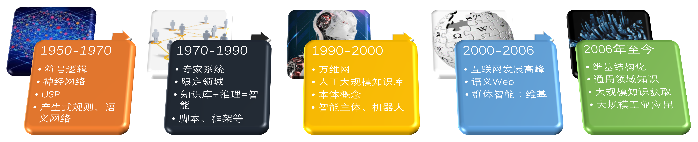
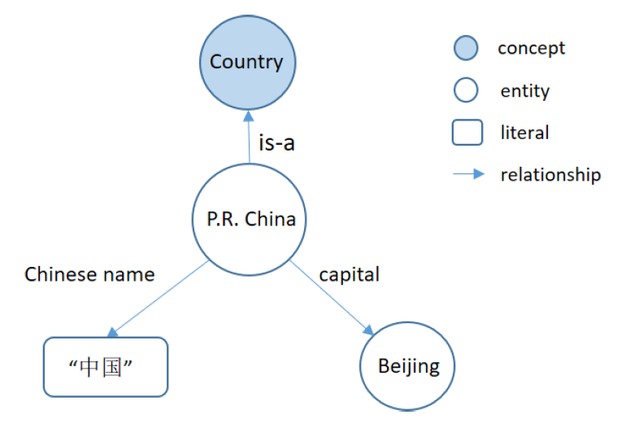
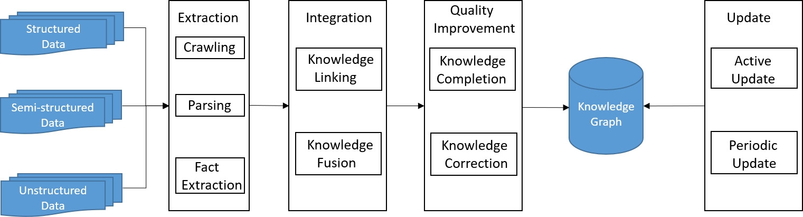
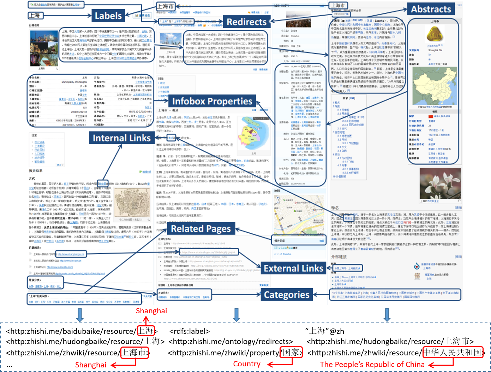
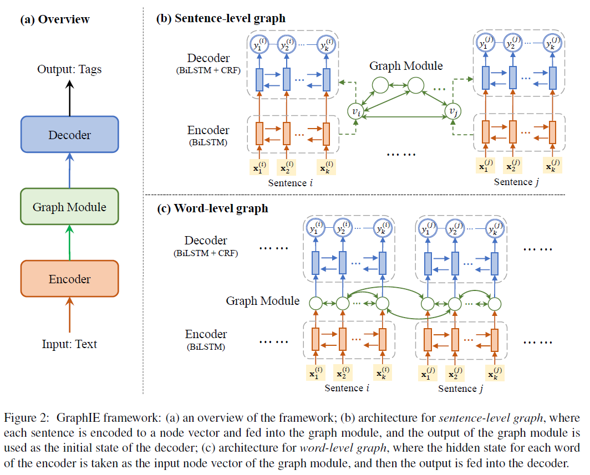
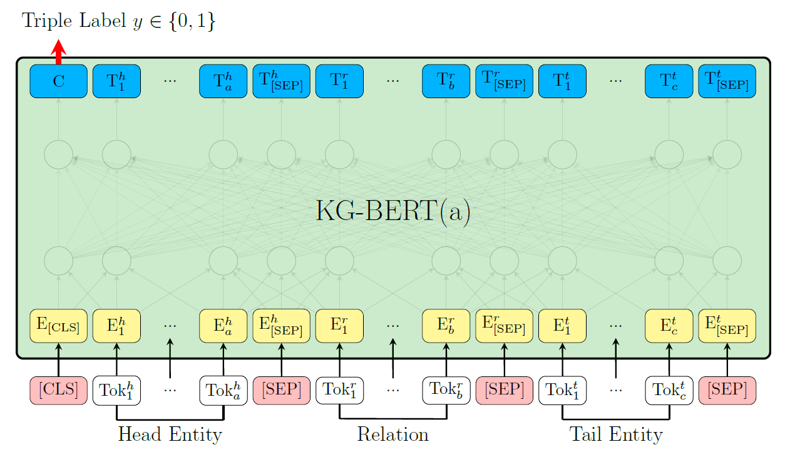
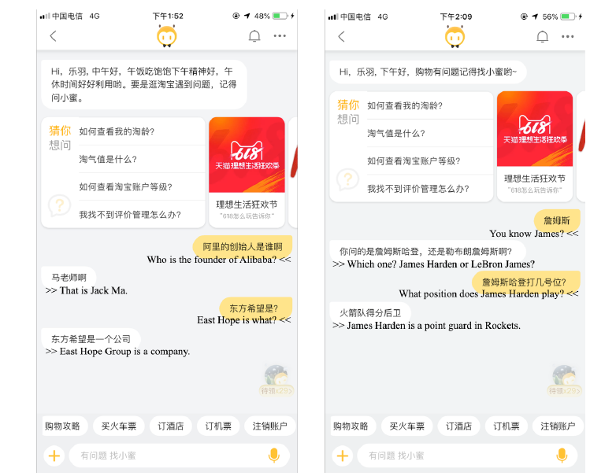
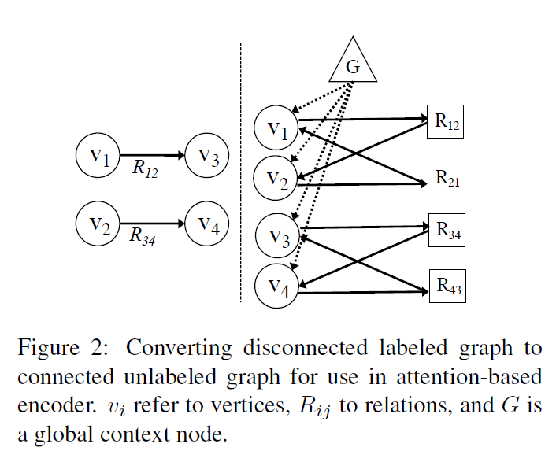
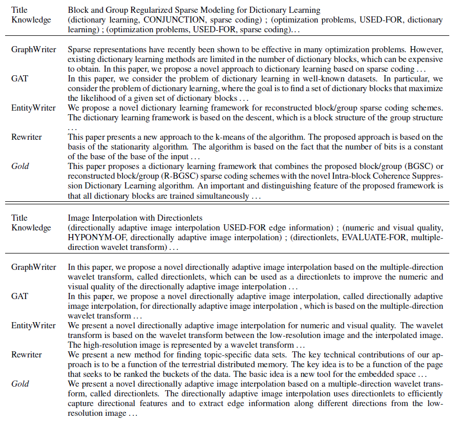

[toc]
### 摘要
知识图谱（Knowledge Graph）是人工智能重要分支知识工程在大数据环境中的成功应用。当下，知识图谱正与大数据和深度学习一起，成为推动互联网和人工智能发展的核心驱动力之一。为了更好的理解知识图谱，我们将从知识图谱的技术实现、最新研究成果、应用实例、未来趋势几个方面对知识图谱进行介绍。

关键词：知识图谱，深度学习，推荐系统

### Abstract
Knowledge graph is a successful application of knowledge engineering, an important branch of artificial intelligence, in a big data environment. At present, the knowledge graph is becoming one of the core driving forces for the development of the Internet and artificial intelligence, together with big data and deep learning. In order to better understand the knowledge graph, we will introduce the knowledge graph from the aspects of the technology realization of the knowledge graph, the latest research results, application examples, and future trends.

Key words : knowledge graph; recommended system; deep learning

### 1 引言
&emsp;&emsp;知识图谱（Knowledge Graph）的概念最先是由谷歌于 2012 年正式提出[1]，主要用来支撑下一代搜索和在线广告业务。2013 年以后知识图谱开始在学术界和业界普及，并在搜索、智能问答、情报分析、金融等领域应用中发挥重要作用。
&emsp;&emsp;知识图谱本质上是一种语义网络[2] , 在描述客观世界的概念、实体、事件及其之间的关系。其是人工智能对知识需求所导致的必然结果，但其发展又得益于很多其他的研究领域，涉及专家系统、语言学、语义网、数据库，以及信息抽取等众多领域，是交叉融合的产物而非一脉相承。其演化过程如图1-1所示。<br>

<br>

### 2 知识图谱的实现
#### 2.1 知识图谱的基本概念
&emsp;&emsp;知识图谱指以图形式表示的任何知识集合[3]，如语义Web知识库(如DBpedia[4]和Yago[5])、RDF数据集和形式本体。图结构中的节点可以是概念、实体和属性，边是不同类型的关系。
&emsp;&emsp;（1）实体：指的是具有可区别性且独立存在的某种事物。如某一个人、某一座城市、某一种植物、某一件商品等等。世界万物由具体事物组成，此指实体。实体是知识图谱中的最基本元素，不同的实体间存在不同的关系。
&emsp;&emsp;（2）概念：指的是具有同种特性的实体构成的集合，如国家、民族、书籍、电脑等。
&emsp;&emsp;（3）属性：用于区分概念的特征，不同概念具有不同的属性。不同的属性值类型对应于不同类型属性的边。如果属性值对应的是概念或实体，则属性描述两个实体之间的关系，称为对象属性；如果属性值是具体的数值，则称为数据属性。
&emsp;&emsp;如图2-1所示，实体代表现实世界的个人(例如，“P.R.中国”和“北京”)。概念代表了一组具有相同特征的个体，如“中国”、“希腊”、“美国”等，构成了一套与“国家”概念相对应的概念。这些节点之间的边代表着实体、概念和属性之间的不同关系，如“中华人民共和国”是一个“国家”，“中国”的首都是“北京”。所有这些关系及其相关实体、概念或属性都以知识图谱的三元形式存储，知识图谱是知识图谱的基本存储单元。三元组以<主语、谓语、宾语>的形式组织知识，例如<P.R.中国、is-a、Country>和<P.R.中国，中文名称“中国”>.<br>

<br>

#### 2.2 知识图谱的实现步骤
&emsp;&emsp;接下来我们将介绍知识图谱的实现步骤，一般来说知识图谱的构建包含四个阶段：知识抽取、知识链接与融合、知识质量改进和知识更新、知识应用。实现框架如图2-2所示。<br>

<br>

##### 2.2.1 知识抽取
&emsp;&emsp;知识图谱构建的前提是需要把数据从不同的数据源中抽取出来。对于垂直领域的知识图谱来说，它们的数据源主要来自两种渠道：一种是业务本身的数据，这部分数据通常包含在公司内的数据库表并以结构化的方式存储；另一种是网络上公开、抓取的数据，这些数据通常是以网页的形式存在所以是非结构化的数据。如图2-3所示，从这三个在线百科全书的文章中的结构化数据(例如消息盒)和半结构化数据(例如标签、摘要、类别和重定向)中提取实体及其相关知识，并且列出了用于表示知识的一些生成的RDF三元组。<br>

<br>
&emsp;&emsp;信息抽取的难点在于处理非结构化数据。在构建类似的图谱过程当中，主要涉及以下几个方面的自然语言处理技术：

```bash
a. 实体命名识别（Name Entity Recognition）
b. 关系抽取（Relation Extraction）
c. 实体统一（Entity Resolution）
d. 指代消解（Coreference Resolution）
```

##### 2.2.2 知识链接与融合
&emsp;&emsp;大多数知识图谱都是从各种来源提取出来的，因此有必要对这些异构的知识进行集成。现有的知识图谱以知识链接和知识融合两种方式集成知识。
&emsp;&emsp;（1）知识链接的目的是挖掘不同来源的实体或概念之间的语义关系(如实体之间的等价关系和概念之间的子类关系)。我们把这种关系视为链接。知识连接可以分为单一语言知识链接和跨语言知识链接。主要方法可以分为半监督学习方法，深度学习方法等。
&emsp;&emsp;（2）知识融合与知识链接不同，知识融合的目的是整合不同数据源的知识，而不是将它们联系起来。为了融合不同数据源中的等价知识，CN-DBpedia[4]利用规范化模块对含义相同但字符串标签不同的实体、属性和属性值进行规范化。然而，在融合不同数据源的知识时，可能会出现冲突，可能会给知识图谱带来错误，需要很多人的努力。

##### 2.2.3 知识质量改进和知识更新
&emsp;&emsp;构建知识图谱需要大量的数据源(如Wikipedia、google等)，而这些数据源是由人自由编辑的，因此知识图谱中的错误在所难免。因此，通过误差检测和校正技术来提高知识图谱数据的质量是非常重要的。此外，知识图谱是不完整的，为了提高数据质量，知识补全也是必要的。这两种改进知识图谱质量的方法称为知识更正与知识补全：
&emsp;&emsp;(1) 知识矫正的过程包括两个阶段，即误差检测和更正。Xu等人[4]提出了两种错误检测方法，第一个是基于规则的错误检测。该方法使用许多预定义的规则来检测违反规则的错误。第二个方法基于用户反馈。 在错误检测之后，Xu等人[4]也提出了一种基于众包的更正方法。错误事实被分配给众包的不同贡献者进行更正。然后采用一种简单而有效的方法，即多数投票以聚合多个和有干扰的贡献者输入，去产生一致的输出。
&emsp;&emsp;(2) 知识图谱补全技术包括类型推理和消息盒补全。目前主要的类型推理方法可以分为类型推断，属性驱动类型推断以及跨语言类型推断。消息盒补全：消息盒以三元组的形式显式地包含实体的结构化事实，当知识抽取获得的消息盒是不完整的就需要进行补全，目前主流的补全方法是基于长短时记忆递归神经网络的NLP方法。
&emsp;&emsp;另外，由于在新闻和其他网络中不断出现的新兴的实体，并且随着时间的推移，现有实体的知识也可能会发生变化，所以更新机制对于保证在特定的时间点知识图谱的完整性和准确性是很重要的。

##### 2.2.4 知识应用
&emsp;&emsp;知识图谱可以分别应用于不同语言的语义搜索、问答、智能分析、决策等方面。本文将在后文中给出3个知识图谱的应用实例。

### 3 最新研究成果
#### 3.1 GraphIE: A Graph-Based Framework for Information Extraction
&emsp;&emsp;GraphIE，一个在图上运行的信息抽取框架[6]。这是一个通过自动学习输入空间中本地和非本地依赖关系之间的交互来改进预测的框架。它将图网络和编码器-解码器集成在一起，构建了序列标记的体系结构，如图3-1所示。
<br>

<br>
&emsp;&emsp;该算法通过图形卷积网络在连接的节点之间传播信息，利用来改进单词级别的预测，从而生成更丰富的表示。论文评估了三个不同的任务：文本，社交媒体和视觉信息提取，结果一致地显示 GraphIE 优于最先进的信息抽取模型。 

#### 3.2 KG-BERT: BERT for Knowledge Graph Completion
&emsp;&emsp;[7]中介绍了知识图谱补全方面的工作，结合预训练模型BERT可以将更丰富的上下文表示结合进模型中，在三元组分类、链接预测以及关系预测等任务中达到了SOTA效果。其关键原理是修改了BERT模型的输入使其适用于知识库三元组的形式，其结构如图3-2所示。
<br>

<br>
&emsp;&emsp;在这项工作中，作者使用预训练的语言模型来完成知识图谱。将知识图谱中的三元组视为文本序列，提出了一种新的基于Transformer (KG-BERT)的知识图双向编码器表示框架来对这些三元组进行建模。该方法以一个三元组的实体描述和关系描述为输入，利用KG-BERT语言模型计算三元组的评分函数。在多个基准知识图谱上的实验结果表明，该方法在三重分类、链接预测和关系预测任务上都能达到最好的性能。

### 4 应用实例
#### 4.1 神马知识图谱-推荐系统
&emsp;&emsp;在[8]中，阿里巴巴已经将基于知识图谱和深度学习的实体推荐系统运用于神马搜索引擎中，在阿里巴巴的UC浏览器中，在线A/B测试结果表明，印象效率的点击率提高了5.1%，页面浏览量提高了5.5%。其演示例子如图4-1所示。<br>

<br>
&emsp;&emsp;为了实现这个应用，阿里巴巴构建了神马知识图谱，这是一个包含1000万个实体、1000个类型和数十亿个三元组的语义网络。它有广泛的领域，如人，教育，电影，电视，音乐，体育，科技，书籍，应用程序，食品，植物，动物等。这本书内容丰富，涵盖了大量关于世俗事实的实体。知识图中的实体通过各种关系连接在一起。基于神马知识图谱，构造了一个包含数百万实例和概念的认知概念图。与神马知识图不同的是，认知概念图是一种概率图，主要关注的是’is - a‘关系。例如，“robin”是鸟，“penguin”是鸟。认知概念图有助于实体概念化和查询理解。

#### 4.2 AliMe Chat-对话系统
&emsp;&emsp;阿里巴巴2015年推出的AliMe Chat，如图4-2所示，已经为数十亿用户提供了服务，现在平均每天有1000万用户访问。AliMe服务大致可以分为辅助服务、客户服务和聊天服务。在[9]中，阿里巴巴团队设计了一个基于知识图谱的解决AliMe服务的高频聊天问题的方法。为了满足在线系统每秒高问题（QPS）的需求，文中设计了几种解决方案来提高AliMe聊天的能力。
<br>

<br>

#### 4.3 文本生成-NLP
&emsp;&emsp;这项工作主要关注如何从信息抽取结果（特别是知识图谱）出发，生成连贯的多句文本。作者表示图谱化的知识表示在计算中普遍存在，但由于其非层次，长距离依赖，结构多样等特性，使得基于图谱的文本生成成为一个巨大的挑战。为了摆脱图谱表示学习过程需要添加的线性/层次约束，有效利用起图谱中的关系结构，作者提出一种新的 Graph Transformer 编码器[10]，结构如图4-3所示。<br>

<br>
&emsp;&emsp;Graph Transformers与图注意力网络(GAT)[11]的思路相近，利用注意力机制[12]，将相邻节点的信息用于生成目标节点的隐状态表示。但是 GAT 模型仅考虑图谱中已出现相邻节点的信息，文章提出的全局节点设定使得模型能够利用更为全局的信息（可能存在的实体关联，但并未出现在知识子图中的潜在信息）。
&emsp;&emsp;利用Graph Transformer生成的文本如图4-4所示。图中“Title”为输入的标题，右侧为利用Graph Transformer生成的文本。
<br>

<br>

### 5 挑战与机遇
#### 5.1 知识图谱遇到的挑战
&emsp;&emsp;大数据时代的到来，使得人工智能技术获得了前所未有的长足进步。同时，随着人工智能对数据处理和理解需求逐日增加，知识图谱升温。融合知识图谱与深度学习，已然成为人工智能进一步发展的重要思路之一。然而，来到2019年的今天，深度学习的诸多局限性也慢慢得到广泛认知[13]。对于自然语言处理而言，要做到精细深度的语义理解，单纯依靠数据标注与算力投入无法解决本质问题。如果没有先验知识的支持，“中国的乒乓球谁都打不过”与“中国的足球谁都打不过”，在计算机看来语义上并没有巨大差异，而实际上两句中的“打不过”意思正好相反。而这正好对应知识图谱构建的第一步——知识抽取。这种语义上难以理解的句子，将给知识图谱带来全新的挑战。
&emsp;&emsp;另外，虽然在实验中，许多知识图谱方法均表现出了不错的性能，然而，实际应用中往往面临诸多挑战[13]：
&emsp;&emsp;（1）数据规模问题：人工精准地标注句子级别的数据代价十分高昂，需要耗费大量的时间和人力。在实际场景中，面向数以千计的关系、数以千万计的实体对、以及数以亿计的句子，依靠人工标注训练数据几乎是不可能完成的任务。
&emsp;&emsp;（2）学习能力问题：在实际情况下，实体间关系和实体对的出现频率往往服从长尾分布，存在大量的样例较少的关系或实体对。神经网络模型的效果需要依赖大规模标注数据来保证，存在”举十反一“的问题。如何提高深度模型的学习能力，实现”举一反三“，是关系抽取需要解决的问题。
&emsp;&emsp;（3）复杂语境问题。现有模型主要从单个句子中抽取实体间关系，要求句子必须同时包含两个实体。实际上，大量的实体间关系往往表现在一篇文档的多个句子中，甚至在多个文档中。如何在更复杂的语境下进行关系抽取，也是关系抽取面临的问题。
&emsp;&emsp;（4）开放关系问题。现有任务设定一般假设有预先定义好的封闭关系集合，将任务转换为关系分类问题。这样的话，文本中蕴含的实体间的新型关系无法被有效获取。如何利用深度学习模型自动发现实体间的新型关系，实现开放关系抽取，仍然是一个”开放“问题。

#### 5.2 知识图谱的发展前景
&emsp;&emsp;当下互联网巨头们已经意识到知识图谱的战略意义，纷纷投入重兵布局知识图谱。整体而言，知识图谱领域的发展将会持续呈现特色化、开放化、智能化的增长趋势[14]。
&emsp;&emsp;就目前而已，在知识库、信息检索、数据挖掘、知识表示、社会网络等方向在知识图谱领域的热度长盛不衰。除此之外，信息提取、查询应答、问题回答、机器学习、概率逻辑、  实体消歧、实体识别、查询处理、决策支持等方向的研究热度在近年来逐渐上升，概念图、 搜索引擎、信息系统等方向的热度逐渐消退。
&emsp;&emsp;随着知识图谱相关技术的发展，我们有理由相信，知识 图谱构建技术会朝着越来越自动化方向前进，同时知识图谱也会在越来越多的领域找到能够  正落地的应用场景，在各行各业中解放生产力，助力业务转型。

### 6 参考文献
Webs:
https://mp.weixin.qq.com/s/2HZk8akia5baPj_Vv65PUw
https://mp.weixin.qq.com/s/WyB5Lssy9c0qJt8Ze7a0Ig
https://mp.weixin.qq.com/s/DIkk0FxaYjK0GdWdFLHTwA
https://zhuanlan.zhihu.com/p/91052495
https://zhuanlan.zhihu.com/p/91762831
https://zhuanlan.zhihu.com/p/80280367
https://zhuanlan.zhihu.com/p/56903119

Papers：
[1] Singhal A. Introducing the knowledgegraph: things, not strings[J]. Official google blog, 2012.
[2] Sowa, J.F. Principles of Semantic Networks: Explorations in The Representation of Knowledge; Morgan Kaufmann: Burlington, MA, USA, 1991.
[3] Wu, T., Qi, G., Li, C. and Wang, M., 2018. A Survey of Techniques for Constructing Chinese Knowledge Graphs and Their Applications. Sustainability, 10(9), p.3245.
[4] Xu, B.; Xu, Y.; Liang, J.; Xie, C.; Liang, B.; Cui,W.; Xiao, Y. CN-DBpedia: A Never-Ending Chinese Knowledge Extraction System. In Proceedings of the International Conference on Industrial, Engineering and Other Applications of Applied Intelligent Systems, Arras, France, 27–30 June 2017; pp. 428–438.
[5] Mahdisoltani, F.; Biega, J.; Suchanek, F.M. Yago3: A Knowledge Base from Multilingual Wikipedias. In Proceedings of the Biennial Conference on Innovative Data Systems Research, Asilomar, CA, USA, 6–9 January 2015.
[6] Qian, Y., Santus, E., Jin, Z., Guo, J. and Barzilay, R., 2018. GraphIE: A graph-based framework for information extraction. arXiv preprint arXiv:1810.13083.
[7] Yao, L., Mao, C., Luo,Y. 2019. KG-BERT BERT for Knowledge Graph Completion. arXiv preprint arXiv:1909.03193.
[8] Jia, Q., Zhang, N. and Hua, N., 2019. Context-aware Deep Model for Entity Recommendation in Search Engine at Alibaba. arXiv preprint arXiv:1909.04493.
[9] Song, S., Wang, C. and Chen, H., Knowledge Based High-Frequency Question Answering in AliMe Chat.
[10] Koncel-Kedziorski, R., Bekal, D., Luan, Y., Lapata, M. and Hajishirzi, H., 2019. Text Generation from Knowledge Graphs with Graph Transformers. arXiv preprint arXiv:1904.02342.
[11] Petar Velickovic, Guillem Cucurull, Arantxa Casanova, Adriana Romero, Pietro Lio, and Yoshua Bengio.2018. Graph Attention Networks. In ICLR.
[12] Vaswani, A., Shazeer, N., Parmar, N., Uszkoreit, J., Jones, L., Gomez, A.N., Kaiser, Ł. and Polosukhin, I., 2017. Attention is all you need. In Advances in neural information processing systems (pp. 5998-6008).
[13] 韩旭, 高天宇, 刘知远. 知识图谱从哪里来：实体关系抽取的现状与未来. https://zhuanlan.zhihu.com/p/91762831.
[14] 清华大学人工智能研究院. 人工智能知识图谱报告.https://www.aminer.cn/research_report/5c3d5a8709e961951592a49d?download=true.