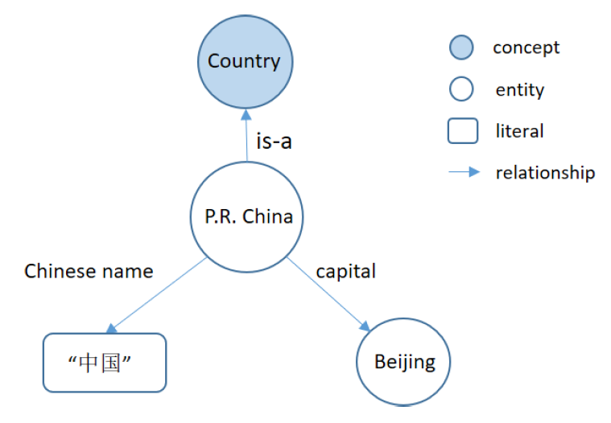
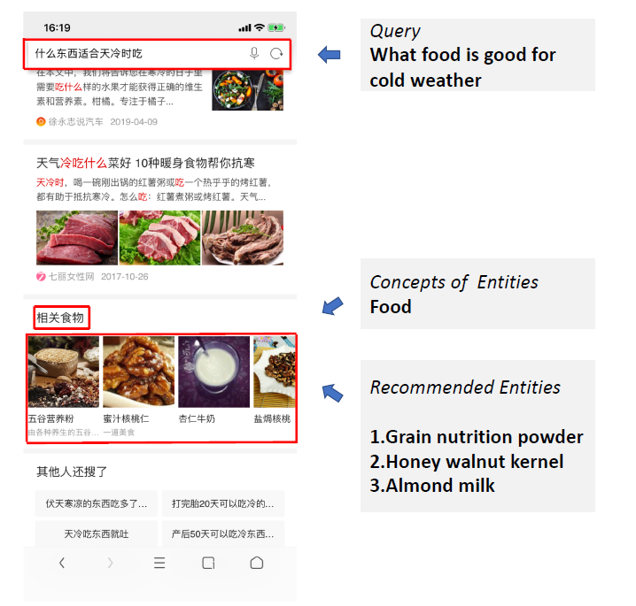
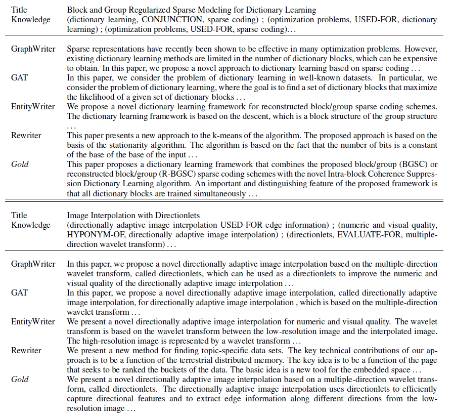

[toc]
### 知识图谱的基本概念
&emsp;&emsp;知识图谱（Knowledge Graph）的概念最先是由谷歌于 2012 年正式提出，主要用来支撑下一代搜索和在线广告业务。2013 年以后知识图谱开始在学术界和业界普及，并在搜索、智能问答、情报分析、金融等领域应用中发挥重要作用。
&emsp;&emsp;知识图谱指以图形式表示的任何知识集合[1]，如语义Web知识库(如DBpedia[2]和Yago[3])、RDF数据集和形式本体。图结构中的节点可以是概念、实体和属性，边是不同类型的关系。
&emsp;&emsp;（1）实体：指的是具有可区别性且独立存在的某种事物。如某一个人、某一座城市、某一种植物、某一件商品等等。世界万物由具体事物组成，此指实体。实体是知识图谱中的最基本元素，不同的实体间存在不同的关系。
&emsp;&emsp;（2）概念：指的是具有同种特性的实体构成的集合，如国家、民族、书籍、电脑等。
&emsp;&emsp;（3）属性：用于区分概念的特征，不同概念具有不同的属性。不同的属性值类型对应于不同类型属性的边。如果属性值对应的是概念或实体，则属性描述两个实体之间的关系，称为对象属性；如果属性值是具体的数值，则称为数据属性。
&emsp;&emsp;如图所示，实体代表现实世界的个人(例如，“P.R.中国”和“北京”)。概念代表了一组具有相同特征的个体，如“中国”、“希腊”、“美国”等，构成了一套与“国家”概念相对应的概念。这些节点之间的边代表着实体、概念和属性之间的不同关系，如“中华人民共和国”是一个“国家”，“中国”的首都是“北京”。所有这些关系及其相关实体、概念或属性都以知识图谱的三元形式存储，知识图谱是知识图谱的基本存储单元。三元组以<主语、谓语、宾语>的形式组织知识，例如<P.R.中国、is-a、Country>和<P.R.中国，中文名称“中国”>. 

 

### 应用实例
#### 神马知识图谱-推荐系统
&emsp;&emsp;在[4]中，阿里巴巴已经将基于知识图谱和深度学习的实体推荐系统运用于神马搜索引擎中，在阿里巴巴的UC浏览器中，在线A/B测试结果表明，印象效率的点击率提高了5.1%，页面浏览量提高了5.5%。其演示例子如下图所示。 

 
&emsp;&emsp;为了实现这个应用，阿里巴巴构建了神马知识图谱，这是一个包含1000万个实体、1000个类型和数十亿个三元组的语义网络。它有广泛的领域，如人，教育，电影，电视，音乐，体育，科技，书籍，应用程序，食品，植物，动物等。这本书内容丰富，涵盖了大量关于世俗事实的实体。知识图中的实体通过各种关系连接在一起。基于神马知识图谱，构造了一个包含数百万实例和概念的认知概念图。与神马知识图不同的是，认知概念图是一种概率图，主要关注的是’is - a‘关系。例如，“robin”是鸟，“penguin”是鸟。认知概念图有助于实体概念化和查询理解。

#### AliMe Chat-对话系统
&emsp;&emsp;阿里巴巴2015年推出的AliMe Chat，如下图所示，已经为数十亿用户提供了服务，现在平均每天有1000万用户访问。AliMe服务大致可以分为辅助服务、客户服务和聊天服务。在[5]中，阿里巴巴团队设计了一个基于知识图谱的解决AliMe服务的高频聊天问题的方法。为了满足在线系统每秒高问题（QPS）的需求，文中设计了几种解决方案来提高AliMe聊天的能力。
 

 

#### 文本生成-NLP
&emsp;&emsp;这项工作主要关注如何从信息抽取结果（特别是知识图谱）出发，生成连贯的多句文本。作者表示图谱化的知识表示在计算中普遍存在，但由于其非层次，长距离依赖，结构多样等特性，使得基于图谱的文本生成成为一个巨大的挑战。为了摆脱图谱表示学习过程需要添加的线性/层次约束，有效利用起图谱中的关系结构，作者提出一种新的 Graph Transformer 编码器[6]，结构如下图所示。 

 
&emsp;&emsp;Graph Transformers与图注意力网络(GAT)[7]的思路相近，利用注意力机制[8]，将相邻节点的信息用于生成目标节点的隐状态表示。但是 GAT 模型仅考虑图谱中已出现相邻节点的信息，文章提出的全局节点设定使得模型能够利用更为全局的信息（可能存在的实体关联，但并未出现在知识子图中的潜在信息）。
&emsp;&emsp;利用Graph Transformer生成的文本如下图所示。图中“Title”为输入的标题，右侧为利用Graph Transformer生成的文本。
 

 

### 心得体会
早期的语义网络因为深度学习的出现而重获新生，以另一种质态出现在世人面前。短短数年就已经在商业邻域拥有了自己的地位。而且联网巨头们已经意识到知识图谱的战略意义，纷纷投入重兵布局知识图谱。在这种大环境下，知识图谱领域的发展将会持续呈现特色化、开放化、智能化的增长趋势。

### 参考文献及资料
webs:
https://mp.weixin.qq.com/s/2HZk8akia5baPj_Vv65PUw
https://mp.weixin.qq.com/s/WyB5Lssy9c0qJt8Ze7a0Ig
https://mp.weixin.qq.com/s/DIkk0FxaYjK0GdWdFLHTwA
https://zhuanlan.zhihu.com/p/91052495
https://zhuanlan.zhihu.com/p/91762831
https://zhuanlan.zhihu.com/p/80280367
https://zhuanlan.zhihu.com/p/56903119

papers:
[1] Wu, T., Qi, G., Li, C. and Wang, M., 2018. A Survey of Techniques for Constructing Chinese Knowledge Graphs and Their Applications. Sustainability, 10(9), p.3245.
[2] Xu, B.; Xu, Y.; Liang, J.; Xie, C.; Liang, B.; Cui,W.; Xiao, Y. CN-DBpedia: A Never-Ending Chinese Knowledge Extraction System. In Proceedings of the International Conference on Industrial, Engineering and Other Applications of Applied Intelligent Systems, Arras, France, 27–30 June 2017; pp. 428–438.
[3] Mahdisoltani, F.; Biega, J.; Suchanek, F.M. Yago3: A Knowledge Base from Multilingual Wikipedias. In Proceedings of the Biennial Conference on Innovative Data Systems Research, Asilomar, CA, USA, 6–9 January 2015.
[4] Jia, Q., Zhang, N. and Hua, N., 2019. Context-aware Deep Model for Entity Recommendation in Search Engine at Alibaba. arXiv preprint arXiv:1909.04493.
[5] Song, S., Wang, C. and Chen, H., Knowledge Based High-Frequency Question Answering in AliMe Chat.
[6] Koncel-Kedziorski, R., Bekal, D., Luan, Y., Lapata, M. and Hajishirzi, H., 2019. Text Generation from Knowledge Graphs with Graph Transformers. arXiv preprint arXiv:1904.02342.
[7] Petar Velickovic, Guillem Cucurull, Arantxa Casanova, Adriana Romero, Pietro Lio, and Yoshua Bengio.2018. Graph Attention Networks. In ICLR.
[8] Vaswani, A., Shazeer, N., Parmar, N., Uszkoreit, J., Jones, L., Gomez, A.N., Kaiser, Ł. and Polosukhin, I., 2017. Attention is all you need. In Advances in neural information processing systems (pp. 5998-6008).