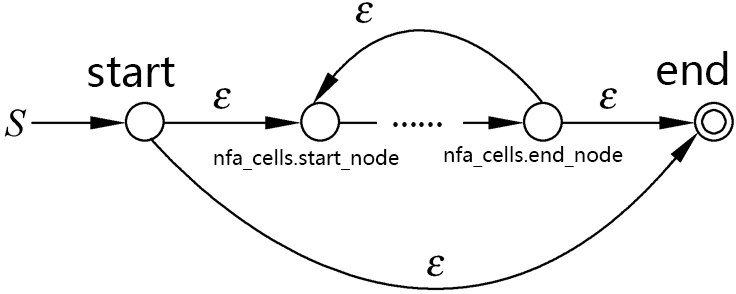
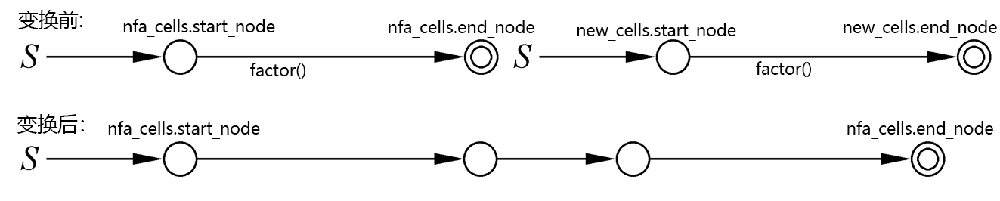
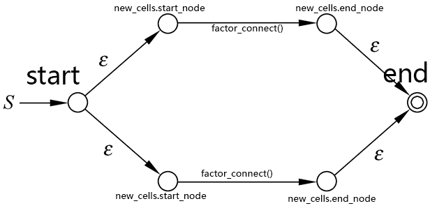
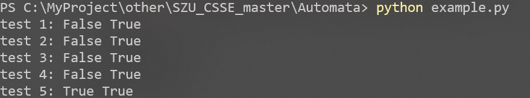
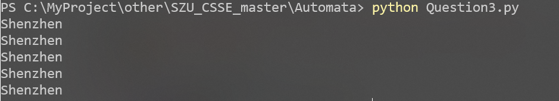
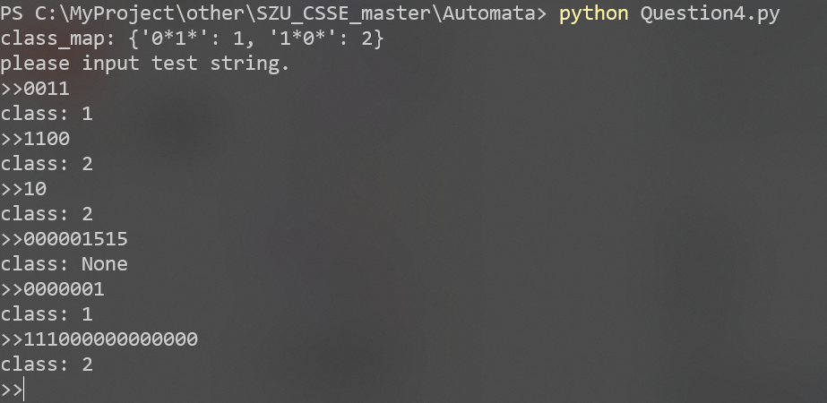

[toc]
## Question1
​		设计一个DFA，使其接受2进制字符串w，并且所有w的逆都能被5整除。比如，该DFA接受二进制串11110，因为其逆为01111，代表十进制的15，所以可以被5整除。详述该DFA的设计。<br>
### 1.1 思路
​		首先设计一个接受的二进制串能被5整除的的DFA，然后将整个DFA的状态反转使其接受的为符合条件的二进制的逆。<br>
### 1.2 设计一个接受的二进制串能被5整除的DFA
* 将已扫描到的字符的余数作为当前状态，一共有5种情况，即5个状态：Q0:余数为0；Q1余数为1......根据规律列出状态转移表如下：<br>
<div align="center">    

</div>

* 根据状态转移表绘制状态转移图：<br>
<div align="center">    

</div>
### 1.3 反转状态转移图
​		将1.2中的DFA的状态反转(将箭头反向并将起始状态与接受状态对调)并根据q0的转移函数添加起始状态qs以防止出现未输入任何字符就接受的情况：<br>

<div align="center">    

</div>

## Question2
​		使用归纳证明法证明对于任意的NFA M=(Q,Σ,δ,q0 ,F)，一定存在CFG G=(Q,Σ,P,S)，使得L(G)=L(M)。
### 2.1 思路
​		等价转化法：已知NFA与RE等价，故问题转化为对任意的正则表达式R，都可以用CFG G=(Q,Σ,P,S)来表示。即要证明L(R)=L(G)。<br>
### 2.2 文法设计
​		RE由运算符，字符集，以及'()'组成，故根据运算优先级可以得到文法G：<br>
```shell
S -> A                                  
A -> B|A"|"B                           # "|" 加（或）             
B -> C|BC                              # "" 乘（直接连接）,幂运算可由乘实现
C -> D|D"*"|D"+"|CD"*"|CD"+"           # "*"闭包  "+"正闭包
D -> E|F                                
E -> "a","b","c","d","e","f","g"...... #终结符
F -> "("A")"                           #括号递归
```
### 2.3 归纳法证明
对输入的正则表达式R的运算符数量进行归纳法证明。<br>
* 当n=1时:<br>
R = "a*" | "a|a" | "a+" | "aa" | "(aa)"......<br>
以R =(aa)为例的派生过程：<br>
S=>A=>B=>C=>D=>F=>"("A")"=>"("B")"=>"("BC")"=>"("CC")"=>"("CD")"=>"("DD")"=>"("DE")"=>"("EE")"=>"(""a""a"")"即S=>(aa)<br>
易知其他情况也满足。<br>
* 假设当运算符数量为n时，正则表达式R也是合法的G<br>
当运算符数量为n+1时:<br>
R' = "R*" | "R|a" | "R+" | "Ra" | "(Ra)"...<br>
由于G可以派生出R，故S=>A=>....R可得A=>R<br>
以R' ="R|a"的派生过程为例：<br>
S=>A=>A"|"B=>R"|"B=>R"|"C=>R"|"D=>R"|"E=>R"|""a"即S=>R‘,成立<br>
对其他情况依次进行归纳，均成立<br>
故对任意的正则表达式R，都可以由所定义的 G得到，即对于任意的NFA M=(Q,Σ,δ,q0 ,F)，一定存在CFG G=(Q,Σ,P,S)，使得L(G)=L(M)。

## Question3
​		正则表达式在信息检索中具有广泛的应用。请设计并编程实现一个基于正则表达式的英文单词检索系统，要求给定任意的正则表达式作为输入，将其转换为等价的自动机，并可以根据该自动机实现从输入文本中检测并输出所有符合正则表达式描述的单词。<br>
​		例如，当输入文本文件input.txt包含以下英文文本及正则表达式```s{a,…,z}*n```时：<br>

```
Shenzhen University (SZU, Chinese: 深圳大学) is a public university established in 1983 located in Nanshan district, Shenzhen, Guangdong, China. It is accredited by the State Council of the People's Republic of China and is funded by the Shenzhen City Government. The university took its first enrollment the same year at what Deng Xiaoping called "Shenzhen Speed". Deng also was named the "father of Shenzhen University." It is regarded as the fastest developing university in China, and also one of the "Top 100 Universities in China" and one of the top university which is listed in the World Top Ranking Universities.
```
​		输出：<br>
```
Shenzhen
Shenzhen
Shenzhen
Shenzhen
Shenzhen
```
​		为所有符合该正则表达式描述得单词，注意，此处单词间以空格分隔，并且对大小写字母不敏感。请在提交报告中给出详细的设计方案、关键代码实现、以及实验测试结果。<br>
### 3.1 思路
​		首先搭建一个正则表达式引擎，其中包括的功能由对正则表达式进行解析，转化为对应的自动机，并允许输入字符串到自动机中判断是否为自动所接受的字符串等功能。然后进行测试，读取input.txt并对单词进行分割，转化为小写字母，调用写好的正则表达式引擎进行匹配, 匹配成功则输出。<br>
### 3.2 正则表达式引擎的设计
#### 3.2.1 整体流程
正则表达式引擎的运行流程如下：<br>
* 1.建立词法分析器lexer类对正则表达式进行解析，校验正则表达式是否合法，得到对应字符的Token<br>
* 2.使用cell类基于BNF范式递归构建NFA<br>
* 3.将需要验证的字符串输入到所构建的NFA中，判断是否会被NFA所接受<br>

#### 3.2.2 词法分析器Lexer
详细代码可在```'./nfa/lexer.py'```中查询<br>
* 主要功能：对正则表达式进行解析与连续读取，校验正则表达式是否合法，得到对应字符的Token<br>
* 目前支持以下Tokens
```python
Tokens = {
    '.': Token.ANY,
    '(': Token.OPEN_PAREN,
    ')': Token.CLOSE_PAREN,
    '[': Token.SQUARE_START,
    ']': Token.SQUARE_END,
    '{': Token.OPEN_CURLY,
    '}': Token.CLOSE_CURLY,
    '*': Token.CLOSURE,
    '+': Token.PLUS_CLOSURE,
    '-': Token.DASH,
    '|': Token.OR,
}
```
* 对应所支持的正则表达式的语法规则：
```python
"""
规则：
"."       : 用于匹配任意单个字符
"c"       : 匹配除了Token以外的输入的字符
"[a-z]"   : 匹配a-z中的任意单个字符
"{a,b,c}" : 匹配a或b或c中的任意单个字符，也可以写作(a|b|c)
"*"       : 闭包
"+"       : 正闭包
"|"       : 或(加)
""        : 默认进行连接操作(乘)
"("expr")": 支持使用括号提高运算优先级
"""
```
* 主要函数入口：
```python
class Lexer(object):
    """
    对正则表达式进行解析，校验正则表达式是否合法，得到对应字符的Token,目前不支持转义字符的输入
    """
    def next(self):
        """
        返回当前对应的Tokens并读入下一个字符
        """
    def get_token(self, text):
        """
        获取Tokens
        """
    def check_pattern(self):
        """
        检查正则表达式括号是否匹配
        """
    def match(self, token):
        """
        将输入的token与当前的token进行比较
        """
```
#### 3.2.3 NFA单个节点的定义
详细内容可在```'./nfa/cell.py'```中查询<br>
* 一个NFA节点包含边类型(self.edge)，两个指向下一节点的边(self.next)以及转移条件(self.char_set)构成
```python
# 根据RE转NFA的规律边的类型分为3种
EPSILON = -1   # edge = EPSILON 对应的节点有两个出去的ε边
CCL     = -2   # edge = CCL     边对应的是字符集(包括单个字符) ，需要结合属性char_set，自动机运行时只要当前读入的字符在char_set中就满足跳转条件
EMPTY   = -3   # edge = EMPTY   一条ε边
class Cell(object):
    def __init__(self):
        self.edge = EPSILON
        self.next_1 = None
        self.next_2 = None
        self.char_set = set()
```
* 为了便于构建NFA，这里再定义一个新的类，这个类由两个Cell的节点构成作为nfa的起始结点以及接受结点
```python
class PairCell(object):
    """
    一对Cell的两个节点
    """
    def __init__(self):
        self.start_node = None
        self.end_node = None
```

#### 3.2.4 语义分析
* 将Question2给出的文法转化为BNF范式
```python
"""
词法分析按照优先级自顶向下
expr ::= <factor_connect> ("|" factor_connect)*          # "|" 加（或）
factor_connect ::= factor | factor factor*               # "" 乘（直接连接）
factor ::= term | term ("*"|"+")*                        # "*"闭包  "+"正闭包
term ::= char | group | "[" char "-" char "]" | "{" char "," char "}" | "." #基本单元,终止符
group ::= "("expr")"                                     # 递归解决括号优先级
"""
```

#### 3.2.5 NFA的构建
详细内容可在```'./nfa/bulider.py'```中查询<br>
##### 3.2.5.1 NFA自动机创建入口
* create_nfa()的主要功能就是根据pattern_string创建lexer，然后定义nfa开始节点和接受结点并调用expr()开始创建过程，最终返回自动机的起始节点
```python
def create_nfa(pattern_string):
    """NFA自动机创建入口
    pattern_string  :: RE表达式
    return          :: nfa起始节点
    """
    global lexer
    lexer = Lexer(pattern_string)
    lexer.next()
    nfa_cells_final = PairCell()
    expr(nfa_cells_final)
    return nfa_cells_final.start_node
```
##### 3.2.5.2 term元素的构建
<div align="center">    

</div>

* 匹配输入的单个字符，创建两个节点A,B，定义A->B的边的类型为CCL，且char_set为当前字符
```python
def nfa_single_char(nfa_cells):
    """
    L 匹配单个字符
    """
    if not lexer.match(Token.L):
        return False
    start = nfa_cells.start_node = Cell()
    nfa_cells.end_node = nfa_cells.start_node.next_1 = Cell()    
    start.edge = CCL
    start.char_set = set()
    start.char_set.add(lexer.current_text)
    lexer.next()
    return True
```
* 匹配单个任意字符，创建两个节点A,B，定义A->B的边的类型为CCL，且char_set为所有ASCII字符
```python
def nfa_any_single_char(nfa_cells):
    """
    . 匹配单个任意字符
    """
    if not lexer.match(Token.ANY):
        return False
    start = nfa_cells.start_node = Cell()
    nfa_cells.end_node = nfa_cells.start_node.next_1 = Cell()    
    start.edge = CCL
    start.char_set = set()
    for i in range(127):
        start.char_set.add(chr(i))
    lexer.next()
    return False
```
* 匹配范围字符集中的单个字符，创建两个节点A,B，定义A->B的边的类型为CCL，且char_set为[" char "-" char "]之间的所有字符
```python
def nfa_range_single_char(nfa_cells):
    """
    [a-z] 匹配范围字符集中的单个字符
    """
    if not lexer.match(Token.SQUARE_START):
        return False
    lexer.next()
    start = nfa_cells.start_node = Cell()
    start.next_1 = nfa_cells.end_node = Cell()
    start.edge = CCL

    # get range char set
    first = ''
    while not lexer.match(Token.SQUARE_END):
        if not lexer.match(Token.DASH):
            first = lexer.current_text
            start.char_set.add(first)
        else:
            lexer.next()
            for c in range(ord(first), ord(lexer.current_text) + 1):
                start.char_set.add(chr(c))
        lexer.next()
    lexer.next()
    return True
```
* 匹配范围字符集中的单个字符，创建两个节点A,B，定义A->B的边的类型为CCL，且char_set为{a,b,c....}中包含的所有字符
```python
def nfa_set_single_char(nfa_cells):
    """
    {a,b,c....} 匹配字符集中的单个字符 相当于(a|b|c...)
    """
    if not lexer.match(Token.OPEN_CURLY):
        return False

    lexer.next()
    start = nfa_cells.start_node = Cell()
    start.next_1 = nfa_cells.end_node = Cell()
    start.edge = CCL

    while not lexer.match(Token.CLOSE_CURLY):
        if lexer.current_text != ',':
            start.char_set.add(lexer.current_text)
        lexer.next()
    lexer.next()
    return True
```
##### 3.2.5.3 根据BNF范式自底向上构建NFA
* group(), 其实就是当检测到"("就递归调用expr(),然后直到检测到”)“停止
```python
def group(nfa_cells):
    """
    group ::= "("expr")"  
    递归调用expr(),实现()操作
    """
    if lexer.match(Token.OPEN_PAREN):
        lexer.next()
        expr(nfa_cells)
    if lexer.match(Token.CLOSE_PAREN):
        lexer.next()
    return True
```
* term类似与终结符，用于构造nfa的最小节点，这里会调用不同类型元素的构建函数
```python
def term(nfa_cells):
    """
    term ::= char | group | "[" char "-" char "]" | "{" char "," char "}" | "."
    对 . | a (单个字符) | 单个一定范围[a-z]的字符 | {a,b,c} 某些字符集合中的单个字符->相当于(a+b+c)
    """
    if lexer.match(Token.L):             # char
        nfa_single_char(nfa_cells)
    elif lexer.match(Token.ANY):         # .
        nfa_any_single_char(nfa_cells)
    elif lexer.match(Token.SQUARE_START):   # [" char "-" char "]
        nfa_range_single_char(nfa_cells)
    elif lexer.match(Token.OPEN_CURLY):  # "{" char "," char "}"
        nfa_set_single_char(nfa_cells)
    elif lexer.match(Token.OPEN_PAREN):  # "("expr")"
        group(nfa_cells)
```
* factor用于实现闭包，其原理如下图所示:
<div align="center">    

</div>

```python
def factor(nfa_cells):
    """
    factor ::= term | term ("*"|"+")* 
    实现两种闭包 "*" | "+"
    """
    term(nfa_cells)
    if lexer.match(Token.CLOSURE) or lexer.match(Token.PLUS_CLOSURE):
        nfa_closure(nfa_cells)
def nfa_closure(nfa_cells):
    """
    * 闭包操作   以及  + 正闭包操作
    """
    if (not lexer.match(Token.CLOSURE)) and (not lexer.match(Token.PLUS_CLOSURE)):
        return False
    start = Cell()
    end = Cell()
    start.next_1 = nfa_cells.start_node
    if lexer.match(Token.CLOSURE): # *
        start.next_2 = end  # 连接start与end形成shortcut，将"+"转化为"*"
    nfa_cells.end_node.next_1 = nfa_cells.start_node
    nfa_cells.end_node.next_2 = end
    nfa_cells.start_node = start
    nfa_cells.end_node = end
    lexer.next()
    return True
```
* factor_connect用于实现连接操作（即乘操作)，其原理如下图所示:
<div align="center">    

</div>
```python
def factor_connect(nfa_cells):
    """
    factor_connect ::= factor | factor factor*  
    实现乘操作，即连接
    """
    if is_connect_token(lexer.current_token):
        factor(nfa_cells)
    while is_connect_token(lexer.current_token):
        new_cells = PairCell()
        factor(new_cells)
        nfa_cells.end_node.next_1 = new_cells.start_node
        nfa_cells.end_node = new_cells.end_node
    return True
```
* expr用于实现或“|”操作（即加操作)，其原理如下图所示:
<div align="center">    

</div>

```python
def expr(nfa_cells):
    """
    expr ::= <factor_connect> ("|" factor_connect)*
    实现OR操作
    """
    factor_connect(nfa_cells) # 第一支路 
    new_cells = PairCell() # 其他支路
    while lexer.match(Token.OR):
        lexer.next()
        factor_connect(new_cells)
        start = Cell()
        start.next_1 = new_cells.start_node
        start.next_2 = nfa_cells.start_node
        nfa_cells.start_node = start
        end = Cell()
        new_cells.end_node.next_1 = end
        nfa_cells.end_node.next_2 = end
        nfa_cells.end_node = end
    return True
```
#### 3.2.6 判断输入字符串是否被NFA接受(match操作)
详细代码可在```'./nfa/run.py'```中查询<br>
* match, 整体思路就是依次读入字符串，记录根据跳转条件判断读入字符后NFA所处于的状态(即运行到的节点)，然后重复这个过程，直到读取完，最后判断状态集合中是否有接受状态。
```python
def match(input_string, start_node):
    """匹配字符串
    input_string :: 需要配备的字符串
    start_node   :: NFA起始节点
    return       :: True | False
    """
    # 初始化运行状态的状态集合: 起始节点+空转移能到达的节点
    current_state_set = [start_node] 
    next_state_set = closure(current_state_set)
    # 循环读入字符生成状态集合
    for i, ch in enumerate(input_string):
        # 读入一个字符后的状态集合+空转移能到达的节点
        current_state_set = move(next_state_set, ch)
        next_state_set = closure(current_state_set)
        # 状态集合为空,返回False
        if next_state_set is None:
            return False
        # 读入最后一个字符且存在接受状态的返回True
        if has_accepted_state(next_state_set) and i == len(input_string) - 1:
            return True
    return False
```
* move，根据当前状态集合以及输入的字符输出所能跳转到的状态集合
```python
def move(state_set, ch):
    out_set = []
    for node in state_set:
        if node.edge == CCL and ch in node.char_set:
            out_set.append(node.next_1)
    return out_set
```
* closure，补充move操作后空转移所能到达的节点，并加入状态集合
```python
def closure(state_set):
    if len(state_set) <= 0:
        return None
    node_stack = []
    for i in state_set:
        node_stack.append(i)
    while len(node_stack) > 0:
        node = node_stack.pop()
        next1 = node.next_1
        next2 = node.next_2
        if next1 is not None and node.edge == EPSILON:
            if next1 not in state_set:
                state_set.append(next1)
                node_stack.append(next1)
        if next2 is not None and node.edge == EPSILON:
            if next2 not in state_set:
                state_set.append(next2)
                node_stack.append(next2)
    return state_set
```
* has_accepted_state，判断状态集合中是否有接受状态(即没有next的节点)
```python
def has_accepted_state(state_set):
    for state in state_set:
        if state.next_1 is None and state.next_2 is None:
            return True
```
* 最后再把NFA的构建和运行的封装在一起通过```./myre.py :: match()```调用
```python
def match(pattern_string,input_string):
    """对input_string使用pattern_string进行正则匹配
    pattern_string :: 正则表达式
    input_string   :: 需要匹配的字符串
    return         :: True | False
    """
    nfa_start_node = builder.create_nfa(pattern_string)
    return run.match(input_string, nfa_start_node) 
```
### 3.3 实验测试结果

#### 3.3.1 正则表达式引擎基础测试
在```./example.py```,有5个测试用例，用以测试正则引擎
```python
# test 1
#至少含两个连续0的0、1串组成的语言
pattern = '(0|1)*00(0|1)*'
st1 = '01111011101'
st2 = '011110011101'
print('test 1:',myre.match(pattern, st1),myre.match(pattern, st2))

# test 2 
# 开头字符与尾字符相同都是0或1
pattern = '(1(0|1)*1|0(0|1)*0)'
st1 = '01111011101'
st2 = '011110011100'
print('test 2:',myre.match(pattern, st1),myre.match(pattern, st2))

# test 3 
# 仅由'a'或'b'或'c'字符构成
st1 = 'sakfhsrfefh'
st2 = 'abababababaaccccbaaaaabbababaaaa'
pattern = '[a-c]*' # 或者 (a|b|c) 或者{a,b,c}* 
print('test 3:',myre.match(pattern, st1),myre.match(pattern, st2))

# test 4 
# 包含'hypo'的字符串
st1 = 'sakfhypssdesrfefh'
st2 = 'sahypossdesrfefhhypoasd'
pattern = '.*(hypo)+.*' # 或者{a,b}*
print('test 4:',myre.match(pattern, st1),myre.match(pattern, st2))

# test 5
# 极限操作，我也不知道这是啥
st1 = 'sakfasdasd324228435'
st2 = 'Shenzhen University'
pattern = '((((s.*n|a)+)*)+{a,x}*|.* *.*|[a-z]*)*****'
print('test 5:',myre.match(pattern, st1),myre.match(pattern, st2))
```
运行结果如下：
<div align="center">    

</div>

#### 3.3.2 测试input.txt
详细代码在```./Question3.py```中
* 读取input.txt
```python
f = open('./input.txt', 'r', encoding='utf-8')
input_txt = f.read()
f.close()
```
* 将txt分割为单词
```python
input_strings = myre.split(input_txt, [' ',',','"','.','(',')'])
```
* 给定正则表达式并依次匹配，输出接受的串
```python
pattern = 's{a,b,c,d,e,f,g,h,i,j,k,l,m,n,o,p,q,r,s,t,u,v,w,x,y,z}*n'
# 或者 pattern = 's[a-z]*n'
for string in input_strings:
    if myre.match(pattern, string.lower()):
        print(string)
```
运行结果如下：
<div align="center">    

</div>

## Question4
​		请设计并编程实现一个简单分类器，要求各类别规则用正则表达式描述，实现输入任意一个字符串，自动给出该串的类别编号。例如定义 类别```1：0*1*```； 类别```2: 1*0*```。则给出串```0011```，程序将输出结果为类别```1```。<br>
### 4.1 思路
使用Question3中设计的正则表达式引擎对输入的字符串进行判断即可
### 4.2 代码实现
详细代码在```./Question4.py```中
* 使用字典类型定义类别
```python
# pattern : class
class_map={
    '0*1*' : 1,
    '1*0*' : 2,
}
```
* 分类器的实现(就是依次对RE进行匹配，哪个匹配成功就是哪一类,都不匹配就输出None)
```python
def classify(string,class_map):
    for pattern in class_map:
        if myre.match(pattern, string):
            return class_map[pattern]
    return None
```
* 获取命令行输入的字符串并进行分类
```python
print('class_map:',class_map)
print('please input test string.')
while True:
    input_string = input('>>')
    print('class:',classify(input_string,class_map))
```
### 4.3 测试结果
<div align="center">    

</div>

## References
[1] 课程对应的ppt文件以及课本
[2] 陈安, 【Parser系列】Lexer I, https://zhuanlan.zhihu.com/p/26142441
[3] 不是Zoe, BNF范式（巴科斯范式）到底是什么？, https://www.zhihu.com/question/27051306
[4]  Gloria, 实现一个四则运算语法解析器, https://zhuanlan.zhihu.com/p/112460676
[5] dejavudwh, 实现一个正则表达式引擎in Python, https://www.cnblogs.com/secoding/p/11576864.html
[6] dejavudwh, Regex，https://github.com/dejavudwh/Regex
[7] xysun, regex,  https://github.com/xysun/regex