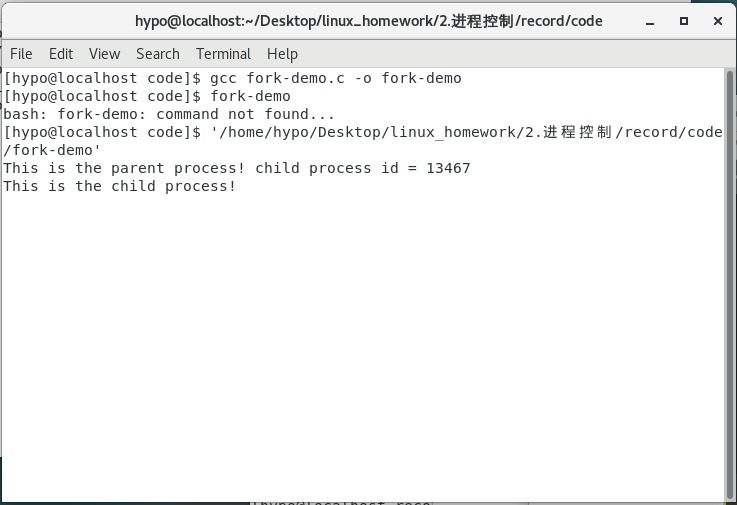
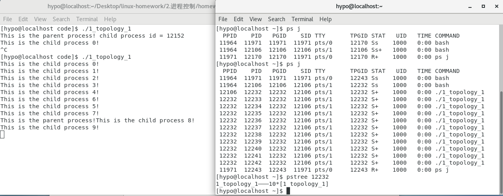

[toc]
## 实验目的
* 通过编程实践、观察，学习内存管理的方式。
## 实验环境
* 硬件
1.Intel(R) Xeon(R) Bronze 3104 CPU @ 1.70GHz
2.DDR4 16G
* 软件
1.CentOS 7
2.ubuntu 18.04
3.VMware Workstation Pro 15
## 实验记录
###  2-1 察看HelloWorld-gechar 的三个进程<br>
```bash
ps -aux | grep HelloWorld
```
3个进程的PID分别是26608 26649 26689<br>


### 2-2 屏显 HelloWorld 可执行文件信息<br>
```bash
file HelloWorld
```

x86-64 平台上的ELF 格式可执行文件。
一种用于二进制文件、可执行文件、目标代码、共享库和核心转储格式文件。
ELF文件由4部分组成，分别是ELF头（ELF header）、程序头表（Program header table）、节（Section）和节头表（Section header table）。
由于ELF 文件内部包含了足够的信息，操作系统可以根据ELF 可执行文件创建出进程映像，进程映像以及各种管理数据结构构成了进程实体，另外进程还可能向系统申请各种资源——共同组成了进程实体的全部内涵。进程实体被调度运行就构成了进程的活动，如果系统中有多个活动的进程，那么它们各自有独立的进程空间（各自独立地使用自己的0~0xFFFFFFFF 虚存空间）。<br>
在Linux 中进程PCB 是task_struct 结构体，<br>

### 进程间组织关系<br>
Linux 系统中所有进程通过进程控制块PCB（struct task_struct）形成多种组织关系。根据
进程创建过程可以有亲缘关系，通过进程间的父子关系组织成一个进程树<br>
一个进程通过创建一个子进程则形成父子关系，如果创建多个子进程，那么这些新创建的
进程间属于兄弟关系<br>
### 2-3 pstree 输出

### 2-4 查看会话、进程组和控制终端的例子

### PPID
PPID(PPID，Parent PID)   PID(进程ID)   PGID(Process Group ID 进程组 ID号)    SID(Session ID 会话ID)  TTY  TPGID(tty process group ID for the process group leader) STAT()   UID   TIME  COMMAND<br>
STAT:D 无法中断的休眠状态（通常 IO 的进程）；R 正在运行可中在队列中可过行的；S 处于休眠状态；T 停止或被追踪；W 进入内存交换（从内核2.6开始无效）；X 死掉的进程（从来没见过）；Z 僵尸进程；+ 位于后台的进程组<br>
“会话/进程组/线程组”几个概念呈现层级关系，Linux 系统中可以有多个会话（session），
每个会话可以包含多个进程组（process group），每个进程组可以包含多个进程，每个进程构
成一个线程组——一个线程组由一个进程内的一个或多个线程组成，这些对象都有各自的ID。会话是从用户登录系统到退出前的全部活动，不同帐户的登录属于不同会话，而同一帐户的多次登录也构成不同的会话。而进程组主要出于作业控制的目的，有些shell 没有作用控制能力，就将整个会话的所有进程构成一个进程组。
### 2-5 创建进程的命令
```bash
chmod a+x shell-script
shell-script
```

第一行用于指出该脚本需要用/usr/bin/bash 来解
释执行，第二行shell 内部命令echo 用来显示，第三行HelloWorld 是外部命令（磁盘上的可执
行文件）。
### 2-6 通过ps 查找进程的PID
1.查找进程的PID<br>
2.kill PID <br>
```bash
ps -ef | grep HelloWorld-getchar
```

### 2-7 fork-demo 的输出

fork 函数被成功调用后将按照父进程的样子复制出一个完全相同的子进程。父进程fork()
函数结束时的返回值是子进程的PID 编号。新创建的子进程则也是从fork()返回处开始执行，
但不同的是它获得的返回值是0。也就是说父子进程执行上几乎相同，<br>
* 唯一区别是子进程中返回0 值而父进程中返回子进程PID。<br>
* 如果fork()出错则只有父进程获得返回值-1 而子进程未能创建。<br>
### 2-8 fork-demo 的输出

### 2-9 fork-twice-demo 执行后的 输出

### 孤儿进程和僵尸进程
（1） 孤儿进程：一个父进程退出，而它的一个或多个子进程还在运行，那么那些子进程将成为孤儿进程。孤儿进程将被init 进程（进程号为1）所收养，并由init 进程对它们完成状态收集工作。
（2） 僵尸进程：一个子进程在其父进程还没有调用wait()或waitpid()的情况下退出。这个子进程就是僵尸进程。
	子进程结束后大部分资源都将直接回收，但是还将在PCB（struct task_struct 和内核堆栈）中记录一些退出时的状态等信息，这些信息供父进程检查后才能销毁回收。因此，僵尸进程因相应的数据没有父进程处理并回收，将会导致资源浪费，而孤儿则不会有这样的问题。
* 孤儿进程

* 僵尸进程

### 2-10 fork-exec-demo 的执行结果

* 这里可以看到子进程通过execve()将自己变身为“/usr/bin/ls”，因此不再执行与父进程里的代——即后面的“printf("this printf()will not be executed, because …”是没有机会得到执行的。
* fork()和exec 函数族构成了创建新进程的完整操作，如果父子进程功能相同则只用fork()，如果父子进程不同则利用exec 函数族的来实现。
### 2-11 用ps –ajx 查看daemon-demo 守护进程

关闭daemon-demo运行终端后仍能找到daemon-demo进程，且PID为1
### 2-12 /etc/rsyslog.conf 中的内容

日志信息写入了/var/log/messages 文件中。
### 2-13 查看/var/log/messages

由于前后运行了多次，所以出现了3个。
### 2-14&2-15 pthread-demo 的输出及ps –aLf 的输出

两个线程公用一个PID号19392，但是LWP却不一样。

### 2-16&2-17 PCB 开销
```bash
cat /proc/slabinfo | grep task_struct
```
比较两者在进程控制块上的开销(包括 struct task_struct 和内核栈)
2-16 fork-100-demo 运行前后的/proc/slabinfo 中关于 task_struct 数量

2-17 pthread-100-demo 运行前后的/proc/slabinfo 中关于 task_struct 数量

两者在运行后的task_struct数量均增加100，说明线程作为调度执行单位,进程控制块PCB(task_struct)还是需要的,这是最小资源的一部分。因此这方面资源开销对进程和线程都是一样的。
### 2-18&2-19&2-20&2-21内存描述符开销
* 查看mm_struct数量
```bash
cat /proc/slabinfo | grep mm_struct
```
2-18 fork-100-demo 运行前后的/proc/slabinfo 中关于 mm_struct 数量

2-19 pthread-100-demo 运行前后的/proc/slabinfo 中关于 mm_struct 数量

前者运行时mm_struct数量增加了100，而后者没有变化，说明，pthread-100-demo 虽然创建了 100 个线程,但是用于共享进程空间,并没有增加一个 mm_struct
* 查看vm_area_struct数量
```bash
cat /proc/slabinfo | grep vm_area_struct
```
2-20 fork-100-demo 运行前后的/proc/slabinfo 中关于 vm_area_struct 数量

2-21 pthread-100-demo 运行前后的/proc/slabinfo 中关于 vm_area_struct 数量

可以发现pthread-100-demo需要新增大约 150 左右的使用量，而fork-100-demo需要约 1300 左右的使用量，故线程的开销确实比进程要小。

## 课后作业
### 1.编写 C 语言程序,利用 fork()创建子进程,形成以下父子关系:并通过 ps 命令检查进程的进程号 PID 和父进程号 PPID 证明你成功创建相应的父子关系,同时也用 pstree 输出进程树结构来验证其关系。

* 解答：
* (1).[code](./homework/code/1_topology_1.c)
 
可以看到父进程12232拥有10个子进程且满足题目的要求
* (2).[code](./homework/code/1_topology_2.c)
 
可以看到父进程13738拥有10个子进程且满足题目的要求
* (3).[code](./homework/code/1_topology_3.c)
 
可以看子进程结构满足题目要求。
### 3.创建多个线程,在各个线程中打印出堆栈变量的地址,大致标记出其位置,注意区分主线程的堆栈和其他线程堆栈位置的差异。
* 解答：[code](./homework/code/3_pthread.c)
注意：编译时需要链接文件-lpthread -rdynamic
```bash
gcc ./3_pthread.c -lpthread -rdynamic -o 3_pthread
```
 
 程序中有一个父线程以及3个子线程，可以发现子线程的偏移地址以及返回地址都是一样的，且斗与父线程不一样。

### 4.尝试自行设计一个 C 语言小程序,完成最基本的 shell 角色:给出命令行提示符、能够接受命令;对于命令分成三种,内部命令(例如 help 命令、exit 命令等)、外部命令(常见的 ls、cp 等,以及其他磁盘上的可执行程序 HelloWrold 等)以及无效命令(不是上述两种命令)。
 * 解答：[code](./homework/code/shell.c)


捕获键盘输入->判断是那种命令->
* 1.内部命令:打印help文件或exit(0);退出<br>
* 2.外部命令,fork出新的进程并使用execvp函数执行
* 3.可执行程序,与外部命令方法相同
* 4.无效命令：打印无效警告
