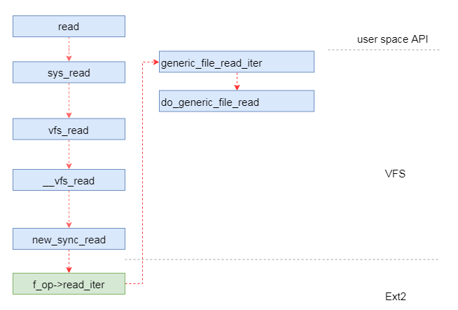
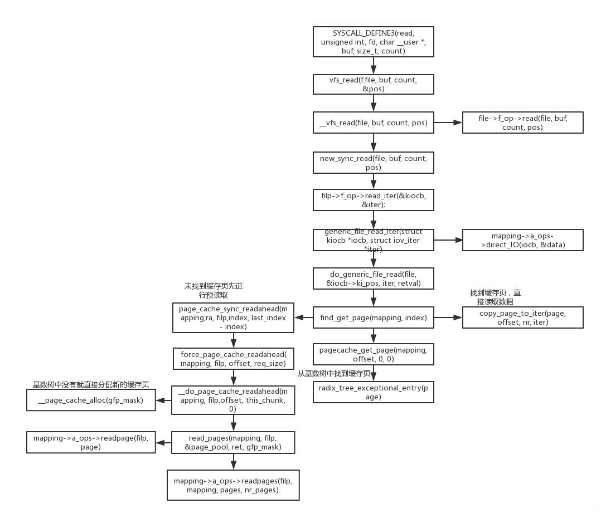
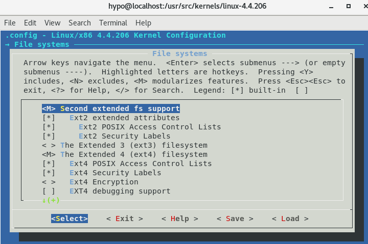
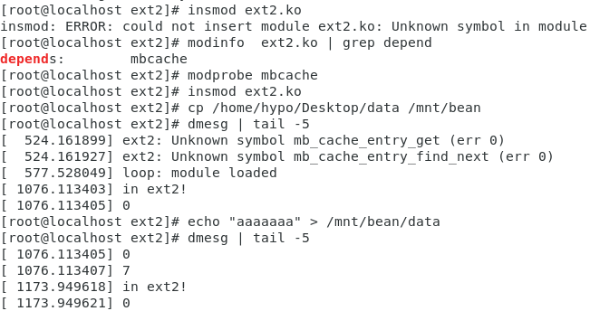
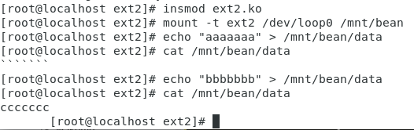
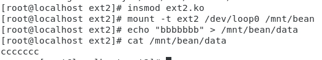
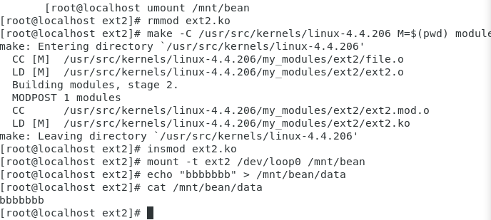
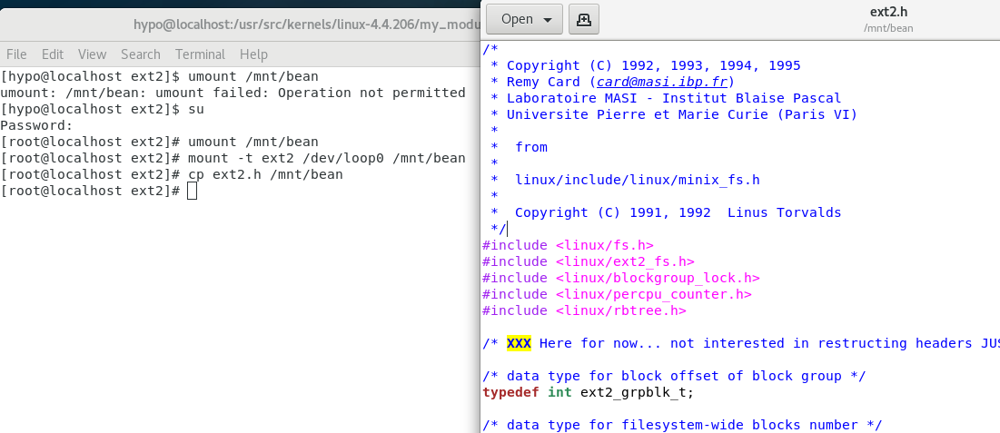
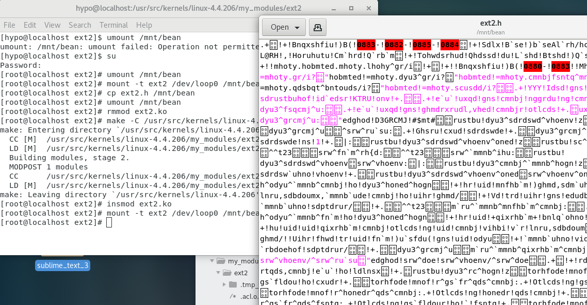
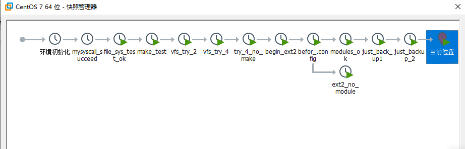

[toc]
## 1 题目描述
选择的题目为第三题：<br>
以现有文件系统的代码为基础，增加数据加密存储的功能。<br>
1.在某种内存文件系统（例如ramfs）上实现；90分<br>
2.在某种磁盘文件系统（例如ext2fs）上实现：100分<br>
在本文中实现的是在ext2上实现的数据加密存储的功能。<br>

## 2 设计方案
### 2.1 linux文件系统分析
&emsp;&emsp;关于虚拟文件系统vfs的部分，本文将不在赘述，本文将侧重于分析当用户态read发起时整个文件系统的工作流程。分析以read为例，write与read相类似。<br>
&emsp;&emsp;值得一提的是在linux中读写数据均分为Direct读写和缓存读写两种形式。为了简化流程，且不分析底层的代码片段，本文的分析将会默认缓存命中。<br>

&emsp;&emsp;简单来说，整个读取流程如下：<br>

```bash
read()--->vfs_read()--->__vfs_read()--->ext2_file_read_iter("file->f_op->read_iter")---> generic_file_read_iter()---> do_generic_file_read()---> ext2_readpage()("mapping->a_ops->readpage")
```
&emsp;&emsp;用流程图的形式来表达就是：<br>


&emsp;&emsp;当用户发起read请求时，首先会引起系统调用```sys_read()，sys_read()```将会把参数传给linux中的虚拟文件系统中的```vfs_read()```，然后调用```__vfs_read(),在__vfs_read()```中将会调用```new_sync_read()```，代码如下:

```c
//fs/read_write.c
static ssize_t new_sync_read(struct file *filp, char __user *buf, size_t len, loff_t *ppos)
{
	struct iovec iov = { .iov_base = buf, .iov_len = len };
	struct kiocb kiocb;
	struct iov_iter iter;
	ssize_t ret;

	init_sync_kiocb(&kiocb, filp);
	kiocb.ki_pos = *ppos;
	iov_iter_init(&iter, READ, &iov, 1, len);

	ret = filp->f_op->read_iter(&kiocb, &iter);/*指向子文件系统*/
	BUG_ON(ret == -EIOCBQUEUED);
	*ppos = kiocb.ki_pos;
	return ret;
}
```
&emsp;&emsp;在程序执行中```ret = filp->f_op->read_iter(&kiocb, &iter);```将文件操作指向子文件系统，下面将以ext2为例进行分析。进入```‘/fs/ext2/file.c:194’```可以看到:<br>
```c
//fs/ext2/file.c
const struct file_operations ext2_file_operations = {
	.llseek		= generic_file_llseek,
	.read_iter	= generic_file_read_iter,/*.read_iter指向generic_file_read_iter*/
	.write_iter	= generic_file_write_iter,/*.write_iter指向generic_file_write_iter*/
	.unlocked_ioctl = ext2_ioctl,
#ifdef CONFIG_COMPAT
......
```
&emsp;&emsp;```generic_file_read_iter()```与```generic_file_write_iter()```均位于’/mm/filemap.c'中，然后```generic_file_read_iter()```将调用```do_generic_file_read()```.<br>
&emsp;&emsp;```do_generic_file_read()```会分为两步，首先获取缓存页find_get_page()然后判断页缓存的标记满足条件，如果满足就```copy_page_to_iter()```,至此用户态```read()```结束。如果缓存不命中将继续进行下一步操作，本文将不再具体分析。整个详细的读写流程如下图所示：<br>


### 2.2  设计思路
#### 2.2.1 整体思路
&emsp;&emsp;从对文件系统的分析可以看出无论是哪一种子文件系统(ext2/ext4/fat)对会由经过虚拟文件系统vfs的传递最终指向```.read_iter```以及```.write_iter```, 而对于不同子文件系统，都单独对这个两个指向进行了定义。一般而言，他们会分别指向```generic_file_read_iter()```以及```generic_file_write_iter()```,所以我们只需要将ext2的```.read_iter```以及```.write_iter```指向我们修改过的函数即可：<br>
```c
//  my_modules/ext2/file.c
const struct file_operations ext2_file_operations = {
	.llseek		= generic_file_llseek,
	// .read_iter	= generic_file_read_iter,
	// .write_iter	= generic_file_write_iter,
	.read_iter	= generic_file_read_iter_my,
	.write_iter	= generic_file_write_iter_my,
	.unlocked_ioctl = ext2_ioctl,
#ifdef CONFIG_COMPAT
......
```
&emsp;&emsp;然后在```generic_file_read_iter_my()```以及```generic_file_write_iter_my()```中调用原本的函数并将传出的数据截获并进行加密以及解密就可以了。<br>
```c
//  my_modules/ext2/file.c
ssize_t generic_file_write_iter_my(struct kiocb *iocb, struct iov_iter *from)
{
	ssize_t ret;
	/*截获数据并加密*/
	ret = generic_file_write_iter(iocb,from);
	return ret;
}
ssize_t	generic_file_read_iter_my(struct kiocb *iocb, struct iov_iter *iter)
{
	ssize_t retval = 0;
	retval = generic_file_read_iter(iocb,iter);
	/*截获数据并解密*/
	return retval;
}

```
#### 2.2.2 读写数据截获
&emsp;&emsp;为了构建新的函数截获读写数据，需要分析```generic_file_read_iter()/generic_file_write_iter()```源码，这时会发现```struct kiocb *```以及```struct iov_iter *```两个结构体。<br>
&emsp;&emsp;其中```struct kiocb *```的描述为： kernel I/O control block即内核I/O控制块。其主要包括当前文件的描述信息```struct file	```以及一些控制信息。其定义如下：<br>
```c
//  linux/fs.h:329
struct kiocb {
	struct file		*ki_filp;
	loff_t			ki_pos;
	void (*ki_complete)(struct kiocb *iocb, long ret, long ret2);
	void			*private;
	int			ki_flags;
};
```
&emsp;&emsp;由于这个结构体不包含读写文件的真实数据信息，所以这个不需要进行处理，直接传入传出就可以。<br>
&emsp;&emsp;下面将重点分析```struct iov_iter *```结构体，这里存放了读写数据的指针。进入```struct iov_iter *```的定义，说明文字都附在源码后面。<br>

```c
// linux/uio.h
/*iov_iter的本质是iovec的迭代器，用于遍历iovec结构*/
struct iov_iter {
	int type;
	size_t iov_offset; /*iov指针指向的第一个iovec结构体中数据的第一个字节的偏移*/
	size_t count;      /*iovec数组指向的数据总数*/
	union {
		const struct iovec *iov;  /*struct iovec 数组指针*/
		const struct kvec *kvec;  
		const struct bio_vec *bvec;
	};
	unsigned long nr_segs;        /*iovec结构体的个数*/
};

```
&emsp;&emsp;然后再来看```struct iovec *```<br>
```c
// usr/include/linux/uio.h
/*通常用的系统调用read/write用于读取或写入文件，比如read用于读取数据到一个用户态缓冲区，readv读取数据到多个用户态缓冲区，那么为了兼容这两种syscall，引入了数据结构iovec*/
struct iovec
{
	void *iov_base;	/* 用户空间缓存区地址 */
	__kernel_size_t iov_len; /*iov_base指向的缓冲区长度的长度 */
};
```
&emsp;&emsp;所以，为了截获数据只需对```struct iov_iter *```遍历就可以得到每个用于储存读写缓存数据的用户空间缓存区地址iov_base，然后对地址按照iov_len读出就可以获得读写缓存数据。<br>
#### 2.2.3 加密以及解密
&emsp;&emsp;加密以及解密部分就用了最简单的与1异或的操作，这不仅同时适用于加密与解密，而且还不会改变数据长度。具体实现步骤及代码见调试与验证过程。<br>


## 3 调试与验证过程
###  3.1 准备工作
#### 3.1.1 将ext2修改为系统模块
&emsp;&emsp;将ext2文件系统编译成模块化，当我们需要对ext2进行修改的时候，就不需要重新编译内核。这样可以大大加快调试速度。<br>
* 1.修改.config文件，将File system里的ext2标注为模块[M]
```bash
make menuconfig
```

* 2.重新编译并安装内核
```bash
make
make modules_install
make install
```
* 3 重启进入新内核
* 4 复制/fs/ext2文件夹到/my_module/
&emsp;&emsp;同时修改在写入时中插入printk(KERN_ALERT "in ext2");便于后面测试模块是否被成功调用<br>
```c
//  my_modules/ext2/file.c
ssize_t generic_file_write_iter_my(struct kiocb *iocb, struct iov_iter *from)
{
	ssize_t ret;
	printk(KERN_ALERT "in ext2");
......
```
* 5 编译安装ext2模块
```bash
[root@localhost ext2]# make -C /usr/src/kernels/linux-4.4.206 M=$(pwd) modules
make: Entering directory `/usr/src/kernels/linux-4.4.205'
  CC [M]  /usr/src/kernels/linux-4.4.205/myKernelExp/ext2/balloc.o
......
  LD [M]  /usr/src/kernels/linux-4.4.205/myKernelExp/ext2/ext2.ko
make: Leaving directory `/usr/src/kernels/linux-4.4.205'
[root@localhost ext2]# insmod ext2.ko
insmod: ERROR: could not insert module ext2.ko: Unknown symbol in module
#出现错误，需要加载依赖项
[root@localhost ext2]#  modinfo  ext2.ko | grep depend
depends:        mbcache
[root@localhost ext2]# modprobe mbcache
[root@localhost ext2]# insmod ext2.ko
```
#### 3.1.2 创建环回设备用于测试ext2文件系统
&emsp;&emsp;在磁盘中创建并挂载用于测试的ext2文件系统<br>
```bash
#创建文件
[root@localhost hypo]# dd if=/dev/zero of=bean bs=1k count=512000
512000+0 records in
512000+0 records out
524288000 bytes (524 MB) copied, 53.9752 s, 9.7 MB/s
#检查
[root@localhost hypo]# ll bean
-rw-r--r--. 1 root root 524288000 Dec 20 00:25 bean
[root@localhost hypo]# ll -h bean
-rw-r--r--. 1 root root 500M Dec 20 00:25 bean
#创建设备
[root@localhost hypo]# losetup /dev/loop0 bean
[root@localhost hypo]# cat /proc/partitions
major minor  #blocks  name

   8        0   52428800 sda
   8        1     307200 sda1
   8        2    2098176 sda2
   8        3   50022400 sda3
  11        0    1048575 sr0
   8       16   60422650 sdb
   8       17   60421120 sdb1
   7        0     512000 loop0
# 格式化
[root@localhost ext2]# mke2fs /dev/loop0
mke2fs 1.42.9 (28-Dec-2013)
......                 
Writing superblocks and filesystem accounting information: done 
# 挂载并检查
[root@localhost hypo]# mkdir /mnt/bean
[root@localhost hypo]# mount -t ext2 /dev/loop0 /mnt/bean
[root@localhost hypo]# mount
......
/dev/loop0 on /mnt/bean type ext2 (rw,relatime,seclabel,errors=continue,user_xattr,acl)
```

#### 3.1.3 ext2.ko模块加载测试
&emsp;&emsp;创建文件data并复制到 /mnt/bean<br>
```bash
[root@localhost ext2]# cat /home/hypo/Desktop/data
aaaaaaa
[root@localhost ext2]# cp /home/hypo/Desktop/data /mnt/bean
[root@localhost ext2]# echo "aaaaaaa" > /mnt/bean/data
[root@localhost ext2]# dmesg | tail -5
[ 1635.327204] in ext2
[ 1635.328899] in ext2
[ 1635.334341] in ext2
[ 1635.336209] in ext2
```
&emsp;&emsp;可以发现复制文件时所修改的ext2模块已经生效,截图如下：<br>


###  3.2 编写代码并调试
#### 3.2.1 调试流程
&emsp;&emsp;每次修改代码后都将使用以下流程进行调试<br>
```bash
umount /mnt/bean   #取消挂载设备
rmmod ext2.ko      #卸载模ext2块
make -C /usr/src/kernels/linux-4.4.206 M=$(pwd) modules  #编译
insmod ext2.ko     #安装模块
mount -t ext2 /dev/loop0 /mnt/bean    #挂载设备
#cp /home/hypo/Desktop/data /mnt/bean  #写入测试
echo "aaaaaaa" > /mnt/bean/data        #写入测试
dmesg | tail -5   #获取printk输出
cat /mnt/bean/data
```
#### 3.2.2 写入加密测试
&emsp;&emsp;在这一部分中，将编写函数```generic_file_write_iter_my```用于截取传入```generic_file_write_iter```的```iov_iter```，对其所指向的内存的内容对1异或操作进行加密。由于并没有修改ext2的文件读取方法，这种测试环境下可以模拟储存介质丢失的情况。<br>
```c
ssize_t generic_file_write_iter_my(struct kiocb *iocb, struct iov_iter *from)
{

	ssize_t ret;
	size_t buf_offset;
	struct iov_iter iter_this = *from;

	printk(KERN_ALERT "write ext2!");

	//encrypt
	if (iter_this.nr_segs > 0)
	{
		if (iter_this.iov[0].iov_len > iter_this.iov_offset)
		{
			for (buf_offset = 0; buf_offset < iter_this.iov[0].iov_len; ++buf_offset)
			{
				*((char *)(iter_this.iov[0].iov_base) + iter_this.iov_offset + buf_offset)^=1;
			}
		}
	}

	ret = generic_file_write_iter(iocb,from);// call generic_file_write_iter to write

	return ret;
}
```
编译调试步骤如下：<br>
```bash
[root@localhost ext2]# umount /mnt/bean
[root@localhost ext2]# rmmod ext2.ko 
[root@localhost ext2]# make -C /usr/src/kernels/linux-4.4.206 M=$(pwd) modules 
make: Entering directory `/usr/src/kernels/linux-4.4.206'
.....
make: Leaving directory `/usr/src/kernels/linux-4.4.206'
[root@localhost ext2]# insmod ext2.ko
[root@localhost ext2]# mount -t ext2 /dev/loop0 /mnt/bean
[root@localhost ext2]# echo "bbbbbbb" > /mnt/bean/data
[root@localhost ext2]# cat /mnt/bean/data
ccccccc
[root@localhost ext2]# 
```
截图如下，观察发现写入的```bbbbbbb```被截获并编码为了```ccccccc```<br>
即对明文加密写入而不解密就读出的话，将不能获得明文。<br>
计算验证：<br>
b->114(ascii)->111 0010<br>
111 0010 xor 000 0001 = 111 0011 ->115 ->'c'<br>


#### 3.2.3 读取解密测试
&emsp;&emsp;在这一部分中，将编写函数```generic_file_read_my```用于截取传出```generic_file_read_iter```的```iov_iter```，对其所指向的内存的内容对1异或操作进行解密。为了验证解密工作，在测试时会注释掉加密的部分。<br>
&emsp;&emsp;用于读取解密部分的代码如下：<br>

```c
ssize_t	generic_file_read_iter_my(struct kiocb *iocb, struct iov_iter *iter)
{
	ssize_t retval = 0;
	size_t buf_offset;
	struct iov_iter iter_this = *iter;

	printk(KERN_ALERT "read ext2!");

	retval = generic_file_read_iter(iocb,iter);// call generic_file_read_iter to read

	//decrypt
	if (iter_this.nr_segs > 0)
	{
		if (iter_this.iov[0].iov_len > iter_this.iov_offset)
		{
			for (buf_offset = 0; buf_offset < iter_this.iov[0].iov_len; ++buf_offset)
			{
				*((char *)(iter_this.iov[0].iov_base) + iter_this.iov_offset + buf_offset)^=1;
			}
		}
	}

	return retval;
}
```
&emsp;&emsp;结果如下：<br>
```bash
......
[root@localhost ext2]# insmod ext2.ko
[root@localhost ext2]# mount -t ext2 /dev/loop0 /mnt/bean
[root@localhost ext2]# echo "bbbbbbb" > /mnt/bean/data
[root@localhost ext2]# cat /mnt/bean/data
ccccccc
```
<br>
&emsp;&emsp;可以发现对明文不加密写入的情况下进行读取并解密，也将获得密文。<br>

#### 3.2.4 加密-解密联合测试
&emsp;&emsp;写入加密与读取解密结合在一起后,形成加密-解密回路后在安装了该ext2模块的电脑上可以对/mnt/bean文件夹内的文件进行正常读写。<br>
&emsp;&emsp;结果如下：<br>
```bash
       [root@localhost umount /mnt/bean
[root@localhost ext2]# rmmod ext2.ko 
[root@localhost ext2]# make -C /usr/src/kernels/linux-4.4.206 M=$(pwd) modules 
make: Entering directory `/usr/src/kernels/linux-4.4.206'
......
  LD [M]  /usr/src/kernels/linux-4.4.206/my_modules/ext2/ext2.ko
make: Leaving directory `/usr/src/kernels/linux-4.4.206'
[root@localhost ext2]# insmod ext2.ko
[root@localhost ext2]# mount -t ext2 /dev/loop0 /mnt/bean
[root@localhost ext2]# echo "bbbbbbb" > /mnt/bean/data
[root@localhost ext2]# cat /mnt/bean/data
bbbbbbb
```

&emsp;&emsp;当加密解密形成回路，就可以正常的读写文件<br>

###  3.3 加密验证（模拟储存介质丢失的情况）
&emsp;&emsp;存储加密最重要的作用就是防止存储设备丢失后数据会被窃取<br>
&emsp;&emsp;这里将模拟将加密的文件在另外一台电脑中打开的情况。<br>

* 1.将loop0挂载以修改过的加密ext2文件系统挂载到/mnt/bean文件夹并将ext2.h作为测试文件写入/mnt/bean, 然后打开文件查看。

* 2.将loop0卸载，并还原ext2文件系统到未修改的情况(指向原本的读写函数)，然后再挂载loop0
```c
const struct file_operations ext2_file_operations = {
	.llseek		= generic_file_llseek,
	.read_iter	= generic_file_read_iter,
	.write_iter	= generic_file_write_iter,
	// .read_iter	= generic_file_read_iter_my,
	// .write_iter	= generic_file_write_iter_my,
```

* 3.检查在正常的ext2文件系统中能否正常读取在加密ext2文件系统中写入的文件。

乱码一篇，加密成功！<br>

## 4 心得体会
完成这项作业花了将近1周时间，从编译内核开始一步步过来，感触良多。下面的VMware快照就是见证者。最开始想在vfs里截获数据进行加密，但是每次修改一点代码就要编译大半天，而且经常即使编译通过了也开不了机。最后问了同学发现可以把ext2文件系统模块化编译，这才恍然大悟，走上正轨。总得来说还是学到了很多东西的。<br>
<br>
最后强调一下VMware 害人不浅，同样的代码在VMware下一加载模块就会死机(键盘灯会闪，怀疑是VMware 有内核保护机制，不给注入数据)，换成VirtualBox就可以了。<br>

## 5 参考资料
[1] SunnyZhang的IT世界.Ext2文件系统读数据流程分析.https://www.jianshu.com/p/acdadea07fd8.<br>
[2] DenzilXu.Ext2文件系统—文件读写.https://blog.csdn.net/DenzilXu/article/details/8579130.<br>
[3] OnePunch-Man.linux内核分析：read过程分析.https://blog.csdn.net/u013837209/article/details/54923508.<br>
[4] 清水浊酒.iov_iter结构体--翻译.https://blog.csdn.net/C_JLMPC2009/article/details/102597790.<br>
[5] Linux kernel Function Tree. http://www.bricktou.com/idx_root_tree.html.<br>
[6]qljessica123. 模块化编译ext2, ext3,ext4 文件系统.https://blog.csdn.net/qljessica123/article/details/38010579.<br>

