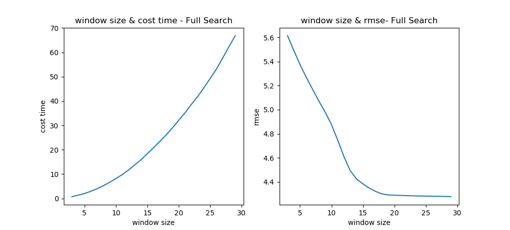
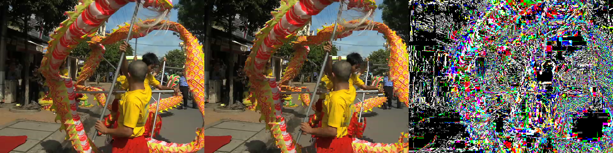

## Motion Compensation
In this project, I use python to implement a YUV reader and three motion estimation methods: full search, three step search, and diamond search . Finally, I compare their performance in terms of accuracy and complexity.<br>
###  Prerequisites
  - Linux, Mac OS, Windows<br>
  - Python 3.6+<br>
  - numpy, matplotlib, opencv-python<br>
### Getting Started
run<br>
```bash
python plot.py
```
then you will get:<br>
<br>
<br>

run<br>
```bash
python main.py
```
then you will get:<br>
```bash
Read dragon_video.yuv done!
Read gas_video.yuv done!
-------Full Search-------
dragon_video  rmse:5.691  psnr:33.034  time:190.468
gas_video     rmse:1.267  psnr:47.109  time:190.697
-------Three-step search-------
dragon_video  rmse:5.561  psnr:33.234  time:60.568
gas_video     rmse:1.218  psnr:47.214  time:59.848
-------Multi-Step search-------
dragon_video  rmse:5.287  psnr:33.673  time:80.428
gas_video     rmse:1.289  psnr:46.433  time:79.131
-------Diamond Search-------
dragon_video  rmse:5.540  psnr:33.267  time:48.877
gas_video     rmse:1.188  psnr:47.492  time:34.231
```

