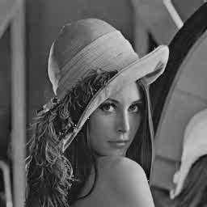

## my_dct
This code finish in python3  and use numpy ,opencv-python as tool.
@Hypo,雷海波 1910273011

## Run  code
```shell
python image_dct_and_idct.py
```
## Result:
QF=1 | QF=20 | QF=50 | QF=100 
:-: | :-: | :-: | :-: | :-:
 |  |  |  | 
* We can find that image will get worse quality when QF is larger. 
* When quantfy  DCT blocks, it will loss more information when QF is large.

