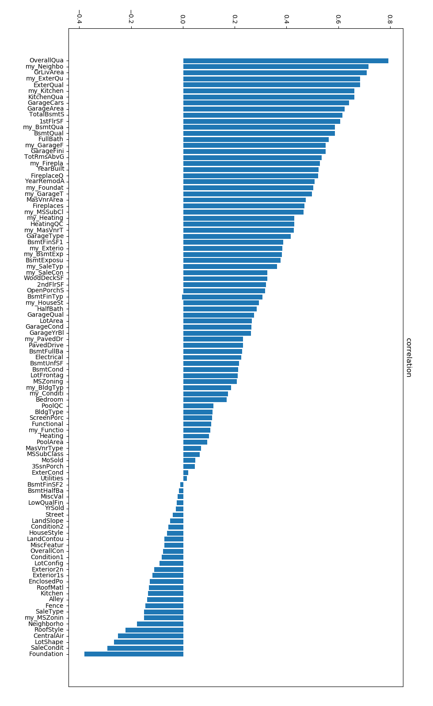

[toc]
### 1 比赛简介
​        选择的项目为[House Prices: Advanced Regression Techniques](https://www.kaggle.com/c/house-prices-advanced-regression-techniques),该比赛要求参赛者使用爱荷华州艾姆斯市(Ames, Iowa)所销售房子的描述对其售价进行预测，是典型的回归问题。数据集包含1460个用于训练的房子描述+售价以及1459个用于测试的房子描述，每个对房子描述的描述包含79个标识，比如平方英尺大小，住宅类型，埃姆斯市区范围内的地理位置等。比赛要求对测试集的每个ID的描述给出SalePrice的预测值，评估标准使用预测值的对数与观察到的销售价格的对数之间的均方根误差(RMSE）
<br>

​        为了实现比赛要求，对数据进行了预处理，特征工程等操作，并搭建了深度神经网络进行回归预测，最终获得前19%的分数。另外，比赛代码公开于[https://github.com/HypoX64/house-prices](https://github.com/HypoX64/house-prices)


### 2 比赛知识点
​        这一节主要说明该比所涉及的一些基础知识点，是代码实现部分的补充说明。详细内容将会在代码实验部分给出。
#### 2.1 数据预处理
​        对于这项比赛，数据预处理的工作主要集中在数据清洗。
​        数据集中给出的描述文件与训练集、测试集有着许多并不对应的字段或错误，这需要进行修补。比如描述文件中‘BrkComm’字段对应着训练集中的'BrkCmn'字段，这对读取文件造成了很大的困难。另外训练及测试集中存在着许多的缺失值，对于不同子段的缺失值需要在使用不同的填充方法，具体内容会在代码实现部分给出。

#### 2.2 数据可视化
​        数据可视化是了解数据特征最直观的办法，本文中对数据进行相关性分析并给出了可视化的结果。另外，本文对于不同的模型，其参数的的改变与最终预测结果的关系也进行了绘图，具体过程将在代码实现部分给出。

#### 2.3 特征工程
进行的特征工程包含离散型变量的排序赋值，特征组合和PCA主成分分析
1.离散型变量的排序赋值的目的是让对房子的描述与向量拥有更好的映射关系，比如对房屋质量的评价，就可以采取将质量好的映射为更大的向量例如：{'NA':1, 'Po':2,'Fa':3, 'TA':4, 'Gd':5, 'Ex':6}
2.特征组合的目的是对现有的79个特征进行组合，挖掘出更多可能。
3.PCA主成分分析的目的是对数据进行降维以及去相关性。

#### 2.4 模型选择
​        本文采用了多种模型对数据进行建模。其中包括自己搭建的深度神经网络，以及一些传统的回归模型，比如KernelRidge，LassoCV，XGBRegressor，ElasticNet，BayesianRidge，GradientBoostingRegressor，LGBMRegressor，SVR等。后文中将详细介绍深度神经网络以及其他机器学习模型的评估效果。

#### 2.5 实验结果的评价

​        比赛的评估标准使用预测值的对数与观察到的销售价格的对数之间的均方根误差（RMSE）以下公式所示。<br>
$$
\begin{matrix} \sqrt{\dfrac{\sum_{i=1}^N(\lg y_i-\lg \hat{y_i})^2}{N}} \end{matrix}
$$
​        然而由于我首选的是深度学习的方法，对于数值预测类任务其对应loss为MES，不需要对数及根号处理，所以本文中将统一使用下面的loss，值得注意的是这将导致程序跑出来的结果与最终提交结果不一致，但两者是同向的关系，这并不影响对模型效果的评估。<br>
$$
\begin{matrix} \dfrac{\sum_{i=1}^N(y_i-\hat{y_i})^2}{N}  \end{matrix}
$$
​        当然，如果需要更换为式(1)的loss只需要取消evaluation.py中的以下注释即可
```python
def RMSE(records_real,records_predict):
    # records_real = np.log1p(np.array(records_real))
    # records_predict = np.log1p(np.array(records_predict))
    records_real = transformer.normlize(np.array(records_real),True)
    records_predict = transformer.normlize(np.array(records_predict),True)
```
​        另外，由于选用了深度神经网络，过小的数据量并不适合K-fold的评估方法，所以本文中统一弃用了K-fold。并使用了一般的深度学习评估方法，直接获取了测试集的ground true进行评估.


### 3 比赛过程及代码实现

#### 3.1 数据读入与预处理
* 数据的读入部分位于‘./dataloader.py’中

* 读取description.txt

```python
# load description_txt
description_txt = []
colon_indexs = []
for i,line in enumerate(open('./datasets/data_description.txt'),0):
    line = line.strip()
    if(':' in line[0:20]):
        colon_indexs.append(i)
    description_txt.append(line)
colon_indexs.append(524)#the end of description
description_length = len(colon_indexs)-1
```
* 进行数据集清洗，修复description.txt中一些与训练数据不一样的键值并将描述根据description.txt的排序简单的进行数值映射便于进行数据的分析。

```python
    if interspace == 0:
        ori_map['Just_num'] = 'None'
        Full_map[desc_key]=ori_map
    else:
        for j in range(interspace-1): #del low space line
            line = description_txt[colon_indexs[i]+j+2]
            key = line[:line.find('\t')]
            #data_description.txt is wrong here
            if key == 'NA ':
                key = 'NA'
            if key == 'WD ':
                key = 'WD'
            if key == 'BrkComm' or key =='Brk Cmn':
                key = 'BrkCmn'
            if desc_key in value_map:
                my_map[key] = value_map[desc_key][key]
                Full_map['my_'+desc_key]=my_map
            ori_ map[key] = interspace-j-1 #change word to vector
            Full_map[desc_key]=ori_map
```
* 修复缺失值，位于‘./description_map.py’
本文中将具有缺失值的特征分为三类，第一类特征的缺失值实际描述的是”没有“，故用自动映射中的最小值”1“代替；第二类特征主要描述的是面积，其缺失值实际就是”0“;而对于LotFrontage（与房子相连的街道数量），其可以用房子所在社区的中值代替
```python
miss_0 = ["PoolQC" , "MiscFeature", "Alley", "Fence", "FireplaceQu", "GarageQual", "GarageCond", "GarageFinish", "GarageYrBlt", "GarageType", "BsmtExposure", "BsmtCond", "BsmtQual", "BsmtFinType2", "BsmtFinType1", "MasVnrType"]
miss_1=["MasVnrArea", "BsmtUnfSF", "TotalBsmtSF", "GarageCars", "BsmtFinSF2", "BsmtFinSF1", "GarageArea"]
miss_2 = ['LotFrontage']
def fix_miss(name):
    if name in miss_0:
        return 1
    else:
        return 0
def fix_LotFrontage(Full_map):
    data_df = pd.DataFrame(Full_map)
    data_df["LotFrontage"] = data_df.groupby("Neighborhood")["LotFrontage"].transform(lambda x: x.fillna(x.median()))
    return data_df["LotFrontage"].to_numpy()

```
* 最后通过load_train以及load_test函数读取测试集以及训练集，数据储存为字典的形式。

#### 3.2 数据基本分析
* 数据的分析部分位于‘./analysis.py’中

* 查看SalePrice的均值，中值以及标准差：
```python
>>print('SalePrice mean:',np.mean(price_map['price']),'median:',np.median(price_map['price']),'std:',np.std(price_map['price']))
>>SalePrice mean: 180921.19589041095 median: 163000.0 std: 79415.29188606751
```
* 将YearBuilt与SalePrice相对应并绘制散点图：
这张图可以看出数据的大致分布同时也可以发现一般来说越新的房子越贵

* 将所有的描述特征对SalePrice做相关性检测，得到下图：
越靠近上方的特征与SalePrice的相关性越强，以my_为前缀的是手动对描述进行向量映射的特征，详见特征工程。


#### 3.3 特征工程
* 离散型变量的排序赋值，映射关系位于‘./description_map.py’
对一些具有主观因素的特征进行主观赋值。比如对于一些建筑材料我们认为砖瓦是最便宜的，石头是最贵的，并以此为依据进行赋值。由于采用了主观赋值的方法，这里对于最终结果会有一定的影响，只能说见仁见智了。
```python
value_map["Exterior1st"] = {'BrkCmn':1,
                             'AsphShn':2, 'CBlock':2, 'AsbShng':2,
                             'WdShing':3, 'Wd Sdng':3, 'MetalSd':3, 'Stucco':3, 'HdBoard':3,'Other':3,
                             'BrkFace':4, 'Plywood':4, 'PreCast':4,
                             'VinylSd':5,
                             'CemntBd':6,
                             'Stone':7, 'ImStucc':7}
```

* 特征组合
原始描述仅含有79个特征，这是远远不够的。而往往通过特征组合的方法可以更深入的挖掘出新特征以及预测值之间的关系。这里选取与SalePrice相关性排在前20的一些特征进行组合。
```python
def add_future(features):
    features["TotalHouse"] = features["TotalBsmtSF"] + features["1stFlrSF"] + features["2ndFlrSF"]   
    features["TotalArea"] = features["TotalBsmtSF"] + features["1stFlrSF"] + features["2ndFlrSF"] + features["GarageArea"]
......
```
除了上述主观组合外还进行了一些随机特征的乘法组合，其主要目的是增加特征的非线性。
```python
    random_list = ['GrLivArea','OverallQual','2ndFlrSF','YearBuilt','1stFlrSF','TotalBsmtSF','OverallCond',
    'my_Neighborhood','my_SaleCondition','BsmtFinSF1','my_MSZoning','LotArea','GarageCars','YearRemodAdd','GarageArea']
    length = len(random_list)
    for i in range(length):
        for j in range(i,length):
            if i != j:
                features[random_list[i]+'*'+random_list[j]]=features[random_list[i]]*features[random_list[j]]              
```
* 归一化
由于要使用深度神经网络作为模型，需要对数据进行归一化。这里采用最大-最小值归一化。
```python
def normlize(npdata,justprice = False):
    _min = np.min(npdata)
    _max = np.max(npdata)
    if justprice:       
        _min = 34900.0
        _max = 755000.0
    return (npdata-_min)/(_max-_min)
```
* PCA主成分分析
PCA主要用于去相关性和降维，实验表明使用PCA降维可以有效提升传统机器学习模型，但对深度学习模型似乎并没有太大的效果。
```python
    pca=PCA(n_components=dimension)     
    desc_all=pca.fit_transform(desc_all)
```
#### 3.4 神经网络搭建与测试
神经网络定义于‘./model.py'
训练代码位于’./train.py‘
* 简单的全连接神经网络_PCA
首先使用经过PCA降维至128维的描述数据测试第一个简单的神经网络并，网络由两个全连接层以及位于两个全连接层中间的激活函数以及Dropout层构成，为了添加非线性性激活函数选用了Sigmoid，为了防止过拟合，Dropout的参数设置为0.2.
网络定义如下：
```python
class Linear(nn.Module):
    def __init__(self, n_feature):
        super(Linear, self).__init__()
        self.fc = nn.Sequential(
            nn.Linear(n_feature, 256),
            nn.Sigmoid(),
            nn.Dropout(0.2)
        )
        self.output = nn.Linear(256, 1)   

    def forward(self, x):
        x = self.fc(x)
        x = self.output(x) 
        return x
```
网络训练参数如下：
```python
#parameter
LR = 0.0001
EPOCHS = 10000
BATCHSIZE = 64
CONTINUE = False
use_gpu = True
Dimension = 128
net = model.Linear(Dimension)
optimizer = torch.optim.Adam(net.parameters(), lr=LR )
criterion = nn.MSELoss()
```
训练迭代次数与loss(MSELoss)的关系：
在大约5000次迭代后出现过拟合现象。

最终loss : 0.026172


* 简单的全连接神经网络_NOPCA
现在依然使用简单的全连接网络，网络结构不变，但不应用PCA而是直接将233维全部输入神经网络。
```python
Dimension = 233
train_desc,train_price,test_desc = dataloader.load_all(Dimension,usePCA=False)
net = model.Linear(Dimension)
```
训练迭代次数与loss(MSELoss)的关系：
在大约2000次迭代后出现过拟合现象。

最终loss : 0.025929

* 具有残差结构的神经网络_NOPCA
网络定义如下：
```python
class Residual_linear(nn.Module):
    def __init__(self, n_feature):
        super(Residual_linear, self).__init__()
        self.fc = nn.Sequential(
            nn.Linear(n_feature, 256),
            nn.ReLU(inplace=True),
            nn.Linear(256, 1024),
            nn.ReLU(inplace=True),
            nn.Linear(1024, 128),
            nn.ReLU(inplace=True),
            nn.Dropout(0.2)
        )
        self.shortcut = nn.Sequential(
            nn.Linear(n_feature, 128)
        )
        self.output = nn.Sequential(
            nn.Linear(128, 1)
        )
    def forward(self, x):
        x_shortcut = self.shortcut(x)
        x = self.fc(x)
        x = x+x_shortcut
        x = torch.sigmoid(x)
        x = self.output(x)
        return x
```
网络训练参数如下：
```python
#parameter
LR = 0.0001
EPOCHS = 100
BATCHSIZE = 64
CONTINUE = False
use_gpu = True
Dimension = 233
train_desc,train_price,test_desc = dataloader.load_all(Dimension,usePCA=False)
net = model.Linear(Dimension)
optimizer = torch.optim.Adam(net.parameters(), lr=LR )
criterion = nn.MSELoss()
```
训练迭代次数与loss(MSELoss)的关系：
在大约30次迭代后出现过拟合现象。

最终loss : 0.026439

* 两种神经网络结构对比
对比浅层神经网络于深层神经网络的结果，可以发现后者网络参数量大，仅仅迭代数十次就出现了过拟合的情况。再者，即使将网络结构精简到只有两层，依然会出现明显的过拟合现象。可见，从某种角度来说，这项比赛的数据量过小，似乎并不适合使用深度神经网络。
另外，通过对比是否应用PCA对结果的影响，可以发现PCA对于神经网络似乎甚至具有相反的效果。
最终结果如下：

| 网络类型                     | loss     |
| ---------------------------- | -------- |
| 简单的全连接神经网络_withPCA | 0.026172 |
| 简单的全连接神经网络_NOPCA   | 0.025929 |
| 具有残差结构的神经网络_NOPCA | 0.026439 |


#### 3.5 基本回归模型测试
除了使用深度神经网络外，我还测试了一些传统机器学习中的回归模型：KernelRidge，LassoCV，XGBRegressor，ElasticNet，BayesianRidge，GradientBoostingRegressor，LGBMRegressor，SVR。

* 他们的参数定义如下：

```python
# KernelRidge()
krr = GridSearchCV(KernelRidge(kernel='polynomial'),cv = 3,
                  param_grid={"alpha": np.logspace(-1, 2, 10),
                              "gamma": np.logspace(-1, 2, 10)})


las = LassoCV(alphas=np.logspace(-5, 2, 50),eps=np.logspace(-5, 2, 20),max_iter=10000)


model_xgb = xgb.XGBRegressor(colsample_bytree=0.4603, gamma=0.0468, 
                             learning_rate=0.05, max_depth=3, 
                             min_child_weight=1.7817, n_estimators=2200,
                             reg_alpha=0.4640, reg_lambda=0.8571,
                             subsample=0.5213, silent=1,
                             random_state =7, nthread = -1)


# ElasticNet
ENet = GridSearchCV(ElasticNet(max_iter = 10000),
                  param_grid={"alpha": np.logspace(-3, 2, 6),
                              "l1_ratio": np.logspace(-2, 2, 5)})

#BayesianRidge
bay = BayesianRidge()

#GradientBoostingRegressor
GBoost = GradientBoostingRegressor(n_estimators=3000, learning_rate=0.01,
                                   max_depth=4, max_features='sqrt',
                                   min_samples_leaf=15, min_samples_split=10, 
                                   loss='huber', random_state =5)

#LGBMRegressor
model_lgb = lgb.LGBMRegressor(objective='regression',num_leaves=5,
                              learning_rate=0.05, n_estimators=720,
                              max_bin = 55, bagging_fraction = 0.8,
                              bagging_freq = 5, feature_fraction = 0.2319,
                              feature_fraction_seed=9, bagging_seed=9,
                              min_data_in_leaf =6, min_sum_hessian_in_leaf = 11)

#SVR
model_svr = GridSearchCV(SVR(kernel="rbf"),
                  param_grid={"C": np.logspace(0, 2, 5),
                              "gamma": np.logspace(-4, -3, 8),
                              "epsilon":np.logspace(-4, -3, 5)})
```
* PCA维数以及模型loss的关系

|  |  |
| -------------------------------------- | -------------------------------------- |
|  |  |
|  |  |
|  |  |
通过上面的图可以发现PCA的输出维数对于传统的回归模型确实由较大的影响。不同的模型最合适的输出维数并不一样。
各种模型的最终loss如下：

```bash
KernelRidge                  loss:0.026778    PCA:85
LassoCV                      loss:0.030053    PCA:137
XGBRegressor                 loss:0.040413    PCA:121
ElasticNet                   loss:0.030281    PCA:138
BayesianRidge                loss:0.029568    PCA:138
GradientBoostingRegressor    loss:0.036021    PCA:82
LGBMRegressor                loss:0.033188    PCA:65
SVR                          loss:0.028606    PCA:114
```
#### 3.6 合并结果并提交
为了获得更好的结果，我将四种模型的结果进行了平均值的计算得到最终的提交结果。
所选取的四种模型分是：三种神经网络的结果及KernelRidge
最终合并的loss : 0.02533

### 4 比赛结果
提交最终结果后获得得分：

<br>
最终排名：

<br>
按百分比计算为前19%：


### 5 总结
#### 5.1 算法优缺点分析
​        通过对多种模型的实验，可以发现神经网络具有极强的学习能力，甚至不需要在特征工程上下功夫，一股脑的把数据丢进去训练就可以得到不错的效果。但同时，也正是由于这种过于强大的学习能力导致了模型十分容易出现过拟合现象，甚至在达到一般回归模型的效果前就发生了过拟合现象。
​       而传统的回归算法不需要神经网络那么庞大的计算量也能获得不错的效果，但是却需要比较复杂的特征工程。


#### 5.2 优化方案
​        从我所了解到的情况，由于这项比赛数据量过小，严重的过拟合现象导致其并不适合使用神经网络进行预测， top方案普遍采用传统的回归模型进行预测，不同点更多的是在特征工程以及多模型集成方面。所以如果需要进一步的优化，可能只能抛弃神经网络这一方法，然后集中修改特征工程的内容。

#### 5.3收获
​        在本次比赛中我主要尝试的是使用神经网络对房价进行预测，这其中很多算法都是与神经网络相对应的的，比如采用了max-min的归一化的方法而不是top方案中普遍采用的log1p方法。另外，为了适应神经网络采取了MES作为损失函数，这或许导致了无法获得最好的性能，但这确实是一种全新的尝试。
​        另外，在数据清洗以及特征工程两个步骤，让我体验到了数据挖掘的魅力，与一般的深度学习不同，数据挖掘的结果往往更取决于特征工程的好与坏，而不是网络的性能如何。